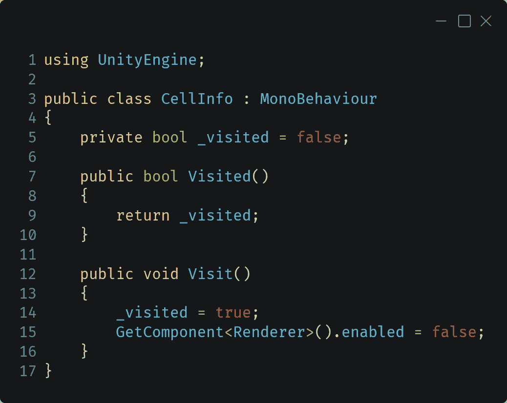
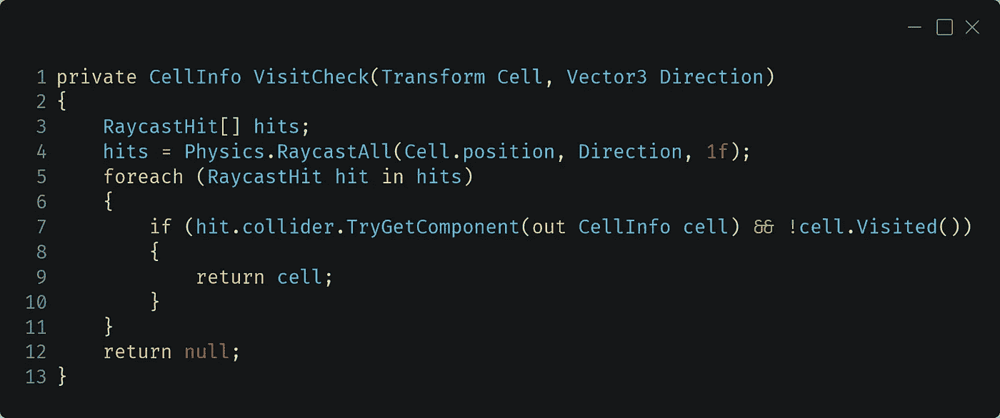
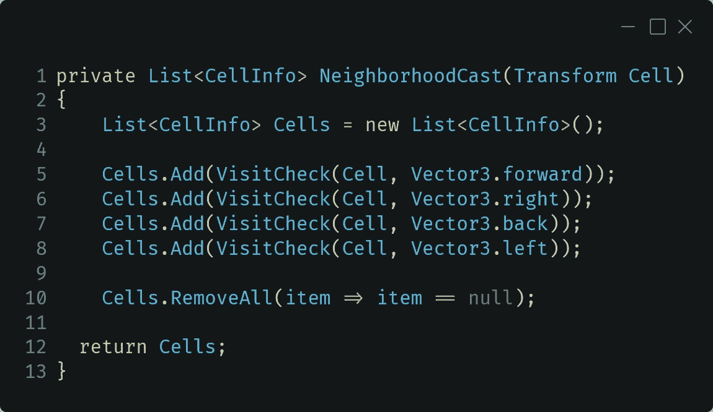
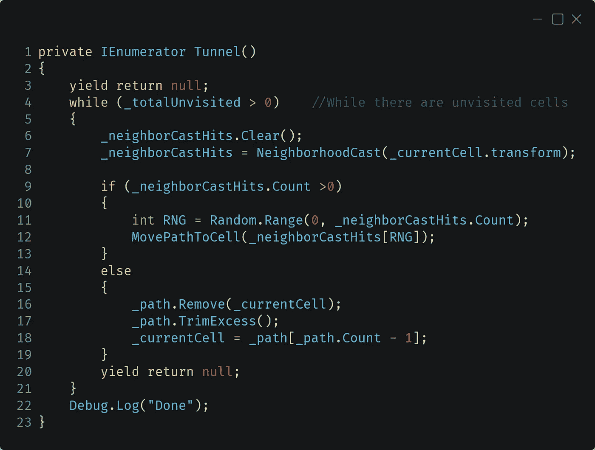
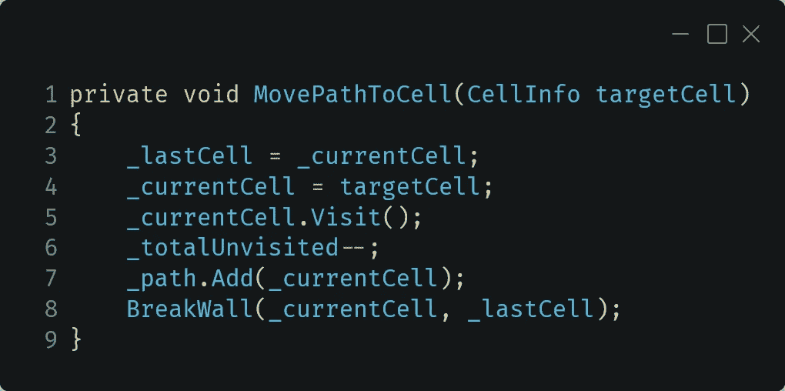
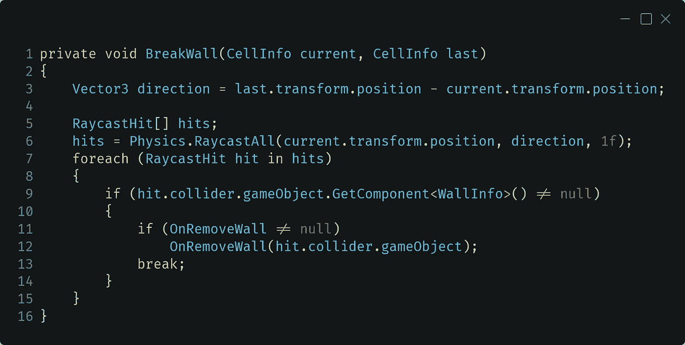
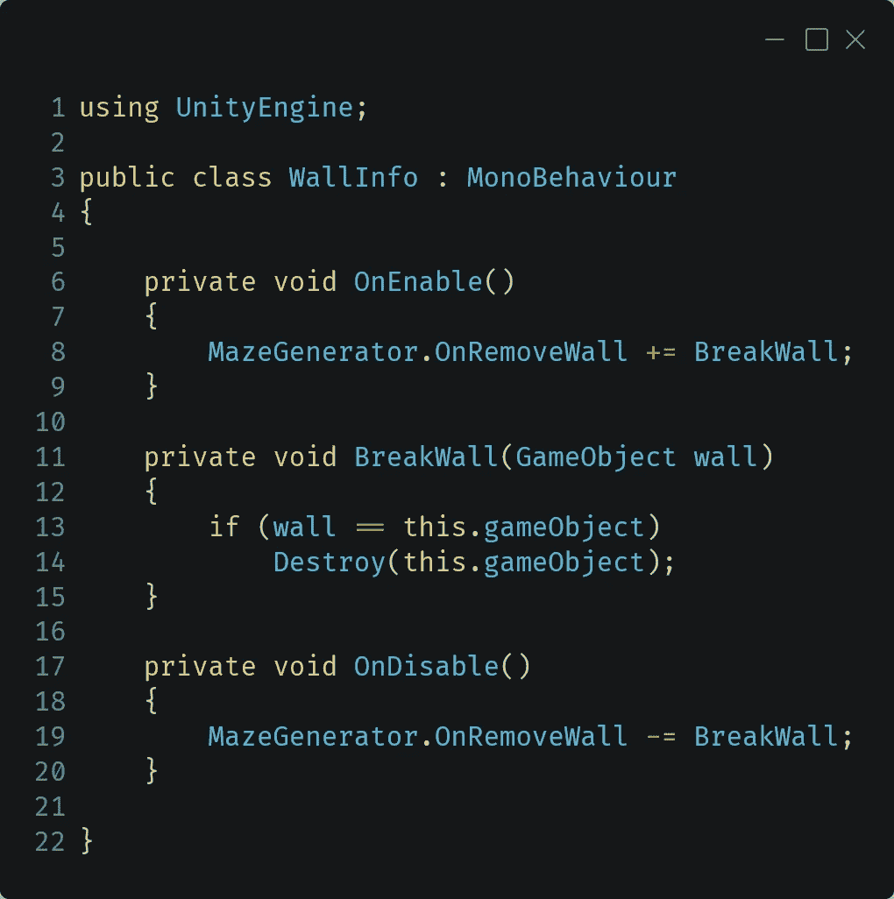
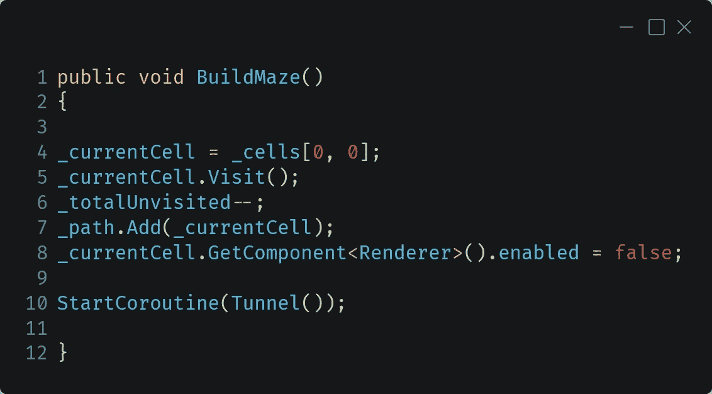
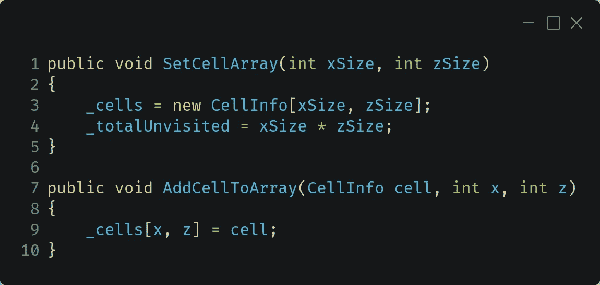

# 迷宫一代:挖开墙壁

> 原文：<https://medium.com/nerd-for-tech/maze-generation-digging-out-the-walls-3b201ee00aa9?source=collection_archive---------11----------------------->

因此，我们有一个细胞网格，只需“挖掘”出迷宫。首先，让我们牢牢把握算法在做什么。

正如你在上面看到的，算法的“头”在一个随机的方向上向前移动了一步。它继续向前移动，直到不能再移动为止。在这一点上，它开始沿着它的路径往回移动，直到它到达一个点，它可以移动到一个细胞，而不是沿着它的路径。这种方法保证每个单元都被访问。但一个潜在的不利方面是，我们最终会有没有重叠路径的长路径。只有一种方法可以解决这种类型的迷宫。

让我们回顾一下我们的代码需要什么。我们需要当前路径中的单元格列表(上面的红色)，并且我们需要能够检查 a 是否已经被访问过。

这里我们可以使用一个小类来跟踪细胞信息。通过将它附加到我们的单元(立方体)预设，它将跟踪它是否被访问过。另外，当它被访问时，我们可以关闭渲染器组件。

现在转到迷宫生成类，让我们分成几个步骤。首先我们必须检查一个单元是否被访问过。有几种方法可以处理这个问题，但是这次我将会使用碰撞器和光线投射。

在这个方法中，我们使用当前单元作为光线投射的原点和一个特定的方向。使用 Raycast 和 RaycastAll 的区别在于，RaycastAll 会给你一组光线经过的所有碰撞器，而不仅仅是第一个。

然后我们使用 Foreach 遍历结果，结果应该是两个单元格和一面墙。通过使用 TryGetComponent，我们可以在不获得空引用的情况下消除墙，同时还可以获得对 Cell Info 类的引用来测试 _visited Bool。

通过将它设置为方法的返回类型而不是 void，我们使得该方法可以在其他情况下使用。

现在我们可以使用 VisitCheck()来检查当前单元格周围的每个方向。我们要让这个方法返回一个未被访问的单元格列表，所以首先我们要初始化一个将要使用的新列表。然后我们可以通过调用每个方向的 VistCheck()来添加到列表中。第 10 行是清除列表中的空值。RemoveAll 将根据条件检查列表中的每一项，并删除任何匹配项。这里我们使用了一个 Lambda 表达式，它解释为“如果 item 为空，则将其设置为移除”RemoveAll 还会在遍历列表时压缩列表，不在列表中留下任何空隙，如果您想遍历列表，这一点很重要。

现在我们开始讨论代代码的内容。这里我们有一个协程，当有不存在的单元时它将运行。我试图给我的变量起一个不言自明的名字，这样我们就可以轻松地浏览代码。

在调用 NeighborhoodCast()重新填充列表之前，我们要做的第一件事是清除前一个单元留下的邻居列表。然后，如果列表不为空，我们选择一个随机的单元格并用 MovePathToCell()移动到它。如果它是空的，这意味着我们已经进入了死胡同，必须开始沿着我们的道路往回走。从路径列表中删除当前单元格后，我们修剪列表以删除留下的任何空值，并使列表中新的最后一个单元格成为当前单元格。这将重复进行，直到我们到达有可用邻居可以移入的小区。

MovePathToCell()大多是简单的“纸上作业”。我们将当前单元格设为 _lastCell，并将要移动到的单元格指定为 _currentCell。我们在新的当前单元格上调用 Visit()将它标记为已访问。我们减少未存在的计数，并将当前单元添加到我们的路径中。然后我们处理两个细胞之间的墙。

当我们想要移除一面墙时，我们调用 BreakWall()来执行一些简单的 3D 数学运算，以获得从一个单元格到另一个单元格的行进方向。然后，它使用 VisitCheck()中使用的相同样式的 RaycastAll。这次它检查 WallInfo 类。当它找到它时，有一个事件触发发送墙的 ID。

查看 WallInfo，我们可以看到它订阅了刚刚由迷宫生成器 BreakWall()触发的事件。当墙上的类获得事件触发器时，它会对照目标墙检查自身。如果匹配，它就自我毁灭。如果我们在一个游戏中做一个迷宫，我们可以用这种方法用另一个模型来代替墙，也许是一个拱门或一扇门。但对于这个“原型”版本，我们将简单地摧毁它。

你可能会问，这很简单。我上一篇文章中的 GridGenerator 类调用 BuildMaze()。

我们从修改后的 MovePathToCell()代码开始，为路径设置第一个单元格。在这里，我硬编码为从 0，0 开始，但这可以很容易地设置为网格中的任何位置。然后我们启动 Tunnel()协程。

加上一个可以持续的补充，我们可以称之为完整。

首先，让我们创建两个公共方法来设置主单元数组并向其中添加单元。

我们可以在 GridGenerator 的 Start()中调用 SetCellArray()。然后我们可以在实例化每个单元格时调用 AddCellToArray。

现在你必须把所有的部分组合起来，为你的下一个游戏或应用程序制作一个简单的迷宫生成器。