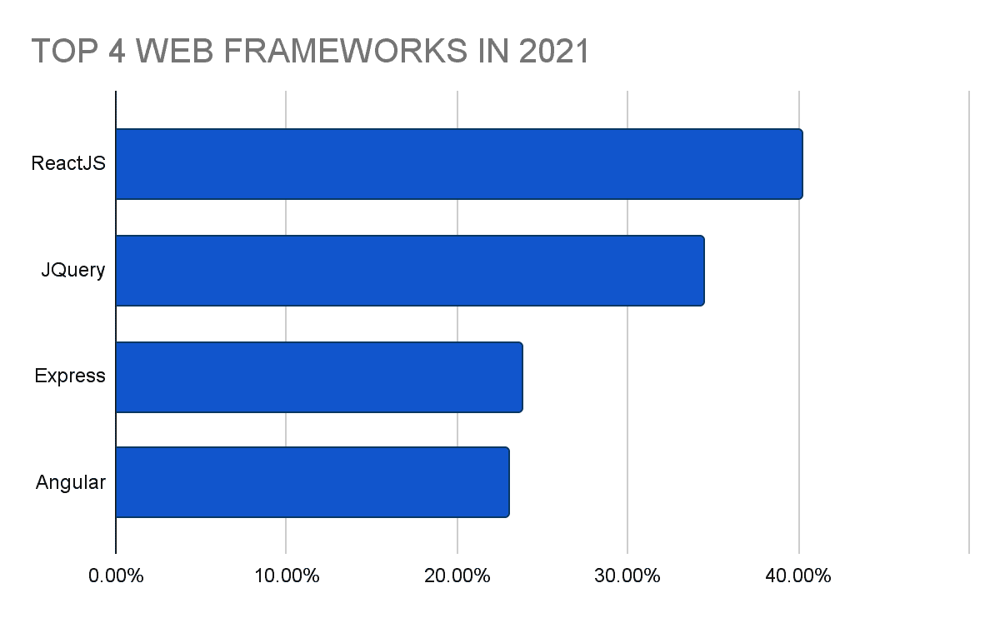
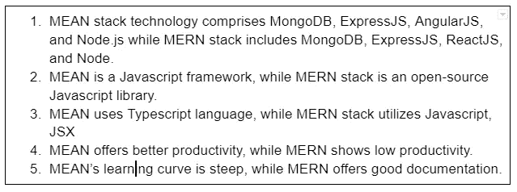
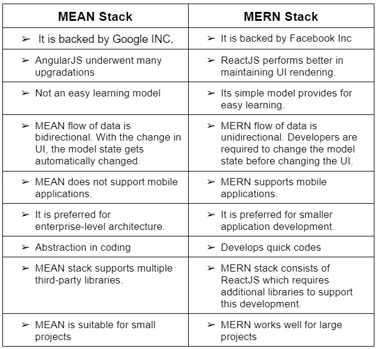

# 意思是还是 MERN？哪种堆栈适合您的企业？

> 原文：<https://medium.com/nerd-for-tech/mean-or-mern-which-stack-suits-your-business-a1bb07ceadbb?source=collection_archive---------4----------------------->

## 均值和 MERN 的主要区别。找到更好的筹码

用户应该是网站或应用程序开发过程的焦点。只有这样，界面的预期目标才能实现。随着数字世界的转型和升级呈指数级增长，选择合适的技术对专家或公司来说变得越来越具有挑战性。因此，工作不仅仅是开发一个网站或应用程序，而是通过利用满足各自 UI 目标的可行堆栈技术来做同样的事情。无论你是想雇佣 MEAN 或 [**MERN 栈开发人员**](https://www.suntecindia.com/hire-mern-stack-developers.html) 还是从事 web 应用开发服务，了解这些技术及其区别对于做出明智的选择至关重要。

# **什么是平均堆栈开发**

这项技术的名字来源于相关的组件，即 MongoDB、ExpressJS、AngularJS 和 Node.js。

它是一个全栈开源 javascript 框架，提供了一个快速简单的开发网站和应用程序的过程。它广泛的内置测试工具可以帮助开发人员随时检查接口。

## 平均堆栈技术的包容性组件的作用:

*   **MongoDB**

DB 代表数据库，这个组件以 JSON 文件的形式存储后端应用数据。在 AngularJS 前端创建的 JSON 文档被传输到 ExpressJSserver，然后存储在 MongoDB 中

*   **ExpressJS**

它是一个 javascript 后端应用程序组件，引导 Node.js 命令。这是 Node.js 的快速简约 web 框架。ExpressJS 使用强大的模型进行 URL 路由和管理 HTTPS 响应。

*   **角度**

该组件的功能是作为前端框架在浏览器中运行代码。

这是平均堆栈的主要技术。它允许你用元数据扩展你的 HTML 标签，产生一个动态的和强有力的交互的网络体验。

*   **Node.js**

这个组件工作在后端 web 应用程序上，为 javascript 提供了一个运行时系统。

# **MEAN Stack 如何让你的界面受益**

这个 [**的意思是栈开发服务**](https://www.suntecindia.com/mean-stack-development-Services.html) 使用该技术的架构用 javascript 构建 web 应用。它提供了非常简单的 JSON 处理。

由于这种技术只使用 javascript 编码，新手可以利用它来探索和学习。它的综合功能提供了快速和容易的开发，也是投资较少。利用其各种支持库和可重用模块，开发人员可以轻松地交付可扩展的最小可行产品。

*   MongoDB 在模式设计方面更加灵活。
*   Angular 的模块化结构允许您将整个应用程序分离成独有的功能。
*   Angular 便于惰性加载。AngularJS 开发的 web 应用程序将根据用户的数据请求优先加载。它将首先显示请求的数据，而不是加载整个数据页面。
*   Angular 中的应用程序开发因命令行界面(CLI)而变得简单。
*   Ivy 渲染器最小化了包的大小，使得大型应用程序变得更轻。
*   Typescript 允许开发人员随时发现并纠正错误。

MEAN 有助于创建云托管应用程序，因为它是一个开源的 web 堆栈。这些方法非常适合云托管，因为它们灵活、可扩展、可伸缩。

有了 MEAN，你不需要 [**雇佣专家来分段开发应用**](https://www.suntecindia.com/hire-mobile-app-developers.html) ，而是一个单独的 javascript 开发者池就能完成这项工作。内置的测试功能有助于随时审核应用程序。

# **为什么要雇佣一个平庸的堆栈开发者**

雇佣一个 [**意味着栈开发者**](https://www.suntecindia.com/hire-mean-stack-developers.html) 可以提供一个快速的 web 或移动应用开发过程。以下是一些好处:

> 他们利用 MVC 架构来帮助平滑开发过程。
> 
> MongoDB 和 ExpressJS 用于后端流程，而 AngularJS 和 Node.js 是前端开发的主要技术。
> 
> 启用有用的插件，节省系统管理时间。

来源:([https://www . statista . com/statistics/1124699/world wide-developer-survey-most-used-frameworks-web/](https://www.google.com/url?q=https://www.statista.com/statistics/1124699/worldwide-developer-survey-most-used-frameworks-web/&sa=D&source=docs&ust=1655356404515893&usg=AOvVaw0mbdqIFBWZdaYVKQ0_PutQ))

# **什么是 MERN 堆栈开发**

术语 MERN 源自该技术的组件——MongoDB、ExpressJS、ReactJS 和 Node.js

## MERN 堆栈技术的包容性组件的作用是:

*   **MongoDB**

它用于存储后端应用程序。它是非表格数据库，存储数据的方式不同于关系表。这是一个文件类型的 NoSQL 数据库。它在均值和 MERN 堆栈中的工作方式相似。

*   **ExpressJS**

它是建立在 Node.js 之上的分层框架，负责处理网站的后端功能和结构。它的功能与均值堆栈类似。

*   **反应堆**

它是一个帮助创建用户界面特性的库，尤其是对于单页 web 应用程序。它是 MERN 发展计划的主要组成部分。声明式 javascript 框架创建动态前端应用程序。它有助于创建复杂的接口，使用简单的元素将它们连接到我们后端服务器上的数据。

*   **Node.js**

它的功能是方便在机器上运行 JavaScript。类似于均值堆栈。

# **MERN 堆栈如何让你的界面受益**

MERN 堆栈涵盖了从前端开发到后端开发的所有内容。它支持现代视图控制器。

MERN 的 javascript 需要 JSON 和编码方面的专家开发者。它还要求兼容 Mongo、Express、React 和 Node 的组件技术。

MERN 堆栈中的框架是开源的，它还带有内置的测试工具。

开发人员使用 MERN 堆栈技术来创建高级网页。它利用库、数据库和框架来开发所需的接口。

MERN 堆栈的主要好处之一是它提供了平滑的开发过程。

使用 ReactJS 代替 AngularJS 使得开发变得快速和容易。让 ReactJS 成为前端 web 开发的更好选择。

# **为什么要雇佣一个 MERN 堆栈开发者**

MERN 开发人员可以利用该技术，使用标准流程和工作高效地构建 web 和移动应用程序。

## MERN 堆栈开发人员可以为您带来以下好处:

> 他们的各种技术专长可以轻松应用创造性的设计。
> 
> 他们在最短的时间内提供全面的发展。
> 
> 用户体验是开发过程的核心，临时解决方案被集成来实现这一目标。
> 
> 他们能够提供高度可扩展的云集成。

# **MERN 堆栈技术之间的 5 个主要差异&**

虽然 MEAN stack 使用 AngularJS，但 MERN stack 使用 ReactJS，这给用户体验带来了巨大的差异。相对于项目的客观性，大多数网站开发人员的选择是基于参与 AngularJS 或 ReactJS 的需要。

然而，均值和 MERN 堆栈之间的其他主要区别是:

# **均值 vs MERN:差异的操作效果**

## **性能哪个好？**

在 MEAN stack 的情况下，AngularJS 的当前版本比早期版本更稳定，保持了更好的文件抽象和维护。而在 MERN 堆栈中，ReactJS 的性能要好得多，因为用它开发代码更快。

## **谁提供了更好的结构？**

在 MERN 堆栈中，UI 渲染很容易，因为它的行为就像一个库。MEAN 由一个更有组织的框架组成，其中数据库和 UI 代码通过中间层隔离。这就是为什么对于企业级架构，MEAN 成为首选，因为它提供了代码的轻松升级。

## 谁提供第三方库集成？

开发人员在构建大型应用程序时利用多个第三方库来满足各种目的。在这种情况下，平均堆栈的角度。JS 特性更加方便。的反应。MERN 堆栈的 JS 组件需要额外的函数库。

## **谁提供了更好的数据流？**

平均堆栈的数据流是双向的，而 MERN 堆栈的数据流是单向的。双向数据流对于小型项目来说是一个方便的选择。MERN 堆栈的单向流程为大型项目提供了更好的管理。

## **谁更划算？**

根据项目的可行性，框架的盈利能力可能会改变。如果这是一个小规模的开发项目，聘请有经验的 MERN 堆栈开发人员会被证明是昂贵的。但这将是一个更好的可扩展选项。MEAN stack 的 AngularJS 是有益的，因为它提供了一个 CLI，并由一个完整的结构组成。它提供了快速简单的代码重写。

## **哪个更容易考？**

棱角分明。平均来说，JS 应用程序可以用一个工具来测试，比如 Jasmine。要测试 MERN 堆栈应用程序，因为它们涉及多个库，仅仅一个工具是不够的。使用多种工具来测试 React。JS，像 Jest 做编码，Enzyme 做元素测试。

## **哪个更安全、更高效？**

MERN 堆栈具有更好的可扩展性。这也使它成为一个更安全的选择。尽管如此，当涉及到生产力，意味着更升级。它使用 Angular CLI，为开发人员带来了更高的工作效率。而 MERN 的第三方库使升级变得困难。

# **总结**

由于 MEAN 和 MERN Stack 都提供高级 web 应用程序开发，只有通过对最终用户的了解才能在这两者之间做出选择。微分分量，即角度分量。JS 和 React。JS 都致力于组织 UI 层元素。

根据项目需求、可伸缩性和用户体验来审查这些框架的能力，可以帮助您确定合适的技术。

使用一个 [**web 应用开发服务**](https://www.suntecindia.com/web-application-development-services.html) 可以帮助你在研究预期输出后选择最佳框架。

> *因此，如果您有任何想法，想要实现技术、特性和功能的正确融合，那么您可以* [**联系我们**](https://www.suntecindia.com/contactus.htm) *或提出疑问。*