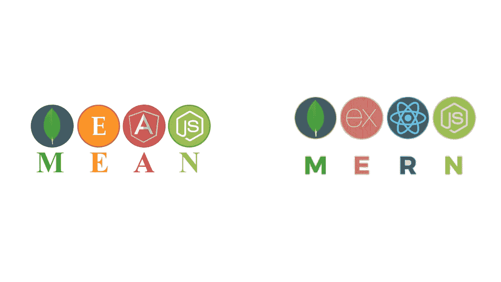

# 平均叠加与 MERN 叠加的比较

> 原文：<https://medium.com/nerd-for-tech/mean-stack-vs-mern-stack-a-comparison-44fb9767cb4d?source=collection_archive---------18----------------------->

平均堆栈与 MERN 堆栈

技术栈是一组编程语言、技术和框架。技术栈确保了一个集成的和不间断的开发过程，为任何项目增加了完美的平衡和灵活性。

在早期，不同的开发人员开发 CSS、HTML 或 JavaScript。但是现在，一个全栈开发人员可以处理一切，包括前端，后端，数据库到用户界面的工具和软件产品的完美结合。

在 web 开发中，全栈开发正迅速成为规范。现在，什么是全栈开发？它为前端、后端、测试和移动应用提供了理想的解决方案。全栈开发人员能够处理任何 web 项目的整个设计结构。

web 开发中的术语“栈”是在 LAMP stack 开始时出现的，LAMP stack 是最早的开源全栈开发包，包含 Linux OS、MySQL DB、PHP 编程语言和 Apache 服务器的功能。灯栈之后出现了均值和 MERN 栈。

这是两个要求很高的技术栈，它们保证了任何软件项目的健壮、活跃和熟练的实现。

为 web 或移动应用程序开发项目选择全面的技术堆栈通常会导致在均值堆栈和 MERN 堆栈之间做出选择。

# 比较来了:平均堆栈与 MERN 堆栈

**平均堆栈**

MEAN 表示全栈 JavaScript 框架，旨在开发复杂的网站和 web 应用程序。

MEAN 是 MongoDB、Express、Angular 和 Node.js 四种技术的缩写——它是由。它为移动和 web 应用程序开发带来了最强大的工具，使事情变得更加简单和快速，最终使其成为企业的首选，搜索使用多个插件的技术堆栈，并减少系统管理所需的时间。

**MERN 栈**

此外，MERN 是开源技术栈，结合了 MongoDB、Express、React 和 Node.js 这些基于 JavaScript 的框架。这一首选技术组合有助于为 web 开发构建一个高效的端到端框架，有助于更快、更简单地开发 web 和移动应用。

## 解释平均堆栈与 MERN 堆栈

均值叠加和 MERN 叠加有相似之处，因为它们有四分之三的成分相似。

MongoDB 是 NoSQL 文档数据库，用于以 JSON 格式存储数据，允许多种云数据分布。这个是安全的。通过这种方式，数据可视化、操作和共享变得更加简单。

Express 是开源后端 web 应用程序的框架。在 Node.js 上使用，为了更快的构建 web 应用，最好使用 Express，它的特点是高效、灵活、简洁。对于一组健壮特性的开发，它是高度可信的。

Node.js 可以定义为在浏览器外运行代码的 JavaScript 开源运行时环境。Node.js 开发者可以通过一台服务器处理多个连接。它的异步事件驱动特性确保了出色的性能。

平均堆栈和 MERN 堆栈之间的关键区别在于这些堆栈在前端应用的技术。MEAN stack 使用全面的 Angular platform，而 MERN stack 使用 React 与其他库相结合。

Angular 是开源的 web 应用框架，由 Google 开发的 TypeScript 支持。它可以轻松地在用户浏览器中运行代码来创建 UI 组件。

开源 JavaScript 库 React 是由脸书创建的。它有助于构建移动应用程序或单页应用程序的用户界面。

这两个堆栈组件都提供了更好地实现任何 web 项目所需的多种功能。

看看平均堆栈和 MERN 堆栈的各种优势，人们可以更好地探索哪一个将更适合于构建任何软件应用程序的能力和效率。

**意思是栈**

这个技术栈由 MongoDB、Angular、Express 和 Node js 组成。

一个 javascript 框架。

数据的双向流动。

不支持移动应用。

管理和呈现代码变得更加容易。

陡峭的学习曲线。

**MERN 栈**

这个技术栈由 MongoDB、React、Express 和 Node js 组成。

一个开源的 js 库。

数据的单向流动。

支持移动应用。

毫不费力地渲染。

更好的文件保证。

## **均值叠加与 MERN 叠加—如何选择一个**

使用 MEAN stack 的关键之处在于整个代码都是由 JavaScript 构成的。因此，进一步探索和开发变得更加容易。最重要的是，统一产品大大降低了项目成本和开发时间。

理想情况下，对于更重要的 web 项目，MEAN stack 是全栈开发框架的更好选择。

另一方面，MERN 堆栈从头到尾都有助于构建利基项目和设置 CRUD 应用程序。React 的使用使管理快速变化的数据变得更容易，提供了一个很好的用户界面。