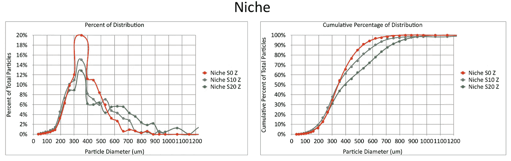
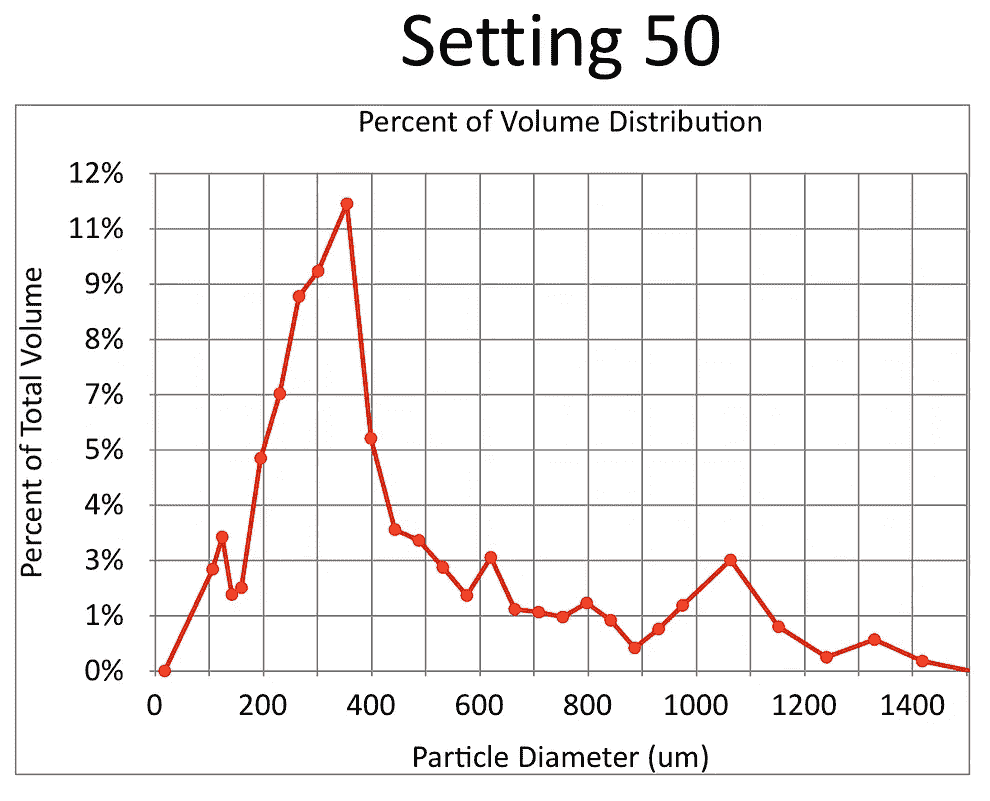
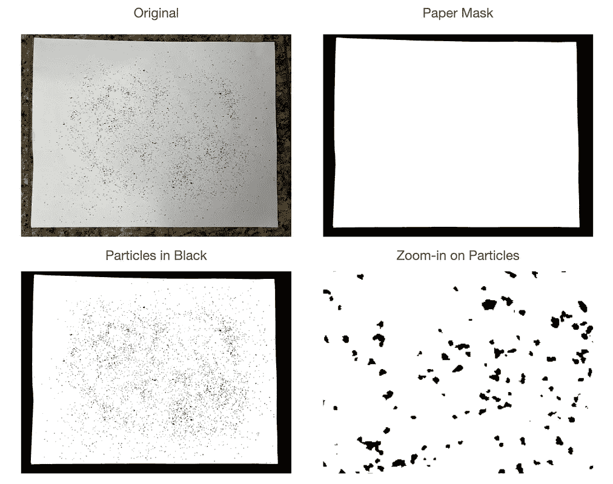

# 测量咖啡研磨分布

> 原文：<https://medium.com/nerd-for-tech/measuring-coffee-grind-distribution-d37a39ffc215?source=collection_archive---------17----------------------->

## 了解咖啡研磨机的冒险

这是一个关于使用图像处理技术测量咖啡研磨分布的文章集。

[使用图像处理测量咖啡研磨颗粒分布](https://towardsdatascience.com/measuring-coffee-grind-particle-distribution-using-image-processing-84882e6dd4fd?source=your_stories_page-------------------------------------)

[使用筛子改进咖啡研磨测量](https://towardsdatascience.com/improving-coffee-grind-measurement-using-a-sifter-7b358f9c8331?source=your_stories_page-------------------------------------)

[使用先进的图像处理技术测量咖啡渣中的粉末](https://towardsdatascience.com/measuring-fines-in-coffee-grounds-using-advanced-image-processing-148f048bdb7?source=your_stories_page-------------------------------------)

[使用自适应阈值改善咖啡研磨分布](https://towardsdatascience.com/improving-coffee-grind-distribution-using-adaptive-thresholds-194e001f301?source=your_stories_page-------------------------------------)

[拍摄咖啡渣进行研磨分布分析](/nerd-for-tech/photographing-coffee-grounds-for-grind-distribution-analysis-d3494e980c28)

[建模咖啡研磨机](https://towardsdatascience.com/modeling-coffee-gringers-afb7c4949d6b?source=your_stories_page-------------------------------------)

如果你愿意，可以在推特[和 YouTube](https://mobile.twitter.com/espressofun?source=post_page---------------------------)[上关注我，我会在那里发布不同机器上的浓缩咖啡照片和浓缩咖啡相关的视频。也可以在](https://m.youtube.com/channel/UClgcmAtBMTmVVGANjtntXTw?source=post_page---------------------------) [LinkedIn](https://www.linkedin.com/in/robert-mckeon-aloe-01581595?source=post_page---------------------------) 上找到我。也可以在[中](https://towardsdatascience.com/@rmckeon/follow)关注我。

# 我的进一步阅读:

个人故事和关注点

[乐高故事启动页面](https://rmckeon.medium.com/lego-story-splash-page-b91ba4f56bc7?source=your_stories_page-------------------------------------)

[浓缩咖啡系列文章](https://rmckeon.medium.com/a-collection-of-espresso-articles-de8a3abf9917?source=your_stories_page-------------------------------------)

[改善浓缩咖啡启动页面](https://rmckeon.medium.com/improving-espresso-splash-page-576c70e64d0d?source=your_stories_page-------------------------------------)

[咖啡萃取飞溅页面](https://rmckeon.medium.com/coffee-extraction-splash-page-3e568df003ac?source=your_stories_page-------------------------------------)

[咖啡烘焙飞溅页面](https://rmckeon.medium.com/coffee-roasting-splash-page-780b0c3242ea?source=your_stories_page-------------------------------------)

[咖啡豆飞溅页面](https://rmckeon.medium.com/coffee-beans-splash-page-e52e1993274f?source=your_stories_page-------------------------------------)

[Espresso Splash 页面的纸质过滤器](https://rmckeon.medium.com/paper-filters-for-espresso-splash-page-f55fc553e98?source=your_stories_page-------------------------------------)

[意式咖啡篮和相关主题启动页面](https://rmckeon.medium.com/espresso-baskets-and-related-topics-splash-page-ff10f690a738?source=your_stories_page-------------------------------------)

[意式咖啡意见飞溅页面](https://rmckeon.medium.com/espresso-opinions-splash-page-5a89856d74da?source=your_stories_page-------------------------------------)

[透明 Portafilter 实验启动页面](https://rmckeon.medium.com/transparent-portafilter-experiments-splash-page-8fd3ae3a286d?source=your_stories_page-------------------------------------)

[杠杆机维护启动页面](https://rmckeon.medium.com/lever-machine-maintenance-splash-page-72c1e3102ff?source=your_stories_page-------------------------------------)

[咖啡评论和感想飞溅页](https://rmckeon.medium.com/coffee-reviews-and-thoughts-splash-page-ca6840eb04f7?source=your_stories_page-------------------------------------)

[咖啡实验飞溅页面](https://rmckeon.medium.com/coffee-experiments-splash-page-671a77ba4d42?source=your_stories_page-------------------------------------)