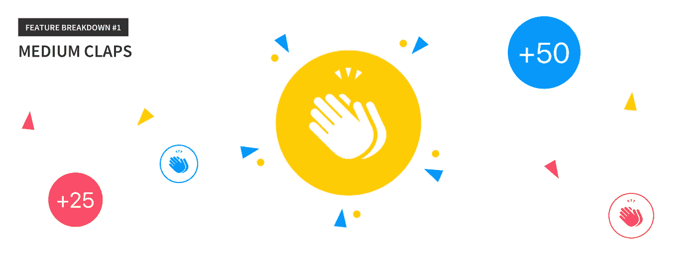
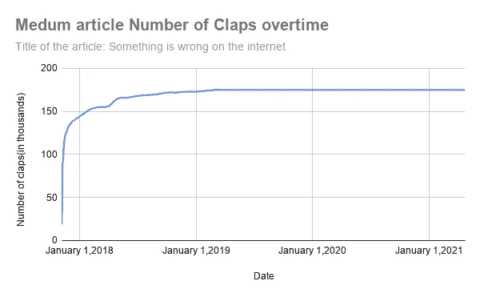
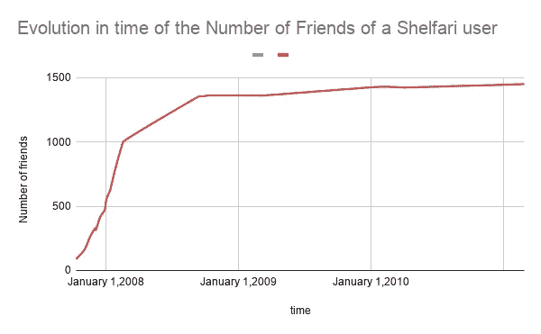
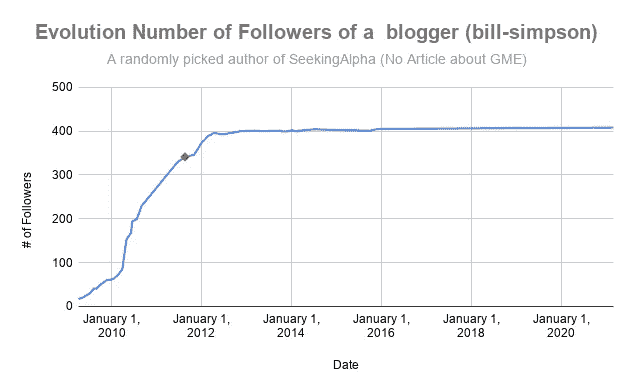
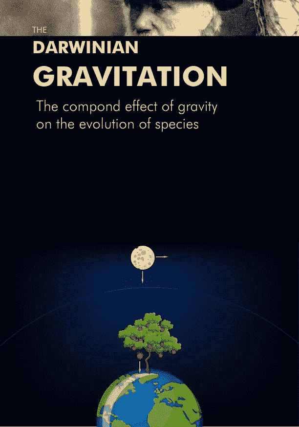

# 媒体文章拍超时和网络效应

> 原文：<https://medium.com/nerd-for-tech/medium-article-claps-overtime-and-network-effect-998c172de4b6?source=collection_archive---------18----------------------->

媒体文章拍超时

因为监测网络效应对那些想把想法、产品或服务传递给他人的人来说是有意义的，所以我研究这种效应多年，直到现在，就像《纽约时报》的文章如何帮助 Jonas Berger 研究这种效应一样，我认为媒体文章也可以告诉我们想法是如何传播的。

在媒体上写作可能不是为了获得更多的掌声，但每个作家都需要曝光率，而曝光率的增加有助于获得更多曝光率，因为推荐效应和证实泡沫，这是我也在研究的互联网的另外两种效应，它们在更快更广泛地传播思想方面起了很大作用。推荐引擎，因为很明显谁知道推荐在互联网上是如何工作的，一篇文章获得的掌声越多，推荐引擎就向其他读者推荐它，而这篇文章被推荐给其他人的事实为它提供了越来越多的掌声，推荐引擎不断给这篇文章评分越来越高，并向越来越多的人推荐它。这种推荐引擎的效果就像过滤引擎的效果一样，会带来一些问题，就像伊莱·帕里泽在《过滤泡沫》一书中强调的那样，你可以在这里看到他关于泡沫效应的 ted 演讲[和我关于泡沫效应的短文](https://www.ted.com/talks/eli_pariser_beware_online_filter_bubbles)[这里](https://mkrdiop.medium.com/tail-of-the-long-tail-curve-business-model-theory-572ac82073a5)。

在这个例子中，所讨论的介质物品是这个物品

[https://medium . com/@ James bridle/something-is-miss-on-the-internet-c39c 471271d 2](/@jamesbridle/something-is-wrong-on-the-internet-c39c471271d2)

你可以清楚地看到，就掌声而言，一篇文章是成功的，这种成功将会消退，我们可以明确地说，除非一个有趣的随机效应，使文章的主题成为潮流，或者作家或 SEO 骗子的一些增长技巧有点疯狂，相信在一篇文章发表一年后获得更多的掌声，因为这篇文章将被推荐引擎视为过时，并将深入黑暗的互联网。但是就像我正在写的这篇已经被蒙在鼓里的文章一样，你可以期待这篇文章的曝光会再次引起轰动。

有趣的是，动力系统的相似性，主要是一阶动力系统，也适用于一篇中等文章的鼓掌次数，就像我在上一篇文章中说的那样，我没有找到它，以便给你链接。但我可以在其他主题中找到一些关于这种相似性的图表，比如社交媒体用户的朋友数量演变，主要是图书社交媒体用户，在这种情况下，shelfari 已被亚马逊收购。

以及一位金融分析师在股票和期权投资平台 SeekingAlpha 上的追随者数量。

你可以在所有这些图表中清楚地看到相同的模式，这表明一些系统性的事情正在后台发生。正是这种系统的行为，我学会了监测和学习网络效应与战术，以优化他们。收集数据、分析数据并从中学习花费了大量的时间和精力，也阅读和聆听了许多专家关于网络效应和病毒式传播的话题，但你值得付出努力。

PS:我用我在数据科学、软件工程和网络效应方面的所有努力和技能写了一篇 Gamestop 剖析股票空头泡沫的文章[这里](http://clickmetertracking.com/nglj)

《Gamestop 剖析股票空头泡沫》一书

并且在写作这些数据驱动的书籍的过程中，为了知识共享和贡献。

达尔文的心

达尔文的引力