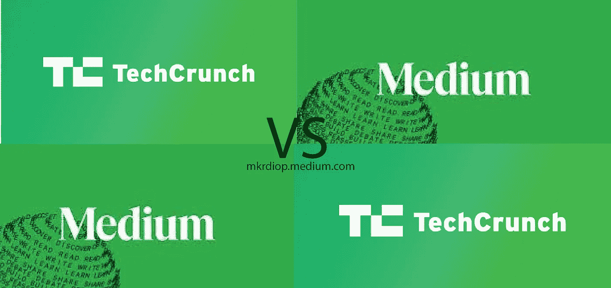
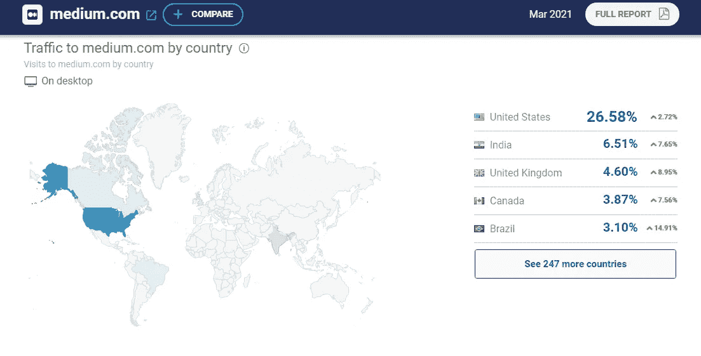
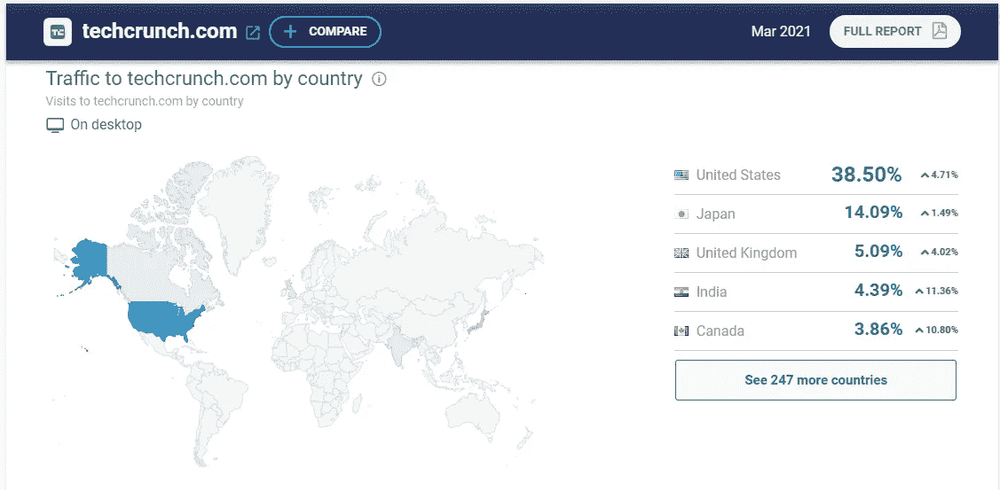
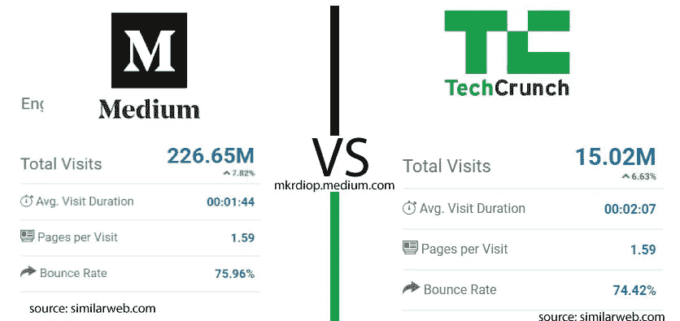

# Medium VS Techcrunch

> 原文：<https://medium.com/nerd-for-tech/medium-vs-techcrunch-1af2d7bf759c?source=collection_archive---------21----------------------->

Medium VS Techcrunch

尽管它们是出版公司，TechCrunch 和 Medium 当然是不同的。Techcrunch 是一家专注于风险投资和创业信息的出版公司，由精选人员组成的编辑团队撰写文章供我们阅读，而 Medium 是一个出版平台，允许每个人撰写文章并发表它们，并通过 Medium Partner 计划从这些文章中获得收入，这在我现在居住的非洲还没有出现。除此之外，你可以从下面的截图中看到一些有趣的不同之处。

国家媒体的传播

出人意料的是，它们在地理上拥有相同的受众，只有一点不同日本是 TechCrunch 的受众，巴西是 Medium 的受众。

这两个平台有不同的受众，因为 Techcrunch 有一个对特定主题感兴趣的更狭窄和特定的受众，而 Medium 的目标受众是对另一个平台发布的任何有趣内容感兴趣的受众。但为什么 Medium 在日本几乎没有，而 Techcrunch 却有？为什么 Medium 在巴西有业务，而 Techcrun 没有？

这是 TechCrunch 的数据，日本占了 14%的访问量，甚至超过了英国

**每次访问的页面也值得注意**

中型与 Techcrunch 指标

[TechCrunch](https://techcrunch.com/) 的访问时长和跳出率高于 Medium，但 [Medium](https://mkrdiop.medium.com/) 的访问量是 TechCrunch 的 10 倍，但有趣的是，它们的每次访问平均页数相同。我觉得这是一个线索，开始思考这个问题。除了我发布这些发布平台的指标之外，有些想法但没有线索**但是在这里找到的谷歌分析脚本呢？**