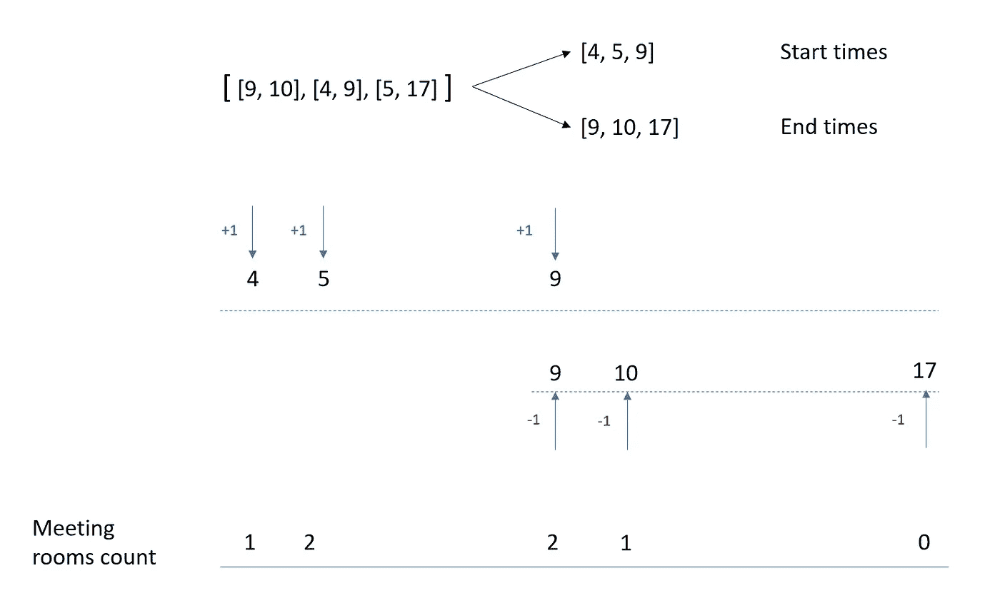
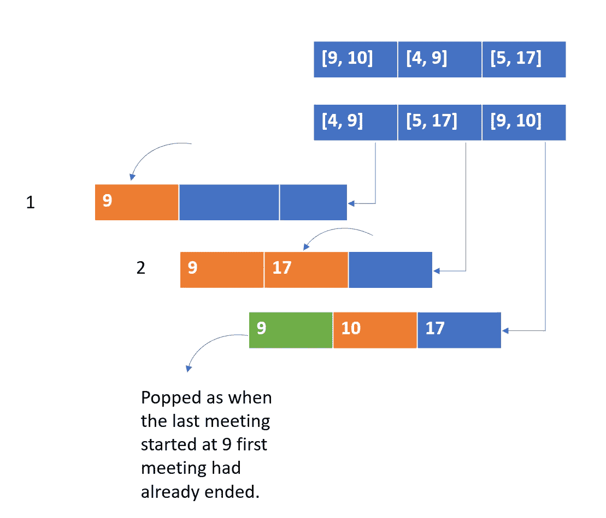

# 会议室——亚马逊面试问题

> 原文：<https://medium.com/nerd-for-tech/meeting-room-amazon-interview-problem-72609de8d776?source=collection_archive---------2----------------------->


[本杰明·蔡尔德](https://unsplash.com/@bchild311?utm_source=unsplash&utm_medium=referral&utm_content=creditCopyText)在 [Unsplash](https://unsplash.com/s/photos/meeting?utm_source=unsplash&utm_medium=referral&utm_content=creditCopyText) 上的照片

在这篇博客中，我们将讨论一个中等标签的问题。这个问题在亚马逊和脸书的采访中经常被问到。

## 253。第二会议室

给定一组会议时间间隔`intervals`，其中`intervals[i] = [starti, endi]`，返回*所需会议室的最小数量*。

示例:

```
**Input:** intervals = [[9,10],[4,9],[5,17]]
**Output:** 2
```

## 方法:

我们需要找出有多少同时发生的会议。一旦我们有了这些信息，我们就可以找到所需会议室的数量。要找到任何给定时间的并发会议，我们需要知道有多少会议的开始和结束时间。

我们可以采用一种强力方法，从最小开始时间开始，一直到最大结束时间，然后检查哪个时间能让我们同时召开最多的会议。

为了改进蛮力方法，我们可以做的不是一直这样做，而是只对接触点计时，即开始和结束。我们知道，只有当另一个会议开始，并且已经有一个会议开始但尚未结束时，会议之间才会发生重叠。因此，如果我们遇到两个连续的开始时间，这意味着我们在那个时候需要两个会议室。当我们遇到结束时间时，这表明我们已经结束了会议，我们不需要那个会议室。



## 代码实现:

```
def minMeetingRooms(intervals):
    starts = sorted([interval[0] for interval in intervals])
    ends = sorted([interval[1] for interval in intervals])
    meet_count, cur_count = 0, 0
    s_ptr, e_ptr = 0, 0
    while s_ptr < len(intervals):
        if starts[s] < ends[e]:
            s_ptr += 1
            cur_count += 1
        else:
            e_ptr += 1
            cur_count -= 1
        meet_count = max(meet_count, cur_count)
    return meet_count
```

**时间复杂度:** O(NlogN)进行排序。While 循环是 n 的一次传递。

**空间复杂度:** O(N)当我们在数组中存储开始和结束时间时

## 替代实施:

我们可以跟踪会议结束时间。每当我们看到一个会议的开始时间小于最小的会议结束时间，我们就增加计数。一旦我们到达比计划首先结束的会议的结束时间更长的开始时间，我们就删除该会议的结束时间，因为到那时会议已经结束了。我们一直这样做，直到我们达到最后的会议日程。为了跟踪会议结束时间并删除最早的结束时间，我们使用堆数据结构。因为在 min heap 中总是会弹出最小的元素，这里是第一个结束的会议。



```
from heapq import *
def minMeetingRooms( intervals):
    intervals.sort(key=lambda x: x[0])
    heap = []
    res = 0
    for interval in intervals:
        if len(heap)==0 or heap[0]>interval[0]:
            res += 1
        else:
            heappop(heap)
        heappush(heap, interval[1])
    return res
```

**时间复杂度:** O(NlogN)进行排序。While 循环是 n 的一次传递。

**空间复杂度:** O(N)当我们在数组中存储开始和结束时间时

快乐的编码！！