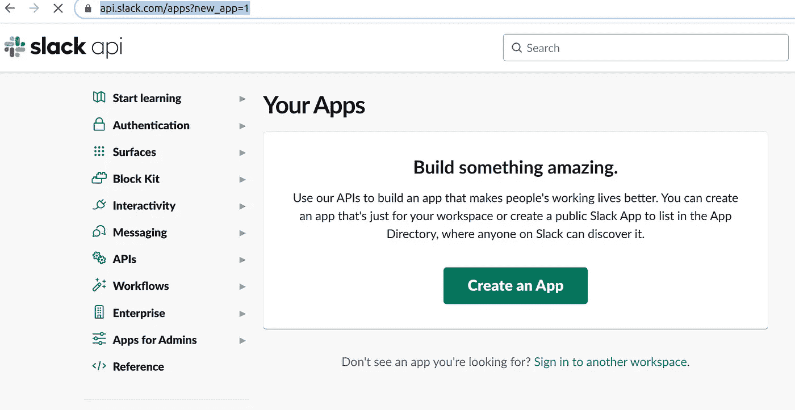
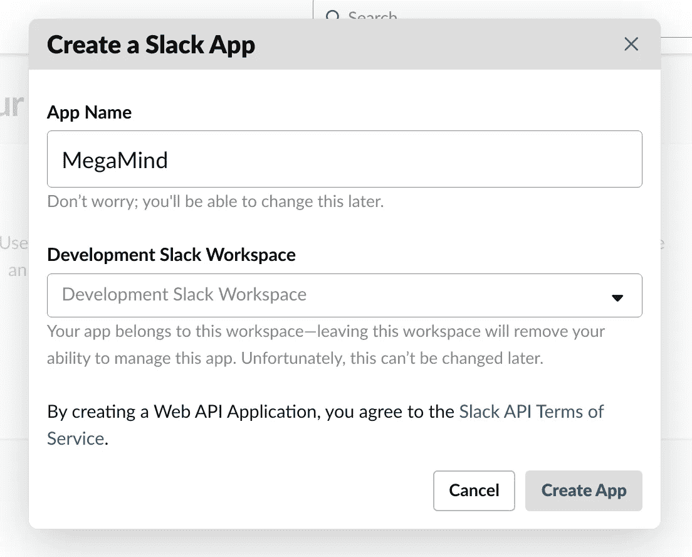

# 巨型机器人

> 原文：<https://medium.com/nerd-for-tech/megamind-the-slack-bot-bb03bfb0cd6d?source=collection_archive---------17----------------------->


哦！，我的大巨人蓝头！😛

当我作为 DevOps 工程师加入我的第一家公司时，每天都有许多手工任务要完成。因为我是新来的，所以花了一点时间来理解我们遵循的所有模式。

一旦我掌握了我的日常任务，我就开始记下所有重复的任务。除了 DevOps 工作，我们还担任产品支持工程师，因此为了检查用户的网站或应用程序问题，我们必须登录到我们的数据库，验证受影响用户的所有条目，并找到任何异常。过了一段时间，又出现了类似的问题，比如表中的某个条目丢失了，所以用户无法访问特定的页面。

现在，这可以在不实际登录数据库的情况下完成。所以我想让我们试试一个松弛机器人。

于是 **MegaMind** 诞生了！！(然后说——**:**也许我不想再做坏人了！)

让我们创建 SlackBot。

1.  前往 api.slack.com[创建一个新应用。](https://api.slack.com/apps?new_app=1)



2.给它起一个超级酷的名字，就像我们的小男孩 MegaMind。



3.选择您的工作空间并点击创建应用程序。创建完成后，从选项卡上的特性部分转到 OAuth & Permissions，为机器人提供一些权限，如 channel:read，chat:write，根据您的用例。

4.然后将 app 安装到您的工作区，复制生成的令牌- **Bot 用户 OAuth 令牌**。

5.然后打开 slack messages 部分，创建一个通道并使用@后跟 bot name 安装 bot。

6.现在，Python 代码—

我们将制作一个可插拔的架构，这样添加新功能就像编写新脚本一样简单，所有的集成都将在重启机器人时处理。

一、主目录名为 MegaMind
二。config dir —用于配置文件，如帮助命令中显示的列表、所有描述、数据库查询文件、字符串文字等。
三。lib dir —用于我们名为 megamind.py
iv 的驱动模块。插件目录—用于所有模块/功能脚本。
v. util 目录——用于将由多个功能脚本使用的所有实用程序文件，如 db_connection.py、get_users_profile.py、load_modules.py(从插件目录加载所有模块的脚本)

包— slackclient==2.0.0，python==3.6.0

机器人将始终使用下面的代码监听频道—

```
def say_hello(payload, message):
    data = payload.get('data')
    channel_id = data.get('channel')
    web_client = payload.get('web_client')
    web_client.chat_postMessage(
                channel=channel_id,
                text=message,
            )@slack.RTMClient.run_on(event='message')
def message_received(**payload):
    say_hello(payload, "hello")RTM_CLIENT = slack.RTMClient('bot_token')
RTM_CLIENT.start()
```

7.一切就绪！现在当你向添加了 Slack bot 的频道发送消息时，它会打招呼。😍

8.有趣的事情发生在这里——当我第一次在 slack 频道 ping 时，我收到了 hello，我很高兴但没过多久，它就开始一次又一次地 ping。但是为什么呢？💭
是的！你猜对了。机器人发送的第一个 hello，它开始回复自己的消息并进入循环。😂愚蠢的大笨蛋！！😧。不过还好，是新生儿。
为了解决这个问题，我们需要从有效载荷中读取发送者。

```
username = data.get('username')
if username == 'MegaMind':
    return
```

如果消息是由机器人发送的，则有效载荷数据中的用户名将是机器人的。在这种情况下，我们将简单地返回控制。

9.使用上述逻辑，我写了所有的模块，并把它们保存在插件目录中，并映射到 Slack bot(频道)的各种命令。这里我就不深究了，因为这是针对一个具体的用例。

10.然后我把这个给了我的队友玩。他们一点也不温柔。😂他们开始检测一些随机的东西。我会列出我当时发现的问题以及我所做的修复。

他们开始将机器人添加到其他一些频道，机器人到处回复。为了跟踪发送给机器人的查询，我必须解决这个问题。所以我添加了通道白名单功能，每个有效负载机器人发送通道 id，所以我添加了一个检查，检查消息是否来自它回复的白名单通道，否则返回控制而不进一步处理。

```
whitelisted_channels = ['channel_id']
data = payload.get('data')
channel_id = data.get('channel')
if channel_id not in whitelisted_channels:
    return
```

二。如果邮件被编辑，则会出现问题。我通过检查有效负载中的文本键的值来解决这个问题，如果它是空的，那么就返回控件而不继续，因为对于已编辑的消息有效负载，文本键是作为空字符串出现的。

```
data = payload.get('data')
message = data.get('text')
if not message:
    return
```

三。随着这一切的发生，他们开始接收频道，可怜的 MegaMind 认为每条信息都是给它的，它回复了每条短信。我通过使用一个特殊的字符——感叹号(**“！”来解决这个问题** ) **，**现在我们的机器人只回复那些以感叹号(“！”开头的消息).

```
if not message.startswith('!'):
    return
```

四。当我们在这个通道的线程中发送消息时会发生什么——我的团队成员中有好奇心。Bot 回复了通道主线程中的每个线程消息。为了解决这个问题，我使用了有效载荷数据的“ts”键。现在，使用这个线程 Id，我们的机器人正在向发送消息的线程回复。

```
data = payload.get('data')
ts = data.get('ts')def send_reply_to_thread(channel_id, reply, ts):
    self.web_client.chat_postMessage(
        channel=channel_id,
        text=reply,
        thread_ts=ts
)
```

#我使用 python 包 importlib.import_module 处理动态导入。因此，现在如果有人编写了一个模块，并把它放在插件目录中，在机器人的下一次重启，这些插件将被自动导入，并准备好用作机器人的命令。

希望这能帮助你入门 Slack Bot。
谢谢你！！