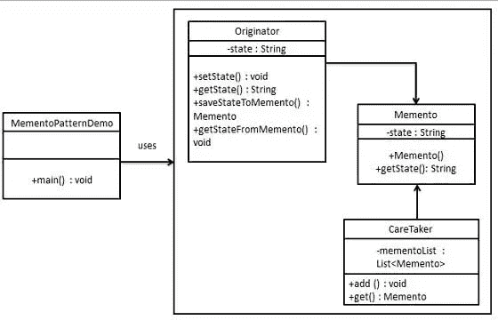
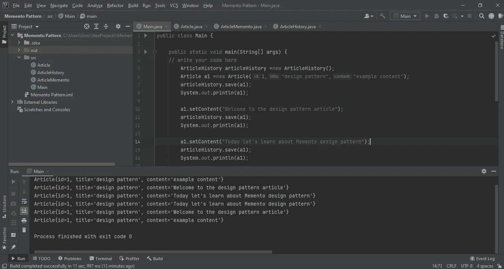

# 纪念品设计模式

> 原文：<https://medium.com/nerd-for-tech/memento-design-pattern-a1b83879c032?source=collection_archive---------20----------------------->

如果你能回到过去，你想在生活中改变什么？比方说，如果你想改变什么，但事实是你在现实生活中无法做到。但是在 **Memento 设计模式中，您可以将对象的状态恢复到之前的状态**。所以欢迎回到另一篇设计模式文章。如果你是设计模式的新手，你可以参考我以前的文章。如你所知，这篇文章是关于行为类型下的纪念品设计模式的。Memento 模式用于将对象的状态恢复到先前的状态。随着应用程序的运行，您可能希望在应用程序中保存检查点，并在以后恢复到这些检查点。因此 Memento 设计模式允许您制作对象状态的完整副本，包括私有字段，并将它们与对象分开存储。让我们看看下面的 memento 设计模式的 UML 图。

纪念品设计模式主要有三个组成部分。那些是，

1.  **发起者:**状态为需要保存的对象。它创建了纪念品，并在将来使用它来撤销。
2.  **memento :** 将要维持发起者状态的对象。
3.  **看守者:**跟踪多个纪念品的对象。比如维护保存点。

现在我们来举个简单的例子，学习一下这个。当我们写文章的时候，我们可以随时撤销并回到以前的状态。让我们以此为例，使用 memento 设计模式来实现。所以首先你需要创建一个名为 Article 的类。**该物品类是发起者类，这意味着该物品类对象需要保存**。在 article 类中，我有三个属性，分别叫做 id、title 和 content。当实现这个场景时，我只实现撤销文章的内容。所以记住这一点。我实现了类的构造函数以及内容属性的 setter 和 getter。然后，您需要实现保存和恢复功能，如下所示。保存和恢复功能是我们主要用来保存对象和撤销的两个功能，我们可以使用恢复功能。因此，当我们保存时，我们将创建一个 ArticleMemento 实例，并将文章的当前内容放入其中。当我们使用 revert 函数时，我们获得内容的先前状态，并使用 ArticleMemento 将其设置为当前内容。

然后你需要创建一个纪念品类。在这里，我创建了一个名为 ArticleMemento 的类。所以在 ArticleMemento 里面你可以放入你想要撤销的属性。正如我在这里前面提到的，我只实现了撤销文章的内容。如果你想添加其他功能来撤销，你只需要对这个类做一些简单的修改。

接下来你需要创建看守类，所以在这里我创建了一个名为 ArticleHistory 的类作为看守类。比方说，当你输入一个 word 文档时，你会做一些改变。那么当你第一次撤销时，你将得到最后一次改变前的状态。然后，如果您再次撤消，您将获得前一个状态之前的状态。与本文场景相同。所以是先入先出(FIFO)的顺序。我们必须为此实现一个堆栈，因为在堆栈中我们可以维护 FIFO。所以在这里我实现了一个堆栈，如下图所示。然后我们有保存和恢复功能。Save 将保存对象的状态，并将其推送到堆栈。“还原”将恢复对象的先前状态。

然后在主程序中，您已经从 Article 类和 ArticleHistory 类创建了一个实例。接下来，您可以使用 save 函数保存，然后您可以使用 setContent()方法对文章的内容进行一些更改，并像下面这样保存。然后，您可以使用 revert()方法撤销更改，并打印实例以查看程序是否正常工作。

程序的输出如下所示。

## **纪念品设计模式的优势**

1.  **总是可以丢弃不需要的更改，并将其恢复到预期的或稳定的状态。**
2.  **提供了一种简单的恢复技术。**

## ****纪念品设计图案的缺点****

1.  **如果发起者对象非常大，那么 Memento 对象的大小也将非常大，并使用大量内存。**
2.  **大量的纪念品需要更多的存储空间。同时，它们给看护者增加了额外的负担。**

## **何时使用纪念品模式**

1.  **当您希望生成对象状态的快照，以便能够恢复对象以前的状态时。**

**就这样，伙计们。本文到此结束。我希望你了解纪念品设计模式。我会将代码上传到 GitHub，并将链接放在参考资料中，这样你也可以参考。那么是时候说再见了，让我们从另一篇文章中见面。保持联系。**

# **参考**

** [## dilshanushara/Krish _ LP _ Training

### 在 GitHub 上创建一个帐户，为 Dilshanushara/Krish _ LP _ Training 的发展做出贡献。

github.com](https://github.com/Dilshanushara/Krish_LP_Training/tree/master/Design%20Patterns/Memento)  [## 纪念品设计模式- GeeksforGeeks

### Memento 模式是一种行为设计模式。Memento 模式用于将对象的状态恢复到以前的状态…

www.geeksforgeeks.org](https://www.geeksforgeeks.org/memento-design-pattern/)  [## 设计模式——纪念品模式

### Memento 模式用于将对象的状态恢复到先前的状态。记忆模式属于行为…

www.tutorialspoint.com](https://www.tutorialspoint.com/design_pattern/memento_pattern.htm)**