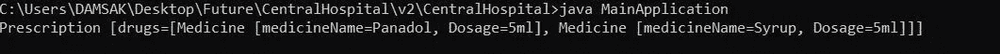
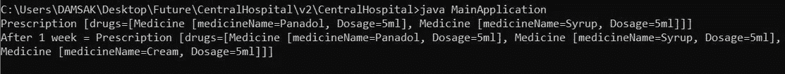
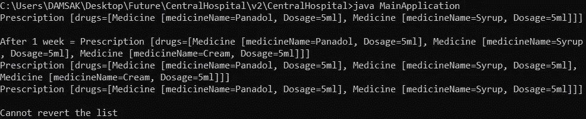
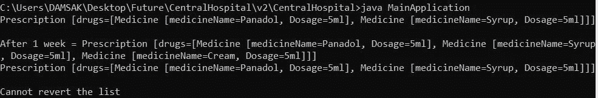

# 纪念品设计模式

> 原文：<https://medium.com/nerd-for-tech/memento-design-pattern-bdf6e77481fc?source=collection_archive---------20----------------------->

Memento 模式是一种设计模式，用于将对象的状态恢复到以前的状态，而不会暴露实现细节。这种模式属于行为设计模式的范畴。考虑这样一种情况，我们用状态开发一个应用程序。现在有一个要求说，在一个特定的点，我们需要回到以前的状态。纪念品设计模式可以用来实现这一功能。

Memento 设计模式有 3 个主要组成部分

1.  **发起者:**需要维护其状态的特定对象。它创造了纪念品。
2.  **Memento** :负责维护发起者状态的对象。
3.  **看守者:**对象跟踪多个纪念品。

**实施** —

发起者与纪念品和看管人的状态相关联。因此，每当我们需要回到以前的状态时，我们与管理员交谈，获得以前的状态并移动。

让我们借助一个真实的例子来理解这种模式。

# 用例

> “中央医院”是一家位于科伦坡的著名私立医院。大约有 200 名医生为他们的病人提供各种治疗。
> 
> **需求** —医生需要跟踪发给患者的药物。
> 
> 治疗的继续取决于患者的状态。如果病人情况不佳，医生可能会在现有清单上增加新的药物。否则，如果病人情况良好，医生可能会减少摄入量。(假设这些都是为需要定期服药的长期病情患者做的。)

## 分析—

*   我们需要记录之前的药物清单。
*   我们需要将当前药物列表恢复到以前药物列表的功能。

所以很明显，我们可以在这种情况下使用 Memento 设计模式。让我们实现一个解决方案。

## 第一步:

让我们实现代表特定药物的 Medicine 类。

## 第二步:

正如前面提到的，Memento 设计模式包含 3 个主要部分。让我们实现发起者和纪念品类。管理员(PrescriptionHistory 类)需要维护这个 Memento 类的状态。

**导入点:**

*   **。getter** 中的 clone()方法——如果我们只是将列表复制到另一个列表，那么对第二个列表所做的修改也会影响原始列表。那是因为我们抄袭了参考文献。因此应该使用 clone()。
*   **private getDrugs()** —只有处方类可以访问此方法。

我们在这门课上实现了两个重要的方法—

*   **。save()** —保留当前状态。通过给予 MedicineMemento 向护理人员提供状态(处方历史)。如果我们给了处方对象本身，我们**不能在不影响先前状态**的情况下改变它。这就是我们传递医药纪念品的原因。基本上，使用当前处方创建一个新的 MedicineMemento 对象，并传递它。
*   **revert()** —恢复当前状态。获取 MedicineMemento 本身，并将当前状态设置为 MedicineMemento 中的状态。

## 步骤 03:

现在我们需要实现看守类。这个类应该保存前一个对象的状态。

**行为** —当我们恢复时，最后的处方清单应该是最先出现的。这意味着行为是后进先出的。因此我们可以使用堆栈。

## 步骤 04:

现在我们可以实现主应用程序类了。让我们试着理解一个实际病人的用例。

*   **特定的医生分配 2 种药物给患者服用。**

实施—

输出—

图 1:第一张处方

*   **患者在 1 周后仍感觉不适**。因此，医生通过在现有列表中引入新的药物来增加治疗。让我们实现这个场景。

实施—

输出—

图 2:更新的处方

现在我们可以看到，我们已经成功地将新药添加到列表中。

*   **使用新药一周后，患者感觉好多了**。医生决定去掉新加的，开旧单子。

实施—

输出—

图 3:第二次更新后的处方

**解释**

*   即使我们执行了 3 次恢复方法，应用程序还是恢复了 2 次。这是为什么呢？

执行不依赖于处方中的项目。第一个处方包含 2 种药物，第二个处方包含 3 种药物。第一次恢复将删除第二次更新的处方。当我们第二次执行 revert 方法时，应用程序说它不能这样做，因为只有一个处方版本。

*   更新的处方打印两次。这是为什么呢？

我们基本上是把新药添加到处方中，然后把它交给处方历史。现在**看管人(处方历史)会开出最后一张处方。等于当前更新的处方。这就是为什么我们恢复一次后得到相同的处方。**

## 这个怎么解决？

*   避免将新添加的药物传递给处方历史。这可以通过从实现中删除下面一行来实现。

`presHistory.save(prescription);`

更新输出—

图 4:没有重复的输出

现在我们可以看到，没有重复的处方。因此，我们成功地实现了上述解决方案。

以下 URL 提供了上述实现的完整源代码。

 [## damsak/Krish-LP-培训

### 通过在 GitHub 上创建一个帐户，为 Damsak/Krish-LP-Training 开发做出贡献。

github.com](https://github.com/Damsak/Krish-LP-Training/tree/main/DesignPatterns/MementoDesignPatternPractical/TheCentralHospital) 

我使用了 Krishntha Dinesh 先生的以下播放列表来收集所需的信息。

# 参考

 [## 设计模式——纪念品模式

### Memento 模式用于将对象的状态恢复到先前的状态。记忆模式属于行为…

www.tutorialspoint.com](https://www.tutorialspoint.com/design_pattern/memento_pattern.htm)  [## 纪念品

### Memento 是一种行为设计模式，它允许您保存和恢复对象以前的状态，而不会暴露…

重构大师](https://refactoring.guru/design-patterns/memento)  [## 纪念品设计模式- GeeksforGeeks

### Memento 模式是一种行为设计模式。Memento 模式用于将对象的状态恢复到以前的状态…

www.geeksforgeeks.org](https://www.geeksforgeeks.org/memento-design-pattern/)