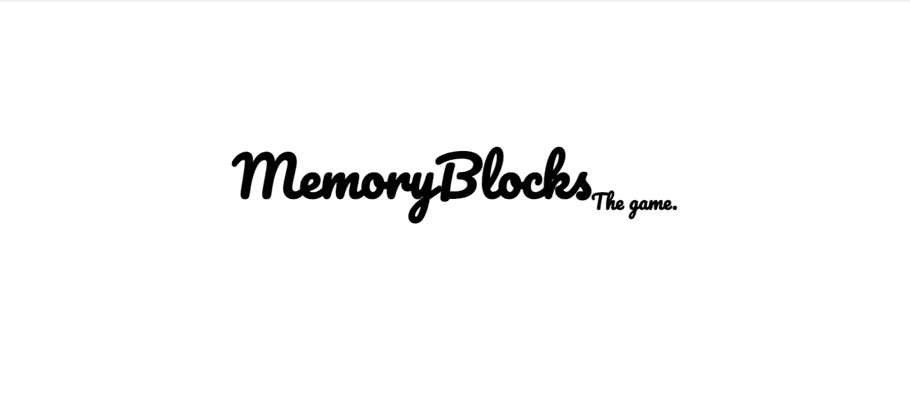
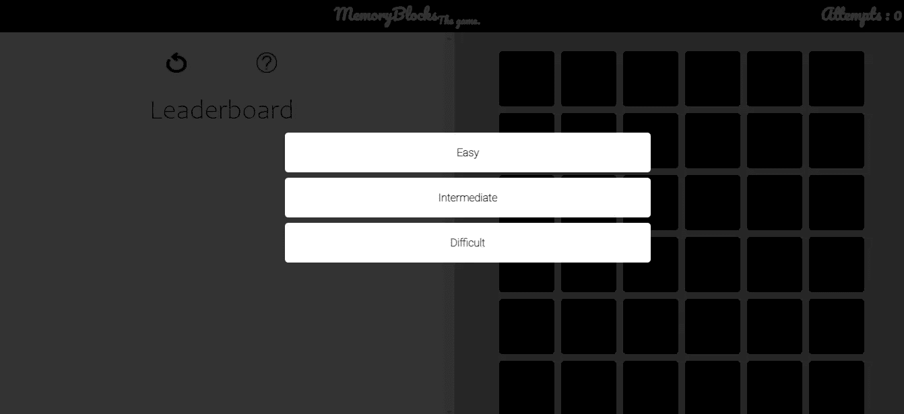
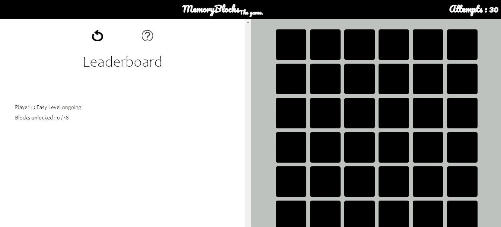

# 内存块游戏使用 HTML，CSS 和 JavaScript

> 原文：<https://medium.com/nerd-for-tech/memory-blocks-game-using-html-css-and-javascript-956db5534468?source=collection_archive---------9----------------------->

随着现代 web 开发的三大支柱——HTML、CSS 和 JavaScript——的到来，web 开发已经转移到一个更高的层次，具有更多的交互性和类似移动应用的体验。网页游戏也是当今的趋势，具有逼真的动作和强大的交互性。本文将讨论一个完全使用 HTML、CSS 和 JavaScript 构建的基于 web 的内存块游戏。记忆积木游戏是一种记忆游戏，你一次打开两个积木，如果两个积木中的图像匹配，你就可以继续游戏，否则你就失去了一次尝试的机会。

## 成分

该游戏是一个客户端专用游戏，有三个组件:HTML 框架、CSS 样式和 JavaScript 交互代码。HTML 定义了基本的框架，比如显示内容的框、按钮等。CSS 提供样式、颜色和所需的动画，JavaScript 用于编程——交互性。

## UI 设计

在我们开始写代码之前，让我们看一下我们正在计划的 UI 设计——有三个主要的 UI 设计要生成

*   介绍屏幕——游戏介绍
*   难度模式选择-选择游戏的难度等级。每个级别之间的差异将在后面的部分中解释。
*   游戏区——这是用户玩实际游戏的地方。

让我们来看看这些设计。

介绍屏幕

选择难度等级

游戏区

## HTML 框架

HTML 框架定义了用户界面的框架结构。它不包括任何颜色或风格，而只是简单的框架结构和显示内容。上述设计的 HTML 代码如下所示。

## CSS 样式

HTML 框架中所有元素的颜色和排列都需要 CSS 样式，以确保网站的视觉质量。类似地，CSS 也可以用于实现网站中的动画和视觉效果。如果你观察上面的 HTML 代码，你会发现很多与 CSS 样式相关的代码行。少数 CSS 样式嵌入在 HTML 本身中，而其他样式在另一个文件中单独给出:

## JavaScript 代码

JavaScript 为网站增加了交互性和动态性。我们这里的游戏需要用户与之互动。它需要是动态的(游戏设置应该在用户每次运行时改变)以变得更加安全。

该脚本提供了以下功能—让我们了解这些方法各自提供了什么功能:

*   *函数 changeImage(a):* 每次用户点击一个方块，方块后面的图像就会出现在方块上。如果用户打开了两个方块(这是这个游戏允许的最大打开量)，则比较这两个方块的图像，看它是否匹配(使用预先固定的文件名来比较图像)。如果发生匹配，块被隐藏，否则块关闭，游戏继续，直到所有的块被打开或用户用尽尝试。
*   *函数 hideIntro():* 该函数在显示几秒钟后隐藏简介屏幕。此方法与用户没有任何交互。
*   *函数 shuffle():*shuffle 函数在每次迭代中增加了游戏的动态性。图像名称被读入一个数组并随机打乱。这确保了图像分布在整个块中，并且对于游戏的每次执行是不同的。
*   *函数 setBackground():* 设置每个块的背景图像。这些图像没有显示，但它们的名称是按顺序分配给每个块的。默认情况下，这些块被设置为黑色，当用户点击它时，图像就会显示出来。
*   *函数 select difference():*显示选择难度的模态框。
*   *函数 set difference():*获取用户选择的难度级别，并将其设置为一个变量。有三个难度级别供用户选择——简单、中等和困难。对于每个级别，块数保持不变，但尝试次数会发生变化，分别为 30、27 和 25。
*   *函数 restartGame():* 重置游戏区域和分数，包括图像排列和难度等级。之前的进步会丢失。
*   *函数 playAgain():* 允许用户在游戏结束后再次玩游戏(通过成功完成游戏或尝试用尽)。

# 未来的工作

*   创建一个登录系统，供用户登录并保存他们以前的游戏结果。
*   为移动设备优化 web 应用程序。
*   改进方块翻转的动画。
*   包括块中图像的多个主题(目前我已经使用编程相关的图像，但也可以包括其他主题)。

感谢您的阅读！

在 GitHub 上找到这个项目:[https://github.com/vishnu-u/web-based-memory-blocks-game](https://github.com/vishnu-u/web-based-memory-blocks-game)

在 LinkedIn 上找到我:[https://www.linkedin.com/in/vishnuu0399/](https://www.linkedin.com/in/vishnuu0399/)

更多地了解我:https://bit.ly/vishnu-u