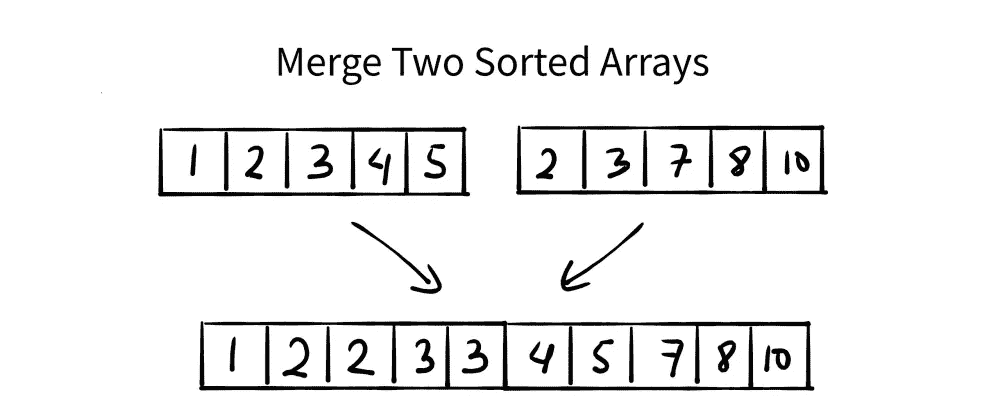

# 合并排序数组

> 原文：<https://medium.com/nerd-for-tech/merge-sorted-array-3c41b3d4eba6?source=collection_archive---------5----------------------->

(Leetcode)



给你两个整数数组`nums1`和`nums2`，按**非降序排序**，两个整数`m`和`n`，分别代表`nums1`和`nums2`中元素的个数。

**将** `nums1`和`nums2`合并成一个按**非降序排序的数组**。

最终排序后的数组不应该被函数返回，而是被*存储在*数组`nums1`里面。为了适应这种情况，`nums1`的长度为`m + n`，其中第一个`m`元素表示应该合并的元素，最后一个`n`元素被设置为`0`并应该被忽略。`nums2`的长度为`n`。

**例 1:**

```
**Input:** nums1 = [1,2,3,0,0,0], m = 3, nums2 = [2,5,6], n = 3
**Output:** [1,2,2,3,5,6]
**Explanation:** The arrays we are merging are [1,2,3] and [2,5,6].
The result of the merge is [1,2,2,3,5,6] with the underlined elements coming from nums1.
```

**例 2:**

```
**Input:** nums1 = [1], m = 1, nums2 = [], n = 0
**Output:** [1]
**Explanation:** The arrays we are merging are [1] and [].
The result of the merge is [1].
```

**例 3:**

```
**Input:** nums1 = [0], m = 0, nums2 = [1], n = 1
**Output:** [1]
**Explanation:** The arrays we are merging are [] and [1].
The result of the merge is [1].
Note that because m = 0, there are no elements in nums1\. The 0 is only there to ensure the merge result can fit in nums1.
```

**约束:**

*   `nums1.length == m + n`
*   `nums2.length == n`
*   `0 <= m, n <= 200`
*   `1 <= m + n <= 200`
*   `-10^9 <= nums1[i], nums2[j] <= 10^9`

**方法:**

# **1。两个指针接近**

这里的基本思想是同时迭代两个数组，比较两个数组中的元素。

**时间复杂度-O(m+n)** 其中 m 是数组 1 的大小，n 是数组 2 的大小。

**空间复杂度-O(m+n)** ，向量数组的大小。

```
**public:
    void merge(vector<int>& nums1, int m, vector<int>& nums2, int n) {
        vector<int>ans;
        int i =0, j=0;
        while(i<m && j<n)
        {
            if(nums1[i]>nums2[j])
            {
                ans.push_back(nums2[j]);
                j++;
            }

            else if(nums1[i]<nums2[j])
            {
                ans.push_back(nums1[i]);
                i++;
            }
            else
            {
                ans.push_back(nums1[i]);
                ans.push_back(nums2[j]);
                i++;
                j++;
            }
        }

             while(i<m)
            {
                ans.push_back(nums1[i]);
                i++;
            }

             while(j<n)
            {
                ans.push_back(nums2[j]);
                j++;
            }

            nums1=ans;
    }
};**I will do a dry run by taking an example :
**nums1 = [1,2,3,0,0,0], m = 3, nums2 = [2,5,6], n = 3**nums1[0] = 1 & sums2[0] = 2 , so 1<2 , 
i = i+1 = 1 and ans[] = [1]nums1[1] = 2 ,nums2[0] = 2 , 2==2 
i = i+1 = 2 and j = j+1 = 1 
ans[]=[1 2 2]nums1[2] = 3 nums2[1] = 5 
3<5 , i = i+1 = 3 and j=1
ans[]=[1 2 2 3]so now insert the rest of the elemnts of nums2 in the ans[]
so **ans[] = [1 2 2 3 5 6]**And thus the final answer is obtained.
```

# 2.而不使用额外的空间

**时间复杂度-O(m+n)，空间复杂度-O(1)**

```
**class Solution {
public:
    void merge(vector<int>& nums1, int m, vector<int>& nums2, int n) {
        int i=m-1, j=n-1, k = m+n-1;
        while(i>=0 && j>=0)
        {
            if(nums1[i]>nums2[j])
                nums1[k--] = nums1[i--];
            else
                nums1[k--] = nums2[j--];
        }

        while(j>=0)
            nums1[k--] = nums2[j--];
    }
};**I will do a dry run by taking an example :
**nums1 = [1,2,3,0,0,0], m = 3, nums2 = [2,5,6], n = 3**i = 2, j = 2 , k = 5
nums1[2] = 3 , nums2[2] = 6 so 3<6
nums1[5] = 6
j = j-1 = 1 and k = 4
**nums1[]=[1 2 3 0 0 6]**nums1[2] = 3 nums2[1] = 5 , 3<5
nums1[4] = 5
k = 4-1 = 3 and  j = 1-1 =0
**nums1[]=[1 2 3 0 5 6]**nums1[2] = 3 nums2[0] = 2
so 3>2 
nums[3] = 3 , k = k-1 = 3-1 = 2, i = i-1 = 2-1 = 1
**nums1[]=[1 2 3 3 5 6]**nums1[1] =2 nums2[0] = 2
nums[2] = 2 , k = k-1 = 2-1 =1, j=j-1 = 0-1= -1
**nums1[]=[1 2 2 3 5 6]**so the program will exit out of the while loop,now since j value is negative so it will not execute the outer loop. Hence we obtain our merged sorted array as **nums1[]=[1 2 2 3 5 6]**
```

希望这能让你清楚使用这两种方法解决上述问题的概念。还有各种其他方法，例如:

1.  插入排序，TC-O(n*m)其中 n 是第一个数组的大小，m 是第二个数组的大小，SC-O(1)
2.  使用间隙法。

下面我会附上一些有用的链接供你参考。

1.  [https://leetcode.com/problems/merge-sorted-array/](https://leetcode.com/problems/merge-sorted-array/)
2.  [https://www.youtube.com/watch?v=hVl2b3bLzBw&list = plguwdvibif 0 RPG 3 ictpu 74 ywbq 1 cabk 2&index = 6](https://www.youtube.com/watch?v=hVl2b3bLzBw&list=PLgUwDviBIf0rPG3Ictpu74YWBQ1CaBkm2&index=6)
3.  [https://www . geeks forgeeks . org/efficient-merging-two-sorted-arrays-with-O1-extra-space/](https://www.geeksforgeeks.org/efficiently-merging-two-sorted-arrays-with-o1-extra-space/)
4.  [https://docs . Google . com/document/d/1 sm 92 efk 8 odl 8 nyvw 8 nhpnbgexts 9 w-1 gmteyfeurlwq/edit](https://docs.google.com/document/d/1SM92efk8oDl8nyVw8NHPnbGexTS9W-1gmTEYfEurLWQ/edit)

希望这有所帮助！继续编码！👩‍🎓💻

既然你喜欢看我的博客，为什么不请我喝杯咖啡，支持我的工作呢！！https://www.buymeacoffee.com/sukanyabharati☕