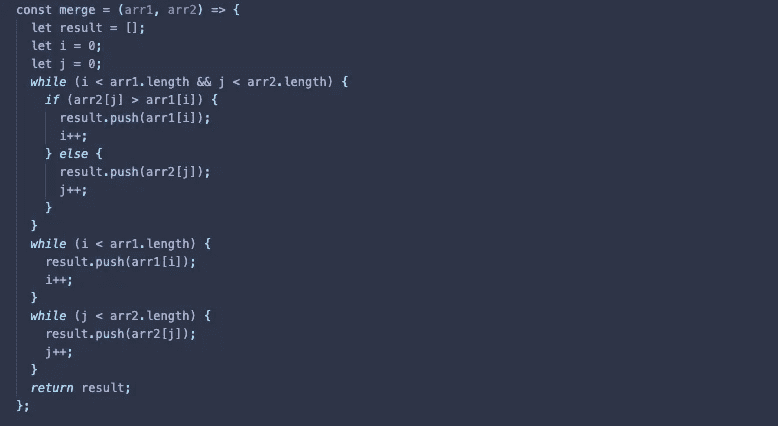

# 合并排序后的数组:

> 原文：<https://medium.com/nerd-for-tech/merging-sorted-arrays-167623708d15?source=collection_archive---------18----------------------->

## 准备合并排序算法(Javascript)



为了更好地理解合并排序算法的工作原理，最好从学习如何实现合并两个数组的函数开始。

## 时间复杂度:

因为我们需要两个不同的数组，它们的长度可以不同，所以时间复杂度是: **O(n +m)**

## 工作原理:

这个函数将对以相同方式排序的数组进行比较。
为了比较它们，我们将创建两个变量( *i* 和 *j* )来处理每个数组的索引，并创建一个数组来存储结果。
然后我们将使用 while 循环对它们进行迭代，直到 *i* 或 *j* 等于它们各自数组的长度。
如果 *arr[i]* 小于 *arr[j]* ，我们将把 *arr[i]* 推送到结果中，并给 I 加+1，以比较下一个元素与 *arr[j]* 。
如果 *arr[j]* 小于 *arr[i]* 我们将做相反的事情。我们将继续这样做，直到用完其中一个数组。然后，我们将把另一个数组中所有剩余的元素放入结果中。

## 伪代码:

```
// Create a function that accepts 2 arrays sorted in the same way.// Create an empty array where we'll push the smallest value when 
   comparing both arrays.// While we have elements to compare:// If the value of the first array is less than the value of the 
   second array, push the value of the first array and move one 
   index forward.// If the value of the first array is greater than the value of the 
   second array. Push the value of the second array and move one 
   index forward.// Once we have no more elements to compare within one of the 
   arrays, push all the remaining values from the other array.
```

## 代码: