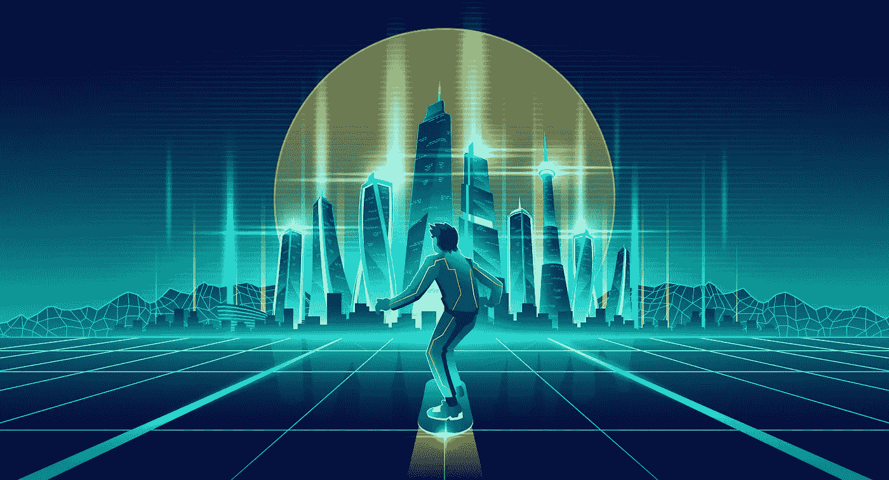

# 元宇宙为增强现实，解释

> 原文：<https://medium.com/nerd-for-tech/metaverse-for-augmented-reality-explain-300a34f953cd?source=collection_archive---------12----------------------->

增强现实是当今流行的技术之一。除了使用起来很有趣之外，它还为用户提供了有价值的见解，尤其是在做出购买决定时。因此，许多零售公司利用 AR 技术来增强他们的客户体验。但现在，元宇宙正在利用区块链技术和人工智能来提供更加增强和迷人的 AR 和 VR 体验。然而，我们还没有发现它对 AR 的影响。

在这里，我们将了解元宇宙对 AR 的可能影响。网上有很多关于区块链技术的课程，供那些想去区块链学**的人选择。**

# **了解元宇宙**

**元宇宙是一种数字现实。基本上，它是在线游戏、VR、AR、加密货币和社交媒体不同方面的组合技术。元宇宙的主要目的是让用户能够进行虚拟交流。**

**我们知道，AR 在现实世界环境中覆盖声音、视觉组件和其他感官输入，以提升用户体验。另一方面，VR 带来了一个完整的虚拟世界，改善了虚构的环境。**

**然而，随着元宇宙的出现，它将建立在线空间，提供比现有空间更多维的用户互动。因此，不仅用户将观看数字内容，而且他们还将沉浸在物理和数字空间交汇的世界中。随着元宇宙利用区块链技术，我们将需要[在线学习区块链](https://www.blockchain-council.org/online-training/)来理解元宇宙的概念。你可以利用多种区块链教育资源。**

# **理解增强现实**

**增强现实提供了一种数字体验，在计算机生成的输入的帮助下，改善了我们物理世界的某些方面。在这里，开发者构建包括视频、声音、GPS、图形等等的输入。此外，这种类型的数字内容能够及时响应用户环境的任何变化，例如移动。**

**如今，消费者广泛接受虚拟场景。因此，ADV 账户对零售、B2B 和 B2C 公司至关重要。事实上，像亚马逊这样的品牌已经在利用增强现实和虚拟现实技术，让消费者更容易接触到他们的产品。此外，它有助于买家做出更明智的决定。例如，一些零售商为更大的家具和家居装饰启用 AR 编织选项。因此，这增加了购物者对这些高价商品进行投资的信心。**

**在这里，像元宇宙这样在新的虚拟舒适区上操作的设置有可能成为与 AR 技术的优秀合作。此外，它不仅允许用户按照自己的选择逃避现实，而且他们还可以同时进行购物。从炊具到时尚，从水龙头到小工具和其他一切，用户将能够随时随地做出即时决定。此外，参加关于 **区块链技术**的**课程，了解它将如何保护我们的数字数据。然而，有了**区块链认证，**你甚至有机会成为区块链技术创新过程的一部分。****

# **实施元宇宙的潜在风险是什么？**

**元宇宙科技将能够通过用户与可穿戴设备的互动来收集用户的个人信息。此外，利用元宇宙的公司可以获得这些数据以获取个人利益，这是一个令人担忧的问题。**

**使用元宇宙的另一个投机领域是，脸书(现在的 Meta)将在元宇宙的背景下布局定向广告。它增加了错误信息传播的机会和潜在的隐私风险。如果你想深入了解元宇宙将如何使用区块链技术来收集不可变数据，那么就参加关于区块链技术的**课程。**事实上，有多种**区块链认证**随着该领域新进展的出现而不断更新他们的课程工作。**

**除此之外，越来越多有问题的社交媒体使用和对这种技术的成瘾的风险是另一个令人担忧的问题。虽然元宇宙有意为全球人口提供更流畅的数字用户体验，但过度使用此类技术带来的身心影响是不可避免的。**

**此外，它还会影响我们的社会关系，因为人们会更喜欢技术，而不是与周围的人互动。**

# **结束语**

**尽管元宇宙刚刚开始展示其在科技界的潜力，但它的功能已经在影响全球人口和公司。然而，伟大的创新也伴随着巨大的风险。因此，在更广泛地实施元宇宙的同时，企业需要关注用户的生活质量。现在，你可以参加区块链教育课程来了解元宇宙的某些方面。**