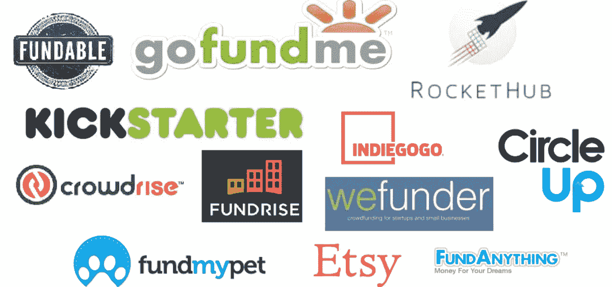
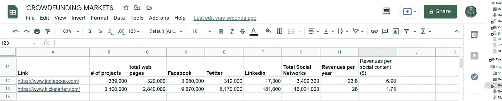
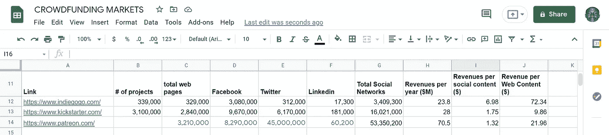
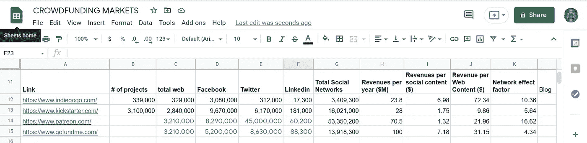
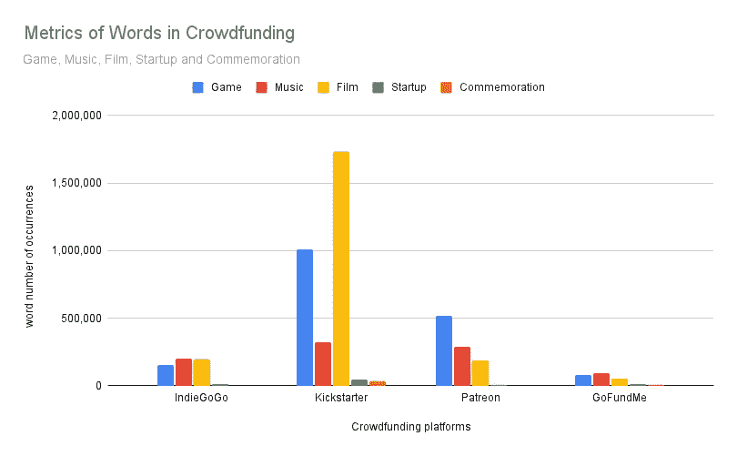
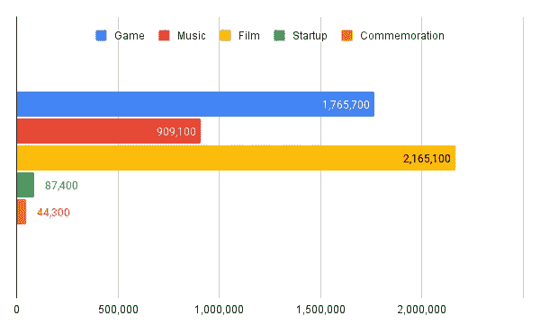
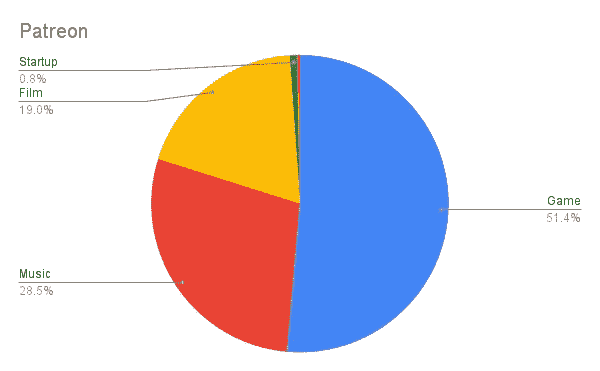
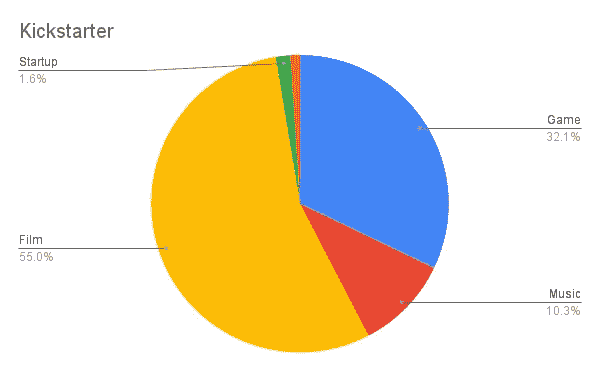

# 众筹词和收入的衡量标准

> 原文：<https://medium.com/nerd-for-tech/metrics-of-crowdfunding-words-and-revenues-95a11f3148ea?source=collection_archive---------5----------------------->

自 1997 年一个英国摇滚乐队通过在线捐款资助他们的团聚之旅以及 2000 年 ArtistShare 第一个众筹平台的诞生以来，众筹已经存在了 25 年。我不会像写博客的历史那样承诺给你一本关于众筹历史的书，因为我不会被视为一个不守信用的人，但我会在这篇文章中努力强调一些与众筹词汇相关的指标，就像我为词汇[软件](/codex/metrics-about-words-of-software-97d855af3bbe)、[营销](/predict/metrics-of-words-of-marketing-in-medium-68af3e5bf9c9)、[教育](/predict/words-and-metrics-about-education-b38914a5bfa8)、[气候变化](/predict/words-of-climate-change-in-medium-6ccf623ed7b4)、[科技公司](/predict/metrics-of-names-of-tech-companies-d7e4d3275cfb)和[作家](/predict/medium-metrics-for-writers-and-publications-e692173361d8)所做的那样

在我开始讨论与众筹平台词汇相关的指标之前，让我们用我自己的方法收集的数据来看看四大平台的指标，这些数据也是代理指标，因为这些平台的所有者可以带来不同的指标。然后，我将向您展示的这些指标是近似的，这意味着它们代表了真实数据，误差水平我无法估计，但我认为这些误差可以忽略不计。4 个领先的众筹平台是 [IndieGoGo](https://www.indiegogo.com/) 、 [Kickstarter](https://www.kickstarter.com/) 、 [Patreon](https://www.patreon.com/) 和 [GofundMe](https://www.gofundme.com/) ，以下是我收集的关于这些众筹平台的指标

根据我收集的这两行数据，我们可以得出结论，IndieGoGo 的贡献者比 Kickstarter 的贡献者贡献更多，IndieGoGo 从 Twitter、脸书和 LinkedIn 等社交媒体上共享内容的网络效应中获得更多收入。那么，对于一个商业模式以众筹平台贡献者为目标的企业家来说，追求 IndieGoGo 的观众要比追求 Kickstarter 贡献者的观众好得多。

追踪收入依赖于网络效应的科技公司的社交分享，如众筹市场中的科技公司，可以帮助你估计他们的未来收入，并以同样的方式使用这些指标作为公司估值模型的输入。对于我们的情况，这就是我在本文中写的注意力估值模型。我希望你明白，网络效应也是关于我们对某样东西的关注程度。考虑到这些众筹平台每年的收入和总的社交网络曝光率，我们可以建立的最简单的指标是每个社交内容的收入，通过这个指标，我们可以得出结论，IndieGoGo 从每个社交内容中获得更多的收入，这是我在第一段中强调的另一种方式，我说 IndieGoGo 的贡献者平均比 Kickstarter 的贡献者贡献得多，我们还可以补充说，这些 IndieGoGo 的贡献者比 Patreon 的贡献者贡献得多，因为 Kickstarter 的贡献者比这些 Patreon 的贡献者贡献得多。这是数据

然后，如果我们将每个众筹平台的贡献者按照他们的贡献水平和能力进行排名，我们最终会得到这个排名

1.  IndieGoGo
2.  Kickstarter
3.  订阅模式

投资者的企业、寻找资助者的政治运动或寻找支持者的非营利组织都应该关注我提供给你们的这些指标，这些指标是他们投资研究决策过程的输入信息，也是他们确定目标受众的依据。

如果我们把一个像众筹平台这样的平台作为一家生产互联网内容并从这些内容中获得收入的科技公司，我们可以建立另一个指标，即你在上表中看到的每个网络内容的收入。根据每项网络内容的收入，我们得出了这三个众筹平台的另一个排名

1.  IndieGoGo
2.  订阅模式
3.  Kickstarter

这两个众筹平台互换位置发生了什么？

为了回答这个问题，我们将使用我在表格中引入的另一个指标。这个指标将是研究网络效应和注意力评估模型的一个重要指标，我们将在以后的文章中一起讨论。我把这个指标称为网络效应系数，它是一个平台从生产内容中获得的社交内容的数量。这是社交分享带来的内容倍增。下面是这三个众筹平台中每一个的这个因素的值的完整表格

除了这两个关于 Patreon 和 GofundMe 项目数量的缺失数据点，你可以清楚地看到这些平台相对于网络内容和社交媒体内容的表现，我引入了一个称为网络效应因子的指标，这是社交媒体内容的规模与众筹平台拥有的内容规模之间的比率。这个网络效应因素显示了像你我这样的人在 Twitter、脸书和 Linkedin 等社交媒体上分享众筹内容的水平和比例。就在我通过简单地将每个平台的总收入除以总的社交网络内容和平台专有内容，计算出每个渠道的收入包络估计值之后。通过这些指标，你可以看到 IndieGoGo 和 Patreon 在每个社交内容的收入和每个平台内容的收入方面比其他两家公司表现得更好。

既然我们已经深入研究了全球指标，我可以用更多的指标来扩展，现在让我们来研究与您直接相关的词语，因为这是一篇简单的介绍性文章，我无法进行更详细的分析。如果你想要更精细的数据，我强烈建议你等待这些关于词汇和度量的技术平台，我将作为 SaaS 来构建和提供。

我选择学习的词汇有音乐、电影、创业、纪念、游戏。在我写游戏的时候，我愿意告诉你，我将在游戏开发杂志上发表关于游戏行业的文章，以及我的工作和技术支持的游戏想法，这是一份由[尼科莱塔·坦克雷德](https://medium.com/u/f4b89afaa5ce?source=post_page-----95a11f3148ea--------------------------------)和[姆利](https://medium.com/u/4cec1b852438?source=post_page-----95a11f3148ea--------------------------------)两位伟人经营的媒体出版物，就像那些对技术、[预测](https://medium.com/predict)、[抄本](https://medium.com/codex)、[数据驱动投资者](https://medium.datadriveninvestor.com/)和[m 学习. ai](https://medium.com/mlearning-ai) 的书呆子一样但这篇文章是关于众筹词汇的度量，那么让我们来看看我们选择的词汇的数据

以上是每个众筹平台关于游戏、音乐、电影、创业和纪念这些词的指标，但如果我们为了得到全球指标而将这些指标相加，下面是我们最终得到的图表

我们可以从这张图表中看到，最重要的词或众筹项目，如果你想的话，是按照出现的级别排列的

1.  电影
2.  比赛
3.  音乐
4.  启动
5.  纪念

这个排名对我来说并不奇怪，但我认为在处理数据之前，Startup 这个词会占据更重要的位置。

我们可以从这些数据中得到的第一个内幕是，在 Patreon，游戏项目比其他类型的项目更重要

而 Kickstarter 似乎更多的是电影众筹而不是其他众筹项目相关的词

关于这几个数据点，我可以说得更多，但让我让你消费它们，看看它们告诉你什么其他故事，因为我们经常把叙事与数字联系在一起。我所期待的，也是我希望看到的是，你能从我发表的这些关于[单词和度量](https://mkrdiop.medium.com/list/words-metrics-0f50785757d8)的文章中受益。也许这些数据会对你接下来的游戏、电影、音乐，或者纪念众筹项目有所帮助。如果你是一名科技企业家，我收集了这些数据，这是一个科技化的商业模式，它利用了最小可行受众理论，试图瞄准这些众筹平台的最小部分受众。你可能会猜到我在说什么，但如果你将来阅读我的文章，你就会知道，因为我很可能会写这个技术支持的利基商业模式，它可以通过一个能引起人们共鸣的适当故事来扩展。更多关于单词和度量的文章你可以在这里看到。

谢谢你阅读我。你的客人和朋友帕帕·马克瑟·DIOP