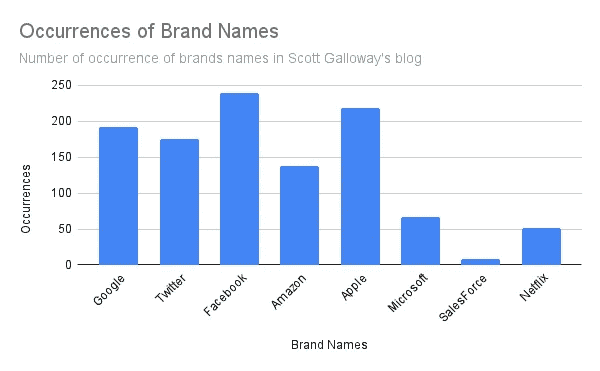
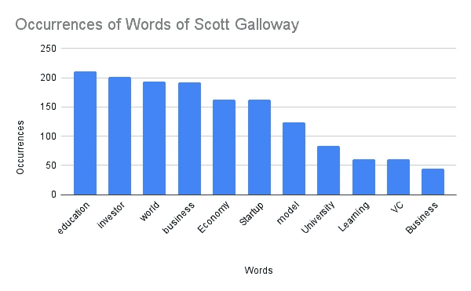
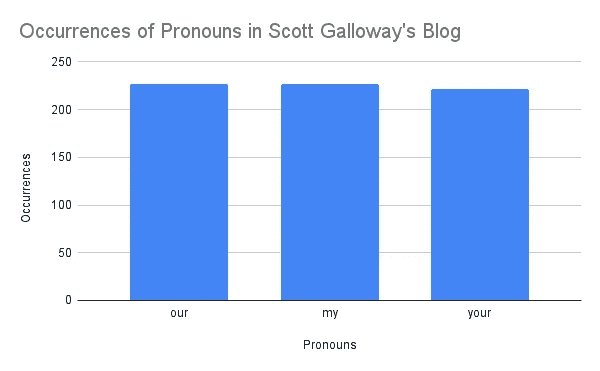
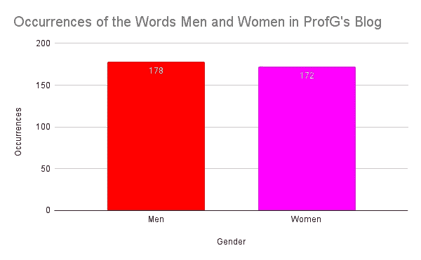
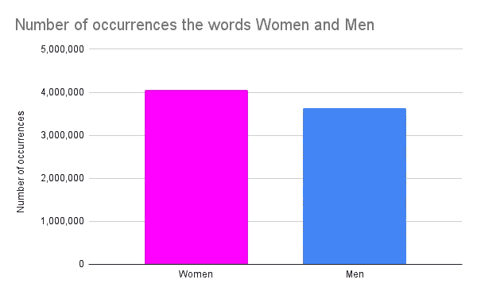
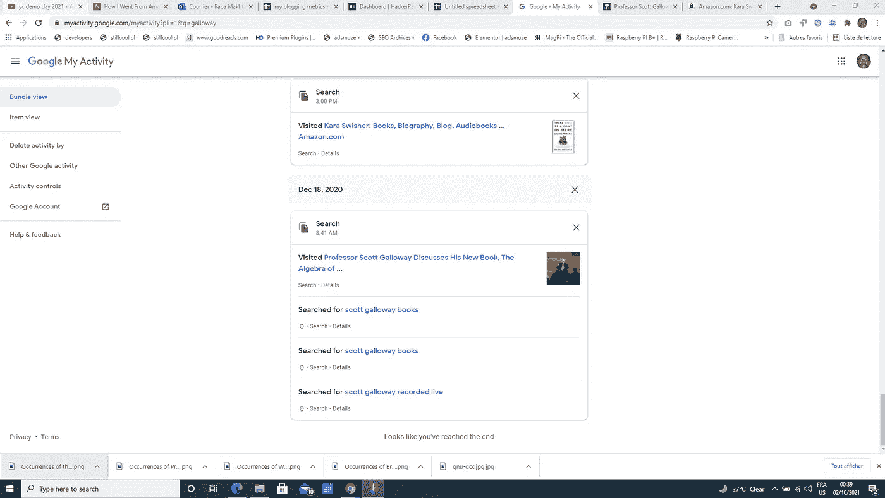

# 普罗夫洛韦的词汇计量学

> 原文：<https://medium.com/nerd-for-tech/metrics-of-words-of-profgalloway-c83081c3d585?source=collection_archive---------4----------------------->

根据我的谷歌搜索活动，我第一次接触到 Scott Galloway(别名 G 教授)的工作是在 12 月，当时我正在寻找关于他的书《成功的代数》的信息，几周或几个月后我开始听 Pivot，这是他和 Kara Swisher 展示的播客。那时我也想过读他的书以及莎拉·斯威舍·Aal.com 的书，还有《这里一定有一匹小马》。我应该承认，我只读过 Scott Galloway 的书《亚马逊、苹果、脸书和谷歌的隐患》中的几章。要说我不能说我是这方面的专家……教授，但我确实认为他通过强调关于他如何看待世界和科技企业的重要思想和理论在做伟大的工作。但这篇文章并不是要解释你的核心盖洛韦的理论和想法，而是试图计算他使用一组定义好的词的次数，以便看看你和我是否可以通过这些指标知道什么主题对这位有洞察力的专业人士来说是重要的，并期望获得有价值的洞察力，我们可以将这些洞察力应用到我们自己的个人和专业工作中。

就像 Scott Galloway 正在做的每周图表，这是一个论坛，他每周分享有趣的事情，注意使用图表，我们将发现与图表一起，Scott Galloway 在他的[网站](https://www.profgalloway.com/)的博客上发表的作品中最重要的词是什么

让我们首先从 profG 的文章中发现科技公司的出现次数或名称，但请记住，绘制的数字来自代理，并不代表确切的出现次数，但数字之间的差异仍然有意义。这张图表显示了斯科特·加洛威提到最多的科技公司。

既然我们已经发现了我们认为对 ProfG 最重要的科技公司，那么让我们来看看一些特别采用的词汇，比如我们在曝光塞斯·戈丁的[词汇指标时是如何做的。这些被选择的单词在这里用它们相应的出现次数绘制，再次使用这个代理作为估计量。](/predict/metrics-of-words-of-seth-godin-3430e663c6e1)

我希望这张图表能帮助你了解教育和大学以及投资对斯科特·加洛韦有多重要，以及世界这个词在他的作品中所占的位置，这是一个很好的地方，表明他对此很关心。关心这个世界的人当然也关心我们，就像我在关于我的中等度量标准的文章中强调了我使用代词来说明我倾向于写更多关于女性的文章一样，我想我也可以与你分享对 Scott Galloway 教授的文章中某些代词出现次数的估计。

这是一个均衡，可能表明 G 教授的思想在性别覆盖范围内有多稳定，这意味着他的博客写作并不像我的博客那样倾向于某一特定性别。让我回忆一下我在发表的文章中使用代词的图表。这张图表在这里

在我的文章中出现“男人”和“女人”的次数

你可以清楚地看到，比起 ProfG，我更倾向于写女性，但这篇文章并不是将我自己与斯科特·加洛韦教授相提并论，马克·谢弗用下面这条推文回复我时是对的

马克·谢弗关于我的文章的推特

我认为这个建议适用于正在阅读这篇文章的你，这篇文章并不是要把你自己和斯科特·盖洛韦相比，而是要像谢弗所说的那样成为第一个、最伟大的你。

谢谢你，谢谢斯科特·加洛韦，谢谢马克·谢弗。希望这些[单词和度量](https://mkrdiop.medium.com/list/words-metrics-0f50785757d8)能帮到某个人。

**PS:** 我想你应该会发现[第 4 节](https://www.section4.com/)的伟大作品通过 Scott Galloway 教授管理的 sprints 获得一种新的学习体验。

**活动证明**

我的谷歌搜索活动截图