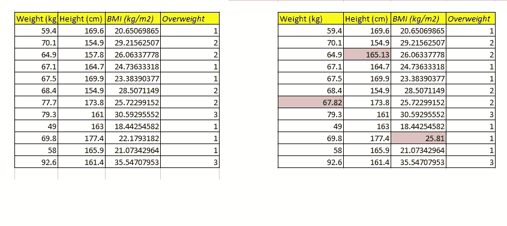
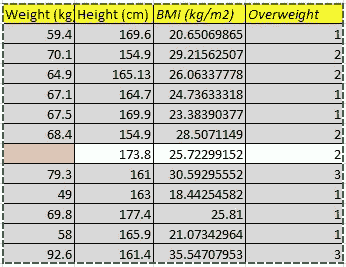
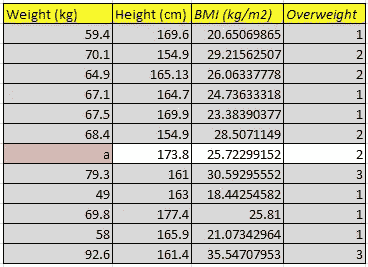
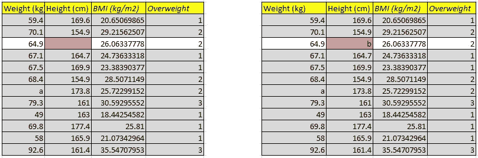
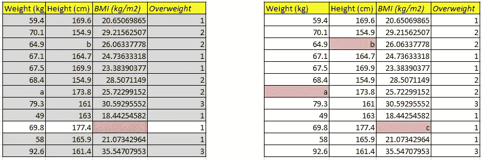
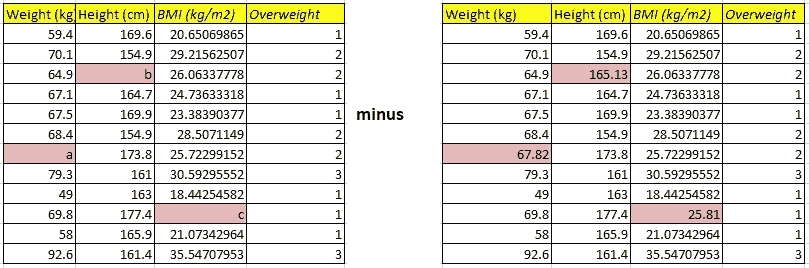
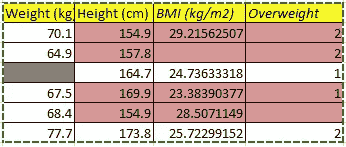
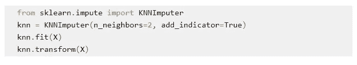

# MICE 和 KNN 缺失值插补的解释及 Python 实现

> 原文：<https://medium.com/nerd-for-tech/mice-and-knn-missing-value-imputations-explanation-and-implementation-with-python-d11c53f3f4b2?source=collection_archive---------0----------------------->

继续我的[博客](/the-innovation/feature-engineering-handling-missing-numeric-data-with-python-7be1e871f85e)关于缺失值和如何处理它们。我在这里要谈的是另外两种非常有效的处理缺失数据的技术，通过:

1.  链式方程的 MICE 或多重插补
2.  KNN 或 K-最近邻插补

首先我们将讨论通过链式方程的**多重插补。**

链式方程的多重插补假设数据为 [MAR](/the-innovation/feature-engineering-handling-missing-numeric-data-with-python-7be1e871f85e) ，即随机缺失。

有时数据集中缺失的数据与其他要素相关，可以使用其他要素值进行预测。

它不能用均值、众数或中位数的一般方法来估算。

例如，如果缺少一个人的体重值，他/她可能有或可能没有糖尿病，但填写该值需要使用其他特征(如身高、身体质量指数、超重)进行评估，以预测正确的值集。

为此，应用线性回归，步骤如下:

**第一步:**

在下面的数据中，我们从数据集中删除一些数据，并使用单变量插补中使用的简单插补器用平均值对其进行插补。

现在我们清楚地看到一个问题，超重 2 级，身高 173.8 厘米，身体质量指数 25.7 的人不可能有 67.82 公斤的体重。



作者图片

**第二步:**

重量值被删除，其余值保持不变。



作者图片

**第三步:**

然后，以权重作为目标特征，在灰色细胞上训练线性回归。

然后，白细胞被视为测试数据，并预测值。假设值“a”代表重量。



作者图片

**第四步:**

我们将在重量特征中加入“a”值，并在高度特征中移除值。

然后，以高度作为目标特征，在灰色细胞上训练线性回归。

然后将白细胞作为测试数据，并预测高度值。假设 b 值代表高度。



作者图片

**第五步:**

接下来，我们将在高度特征中放置“b”值，并在身体质量指数特征中移除值。

然后用身体质量指数作为目标特征在灰色细胞上训练线性回归。

然后将白细胞作为测试数据，并预测身体质量指数值。假设身体质量指数的值为 c。



作者图片

**第六步:**

现在我们在步骤 5 和步骤 1 中减去基值。

除了我们估算的体重为(a-67.82)，身高为(b-165.13)，在身体质量指数为(c-25.81)之外，所有的值都是 0。

目标是在每次迭代中使这些值接近于零。



作者图片

对于下一次迭代，步骤 5 的值保留在步骤 1 中，并且从步骤 2 到 6 重复步骤。

在 Python 中，它是这样完成的:

一种复杂的方法是使用迭代插补器类，该类将每个具有缺失值的特征建模为其他特征的函数，并使用该估计值进行插补。这是以迭代的方式完成的，在每一步，一个特征列被指定为输出 y，其他特征列被视为输入 X。对于已知的 y，回归器被拟合在(X，y)上。然后，回归器被用于预测 y 的缺失值。这是以迭代的方式为每个特征完成的，然后在 max_iter 插补回合中重复。

```
import numpy as np
from sklearn.experimental import enable_iterative_imputer
from sklearn.impute import IterativeImputer
from sklearn.linear_model import LinearRegression

lr = LinearRegression()
imp = IterativeImputer(estimator=lr,missing_values=np.nan, max_iter=10, verbose=2, imputation_order='roman',random_state=0)
X=imp.fit_transform(X)
```

**KNN 或 K-最近邻插补**

k-最近邻是机器学习中最简单和最容易的插补技术之一。它处理相邻坐标 X 和 y 之间的欧几里德距离，以了解数据的相似程度。

下面给出一个非常简单的例子来解释这种插补:



作者图片

假设我们需要预测数据集中缺失的第 3 行的权重。

所有其他行都有数据，也有一些缺少的列。

要找出重量，必须采取以下步骤:

1)选择缺失值来填写数据。

2)选择一行中的值

3)选择你想合作的邻居数量(最好是 2-5 个)

4)从该行中彼此对应的所有其他数据点计算欧几里德距离。

5)选择最小的 2 并平均。

欧几里德距离的计算是:

**距离** = sqrt(重量*距离当前坐标的距离)

**权重** =预测一个特征的特征总数除以有价值的特征数。

坐标距离计算为以下值的平方:

**对于高度**= 164.7–154.9，164.7–157.8，164.7–169.9，164.7–154.9

对于身体质量指数来说,= 24.2156250664228，空白，24.21757575866

空白表示第 2 行中缺少身体质量指数值。

**表示超重**= 1–2，1–2，1–1，空白

对于上述值，其计算如下:(带权重的值的平方)

对于第 2 行和第 5 行，因为 1 个特征缺少值，所以每个权重为 3/2，其余权重为 3/3。

根据公式计算距离。


作者图片

因此，我们选择 2 个最接近的值，即上述情况中的 8.5390280477347 和 5.37299404429225。这些行的权重分别为 64.9 和 67.5。

因此，对于缺失值，权重将是这两个值的平均值。

**体重**=(64.9+67.5)/2 = 132.4/2 = 66.2kg。

对于其余的缺失特征值，采用类似的方法。

在 Python 中，KNNImputer 类使用 k-最近邻方法提供填充缺失值的插补。默认情况下，nan_euclidean_distances 用于查找最近邻，这是一种支持缺失值的欧氏距离度量。使用来自 n_neighbors 最近邻的值对每个缺失要素进行估算，其中 n _ neighbors 最近邻具有要考虑的最近邻值。对相邻要素进行均匀平均或根据到每个相邻要素的距离进行加权。如果样本缺少多个要素，则该样本的相邻要素可能会有所不同，具体取决于要估算的特定要素。对于插补期间使用的训练集，没有定义距离。如果至少有一个邻居具有规定的距离，则在插补期间将使用其余邻居的加权或未加权平均值。



作者图片

**结论:**

MICE 和 KNN 插补都是根据数据及其与其他特征的关系的逻辑推理来计算的。

它远远高于其他插补方法，如均值、中值、众数、简单插补或随机值插补。但是，它用于标记缺失变量的类别。

我希望看完这篇博客后，老鼠和 KNN 的归罪一定很容易理解。

【参考文献:】【https://scikit-learn.org/stable/modules/impute.html】T2

*原载于 2020 年 11 月 6 日 https://www.numpyninja.com**[*。*](https://www.numpyninja.com/post/mice-and-knn-missing-value-imputations-through-python)*