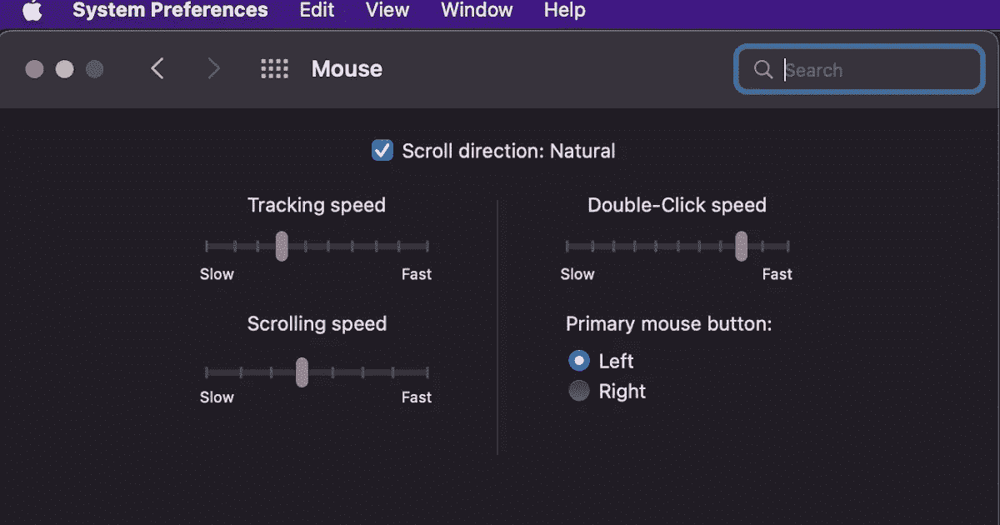
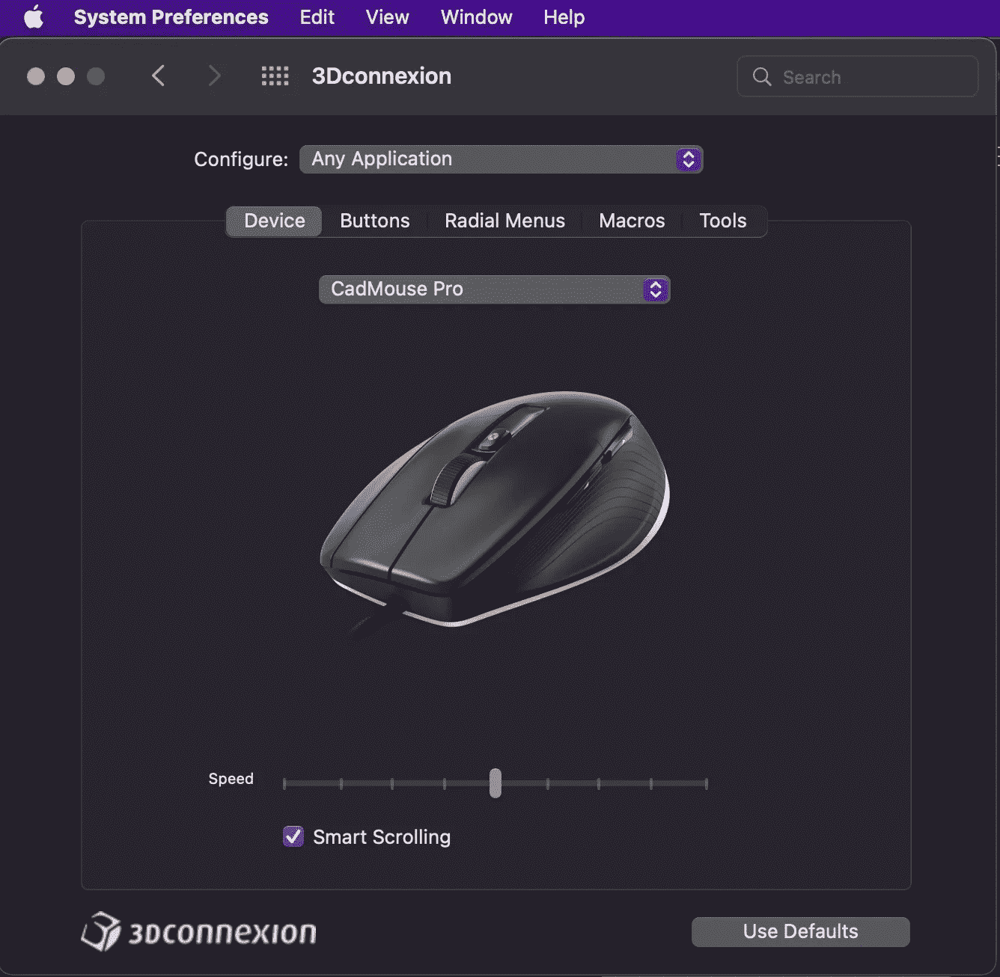
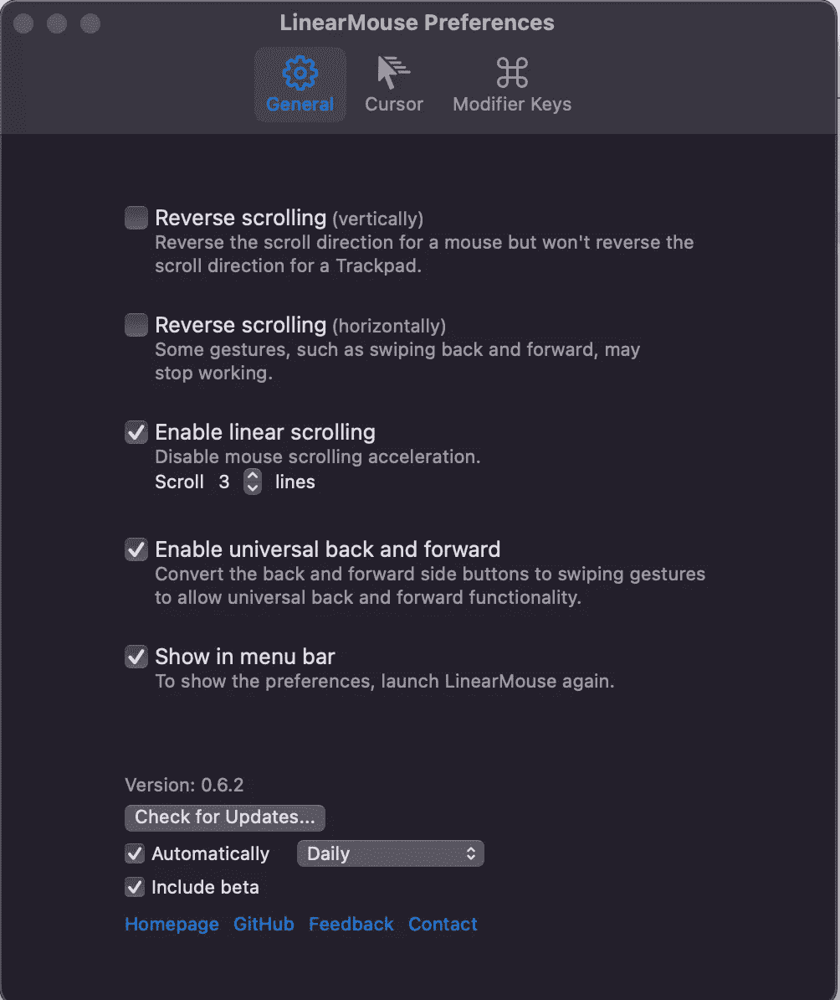

# 老鼠应该一直这样工作

> 原文：<https://medium.com/nerd-for-tech/mice-should-always-have-worked-like-this-fdbbb9af2e1c?source=collection_archive---------6----------------------->

苹果 MAC 电脑使用鼠标，苹果不会给你太多的选项来配置它们。

这确实提供了一些控制，当然它是为苹果鼠标优化的(苹果鼠标现在实际上是触控板，因为它们不再有轮子了)。第三方鼠标可能有自己的软件/系统偏好设置面板，允许进行一些调整。

在他们的智慧中，苹果让滚动加速，因为它被连续使用，所以向下滚动一页，突然它可以跳到结尾，因为滚动已经加速了(特别是滚动长页面)。

现在有一只叫做 [LinearMouse](https://linearmouse.org) 的援助之手(菜单栏中的一个小工具)并且是免费的。可以直接从[网站下载](https://dl.linearmouse.org/latest/LinearMouse.dmg)(。dmg)或通过自制软件安装

#brew 安装—桶线性鼠标

源代码也可以在 [Github](https://github.com/linearmouse/linearmouse#readme) 上获得，所以你可以自己开发应用程序(更重要的是确保它不会在后台做任何可疑的事情)。

安装后，菜单栏中会出现一个鼠标图标，点击它会出现一个下拉菜单，显示鼠标选项，然后点击鼠标属性。

反向滚动就是这样做的，滚动的方向会反过来，但神奇的是它支持线性滚动，因为这会阻止滚动加速。一旦你启用它，你会想没有它你怎么生活，这是一个游戏改变者。

这是你能为你的 Mac 找到的最好的工具之一(现在当然苹果会把这个功能集成到 macOS 的未来版本中)。

*原载于*[*http://eurotechnews.blogspot.com*](https://eurotechnews.blogspot.com/2022/06/mice-should-always-have-worked-like-this.html)*。*