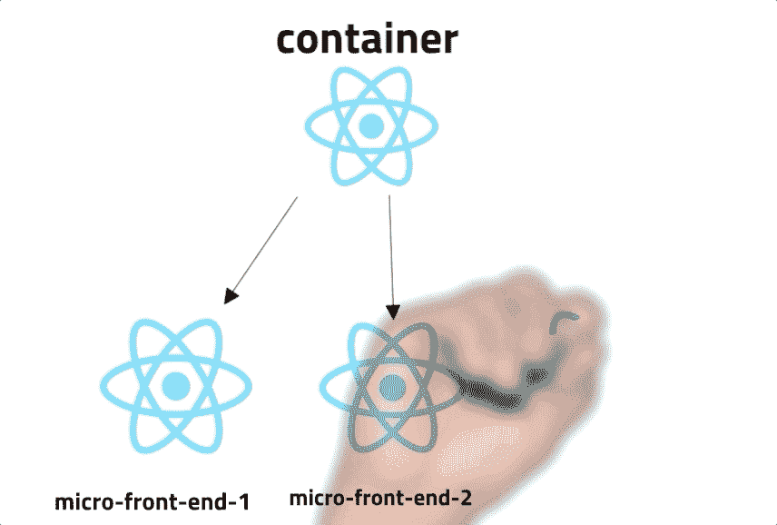
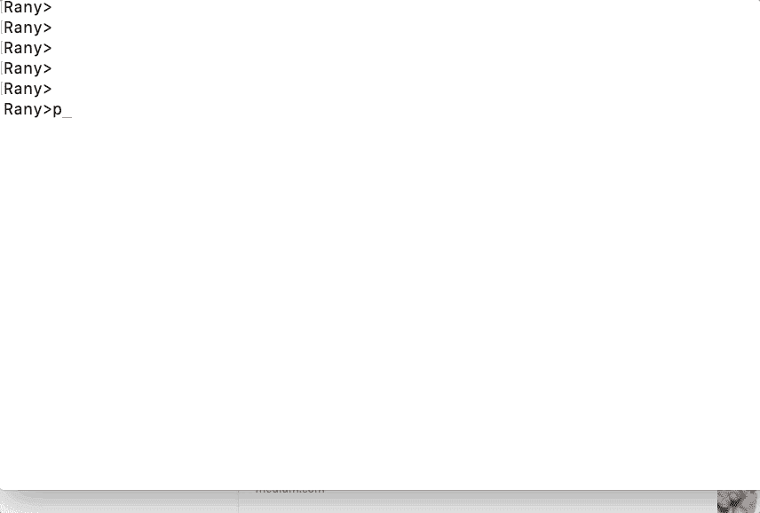
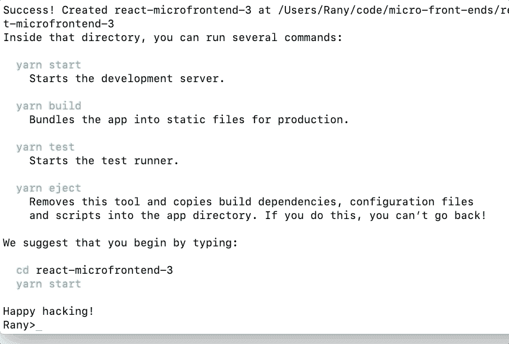
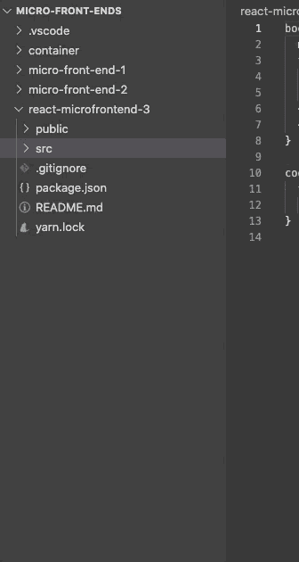
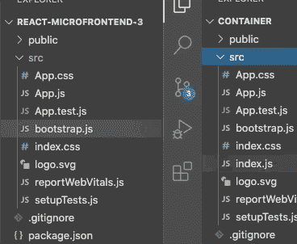
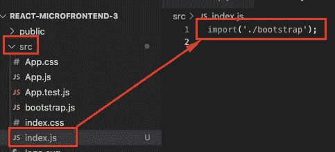
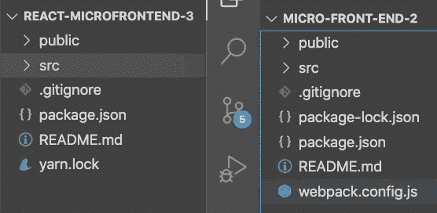
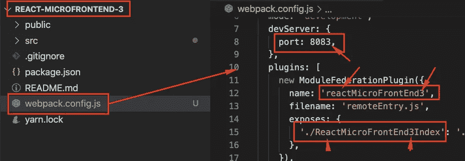
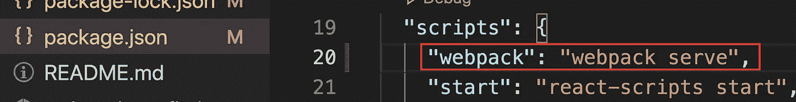
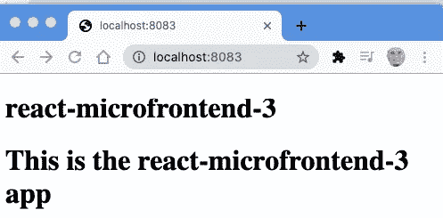

# 微前端使用 React、Webpack 5 和模块联合的实践示例:添加第三个 React 微前端

> 原文：<https://medium.com/nerd-for-tech/micro-frontends-hands-on-example-using-react-webpack-5-and-module-federation-adding-a-third-2fe8c61a73f?source=collection_archive---------1----------------------->

这篇文章是上一篇文章的延续

 [## 微前端:动手项目

### 准备好您的机器并安装节点，如果需要，请按照下面的文章/视频操作:

medium.com](/nerd-for-tech/micro-front-ends-hands-on-project-63bd3327e162) 

最终代码可在以下网址找到

 [## ranyelhousieny/微前端

### 通过在 GitHub 上创建帐户，为 ranyelhousieny/微前端开发做出贡献。

github.com](https://github.com/ranyelhousieny/micro-front-ends) 

到目前为止，我们还没有使用 React。在下面的文章中，我们将添加第三个微前端 react-microfrontend-3

npx 创建-反应-应用反应-微前端-3

现在，让我们进入新创建的文件夹 cd react-microfrontend-3

cd 反应-微前端-3

然后使用代码打开 VSCode。

当 Visual Studio 代码打开时，导航到 react-micro frontend-3/src/index . js，并将其重命名为 bootstrap.js，如下所示

现在将 container/src/index.js 复制到 react-micro frontend-3/src/index . js 如下图所示:

在 react-micro frontend-3/src/app . js 中，将所有内容替换为以下内容

这是最简单的 React App 组件。让我们从小做起，这样我们就可以慢慢成长

保存文件

将微前端-2/webpack.config 复制到 react-微前端-3/

按如下方式更改文件和端口中的名称:

保存文件

现在，让我们来看棘手的部分。我们需要一些规则来将 JSX 翻译成任何浏览器都能理解的 JavaScript ES5。在前两个组件中，我们不必这样做，因为它们是普通的 JavaScript。

1.  **为巴别塔添加一个加载器**

它是一个模块对象

模块{}

这个模块对象包含一个规则列表

规则:[]

在这个数组中，我们将有对象

对象中的第一项是 is test: /\。js？$/，这一行只是要求 babel 编译扩展名为的文件。js 至 ES5

然后我们将 node_modules 目录从 babel 中排除。Babel 不会编译这个目录中的任何文件

这是完整的文件

将 serve 添加到**中的脚本*package . JSON***

确保保存

## 安装 react-microfrontend-3 的依赖项

启动终端(ctrl +`)

运行以下命令

npm 安装 web pack web pack-CLI web pack-服务器 html-web pack-插件

运行 npm install 以确保所有内容都已安装

npm 运行 webpack

并浏览 [http://localhost:8083/](http://localhost:8083/)

对于一个完整的一步一步的项目，请遵循以下文章

[https://www . LinkedIn . com/pulse/micro-frontends-hands-on-example-using-react-web pack-rany/](https://www.linkedin.com/pulse/micro-frontends-hands-on-example-using-react-webpack-rany/)