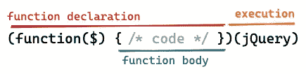

# 微模式:生命与回归-早

> 原文：<https://medium.com/nerd-for-tech/micro-pattern-iife-and-return-early-2a5ce088b855?source=collection_archive---------14----------------------->

## 这些是什么，我们如何利用它们？

由[奥玛·弗洛里斯](https://unsplash.com/@omarg247?utm_source=medium&utm_medium=referral)在 [Unsplash](https://unsplash.com?utm_source=medium&utm_medium=referral) 上拍摄的照片

# 立即调用函数表达式(IIFE)

如果您来自 JavaScript 背景，您很可能会遇到这种模式。还记得 JQuery 吗？

我记得那时我习惯把它看作是我的 JQuery 代码的“包装器”,继续我的生活，而不试图找出它实际上在做什么。所以让我们一起来解构这段代码。

生命是一个被声明然后立即执行的函数

顾名思义，这个包装器实际上只是一个立即执行的函数。您可以看到，该函数在第一个括号内匿名声明(没有名字)，然后立即以`jQuery`作为其参数执行(在函数体内转换为`$`)。顺便提一下，该函数也是一个闭包，这意味着它可以访问其父级(声明它的那个)的所有变量。

实际上，这只是实现相同代码一堆捷径:

那么，我们为什么要使用它呢？

我自己也不太明白为什么我要使用这种模式而不是可读性更好的对应模式，但是后来我意识到我可以这样做:

这种模式最常用的用例可能是在任何范围内快速创建一个异步任务:

如您所见，这是一个非常有用的一次性逻辑块。我发现它在我需要做一些非常简短和具体的逻辑时非常有用。如果我为此编写一个实用函数，我发现它可能会让读者分心，因为它会迫使他们进行上下文切换(切换到一个远处的函数，甚至可能是另一个“utils”文件)。我还需要传入参数，并在上下文切换时添加更多要记住的内容。有了 IIFE，读者可以自然地从上到下阅读代码。

哦，我必须指出，无论如何这不仅仅是 JavaScript 的事情。例如，你也可以在 Go 中生活(我想大多数语言都支持闭包？).事实上，它可以在许多地方被发现。例如，下面是来自 [Signals](https://gobyexample.com/signals) 的示例，演示了它用于创建监听操作系统信号的背景程序:

看到了吗？对于一个简短、简洁、具体的逻辑还是挺有用的吧？后来，如果需要在其他地方使用它，我们总是可以取出它，将其重构为单独的函数(如果需要，将任何父变量作为参数传递)。

# 提前返回模式

> 一个**故障快速**系统是一个在其接口上立即报告任何可能指示故障的条件的系统。([维基百科](https://en.wikipedia.org/wiki/Fail-fast))

有时候我们必须在付出代价之前放弃。

正如马丁·福勒在 [Fail Fast](https://martinfowler.com/ieeeSoftware/failFast.pdf) 中提到的，这是系统设计环境中非常常见的模式，但我发现这也可以衍生为一个很好的微模式，在任何时候都可以使用。我对此的解释很简单:当事情可能出错时，立即返回/抛出，这样我们就可以一直沿着快乐的道路前进。

想象我们有这样的东西(夸张的例子):

如果我们在任何可能的错误上提前返回，不是更容易理解吗？作为奖励，我们还得到更少的嵌套，更容易看到边缘情况，*和*代码向一个方向流动，更容易审查。

# 结论

就是这样，这两个是我发现经常使用的微模式，不仅是我，还有其他人。哦，这两个并不互相排斥，他们也可以一起使用。我个人认为这种模式有助于使我们的代码更容易推理，因此它有利于我们未来的自我，也有利于那些审查我们代码的人。

如果你有其他常用的微模式，请告诉我！