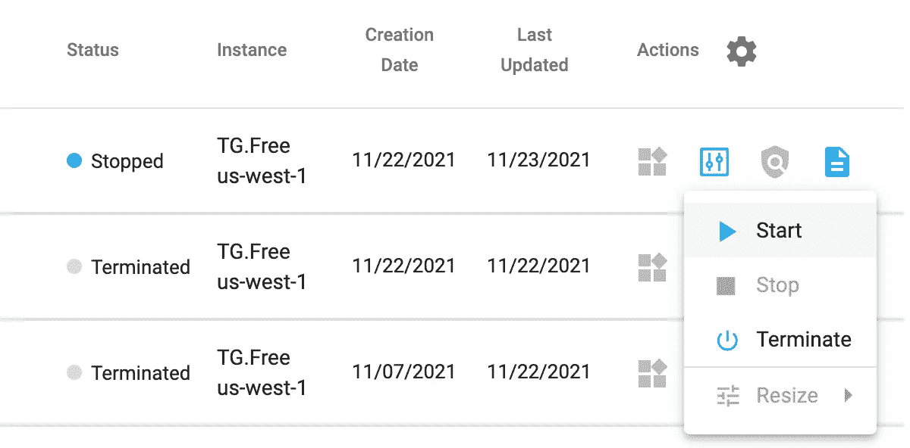
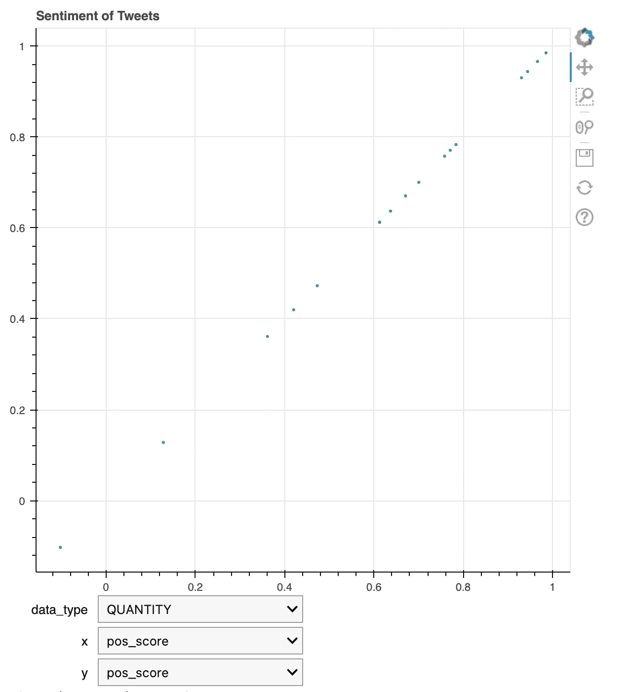

# 微博:用 TigerGraph 和 Bokeh 在笔记本上创建一个迷你图形仪表盘

> 原文：<https://medium.com/nerd-for-tech/microblog-creating-a-mini-graph-powered-dashboard-in-a-notebook-with-tigergraph-and-bokeh-c3b3be018edc?source=collection_archive---------5----------------------->

## 使用 TigerGraph 和 Bokeh 绘制 Twitter 情绪图

# 概观

## 介绍

作为[的延续，“推特感谢什么？”博客](https://shreya-chaudhary.medium.com/what-is-twitter-thankful-for-leverage-tigergraph-and-natural-language-processing-to-find-out-19ca7e69d4f9)，让我们使用 Bokeh 来可视化结果，Bokeh 是一个 Python 库，用于为现代 web 浏览器创建交互式可视化。Boheh 的便利之处在于，我们可以在 Colab 笔记本中创建交互式数据可视化。我们开始吧！

## 使用的工具

*   [TigerGraph 云](https://tgcloud.io/)
*   [pyTigerGraph](https://pytigergraph.github.io/pyTigerGraph/GettingStarted/)
*   [散景](http://docs.bokeh.org/en/latest/)

## 旅程

*   概观
*   第一部分:编写额外的查询
*   第二部分:创建仪表板
*   恭喜和下一步

# 第一部分:编写额外的查询

首先，我们需要一个额外的仪表板查询。首先，导航至[“我的解决方案”选项卡 TigerGraph Cloud](https://tgcloud.io/app/solutions) ，确保您的 TigerGraph 解决方案已启动。

 [## TigerGraph 云门户

### “我的解决方案”选项卡

tgcloud.io](https://tgcloud.io/app/solutions) 

如果您的解决方案有一个蓝点，旁边有单词“Stopped ”,请按“actions”下的框，然后选择下拉列表中的“Start”。给它几分钟启动时间，直到它变绿并显示“准备好”



开始您的解决方案

接下来，导航回您的笔记本。安装并导入 pyTigerGraph 并连接到解决方案，用您的子域替换子域，用您的密码替换密码。

```
!pip install pyTigerGraph
import pyTigerGraph as tgconn = tg.TigerGraphConnection(host = "https://SUBDOMAIN.i.tgcloud.io/", password = "PASSWORD", graphname = "TwitterGraph")
conn.apiToken = conn.getToken(conn.createSecret())
```

完美！一旦连接上，编写并安装查询。第一个查询将获取图中的所有实体类别。

```
conn.gsql('''CREATE QUERY getEntities() FOR GRAPH TwitterGraph { 
  SetAccum<STRING> @@entities;

  Seed = {Entity.*};

  Res = SELECT s FROM Seed:s 
        ACCUM @@entities += s.entity;

  PRINT @@entities;
}INSTALL QUERY getEntities''')
```

太棒了。第二个查询将获取给定实体类型的所有边。

```
conn.gsql('''CREATE QUERY edgesEntityFilter(STRING entity) FOR GRAPH TwitterGraph { 
  ListAccum<Edge<TWEET_ENTITY> > @@test; 

  Seed = {Tweet.*};

  Res = SELECT tgt FROM Seed:s - (TWEET_ENTITY:e) - Entity:tgt 
  WHERE tgt.entity == entity
  ACCUM @@test+=e;

  PRINT @@test;
}INSTALL QUERY edgesEntityFilter''')
```

这样，图形数据库就可以创建仪表板了！

# 第二部分:创建仪表板

让我们使用这些查询来组装一个仪表板。首先，我们需要导入 bokeh、pandas 和 ipywidgets 库。

```
import pandas as pd
from ipywidgets import interactfrom bokeh.io import push_notebook, show, output_notebook
from bokeh.plotting import figure
output_notebook()
```

为此，我们将在下拉列表中采用三个输入:实体类别、x 类型和 y 类型。为了创建这个，让我们准备列表作为下拉列表。

```
ent_opts = conn.runInstalledQuery("getEntities")[0]['@@entities']score_opts = ["pos_score", "neg_score", "neu_score", "overall_sentiment"]
```

太棒了。接下来，我们将构建初始图形本身。

```
p = figure(title="Sentiment of Tweets")df = pd.DataFrame(conn.runInstalledQuery("edgesEntityFilter", {"entity": "QUANTITY"})[0]["@@test"])att = pd.DataFrame(list(df["attributes"]))["overall_sentiment"]r = p.scatter(att, att, 2)
```

最后，为了显示图形并更新它，我们将编写一个更新函数，用更新后的信息调用 edgesEntityFilter 并显示所有这些内容。

```
def update(data_type, x, y): upd = pd.DataFrame(conn.runInstalledQuery("edgesEntityFilter", {"entity": data_type})[0]["@@test"])
  upd_att = pd.DataFrame(list(upd["attributes"]))
  r.data_source.data['x'] = upd_att[x]
  r.data_source.data['y'] = upd_att[y]
  push_notebook()show(p, notebook_handle=True)
interact(update, data_type = ent_opts, x=score_opts, y=score_opts)
```



仪表板示例

通过更改下拉列表，我们可以自动更新笔记本中的数字。

# 恭喜和下一步

太棒了。这样，您就学会了如何利用散景在笔记本上用 TigerGraph 数据创建交互式仪表盘。有疑问或者有兴趣学习更酷的 TigerGraph 技巧？加入 TigerGraph 社区论坛或 Discord 服务器！

[](https://community.tigergraph.com/) [## 老虎图

### 话题回复浏览量活动 11 月 22 日-26 日每周更新:Graph+AI 纽约视频，AMC 股票和情绪…

community.tigergraph.com](https://community.tigergraph.com/) [](https://discord.gg/gRHWBZNpxW) [## 加入 TigerGraph Discord 服务器！

### 查看 Discord 上的 TigerGraph 社区-与 727 名其他成员一起玩，享受免费的语音和文本聊天。

不和谐. gg](https://discord.gg/gRHWBZNpxW)