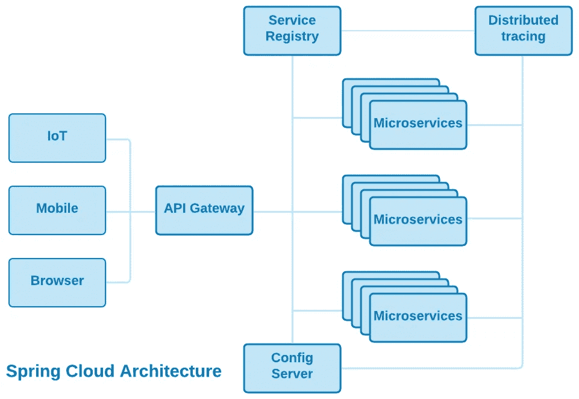

# 微服务架构

> 原文：<https://medium.com/nerd-for-tech/microservice-architecture-622e4148f1?source=collection_archive---------0----------------------->

## 让微服务在云中工作

[**点击查看详情**](https://drive.google.com/file/d/10KLDVswfBmWy9nfgtFtRqx7SsJmRKKRU/view?usp=sharing)

> *“术语* [**微服务架构**](https://martinfowler.com/articles/microservices.html) *在过去几年中涌现出来，用来描述将软件应用程序设计为可独立部署的服务套件的特定方式。虽然这种架构风格没有精确的定义，但在组织、业务能力、自动化部署、端点智能以及语言和数据的分散控制方面有一些共同的特征。”* — **詹姆斯·刘易斯**和**马丁·福勒**

## 微服务

多年来，在构建 Web 应用程序时，服务一直是一种受欢迎的技术。Web 应用程序通常由运行在 Web 浏览器上的 HTML、CSS 和 JavaScript GUI 前端构建，这些前端与 Web 服务器交互以查询、插入、更新和删除业务数据。这种架构模式被奉为 [***面向服务架构***](https://en.wikipedia.org/wiki/Service-oriented_architecture) (SOA)。 [***Spring 框架***](https://spring.io/projects/spring-framework) 和[***Jakarta RESTful Web Services***](https://en.wikipedia.org/wiki/Jakarta_RESTful_Web_Services)(JAX-RS)是用 Java 实现 SOA 的首选框架。

尽管微服务是 SOA 的一种，但并不是所有的 SOA 实现都是微服务，理解这一点很重要。事实上，使用流行的 SOA 框架很难——如果不是不可能的话——实现微服务的全部承诺。

术语*微服务*的主要问题之一是缺乏精确的定义。由于缺乏经验、无知或纯粹的营销厚颜无耻，这个术语经常被误用，指的是不可能满足微服务架构模式的公开目标的技术。那么，是什么让 SOA 服务变成了微服务呢？

微服务:

*   在**有界上下文**中实现**单个任务**(或一组密切相关的任务)。这是微服务的基本特征。单个微服务尝试做的事情越多，或者跨越的所有权边界越多，就越不可能满足微服务的其他目标。
*   是松耦合的，并且很少或者根本不了解其他微服务的定义。理想情况下，当与其他服务通信时，它使用标准格式的消息，比如 JSON。
*   是**自主的**，不需要和其他开发团队协调就可以修改。这是促进微服务开发敏捷性的一个关键属性。
*   **可独立部署**，并且可以单独测试、部署和回滚，而不会影响其他微服务。这是提升微服务部署敏捷性和可扩展性的关键属性。

如果一个应用组件不满足这四个目标，它可能是一个服务，但肯定不是微服务——并且它不能提供微服务架构风格的所有好处。

## 单一有界任务

这就是为什么我们称它们为 ***微*** *服务*而不是简单的*服务*的原因。为了自治和可独立部署，每个微服务都应该专注于实现一个任务，该任务由问题域中明确定义的上下文紧密绑定。这促进了高层次的*粒度*和*关注点分离*，保持了微服务*自治*和*独立可部署性*。

## 松散耦合

松散耦合的微服务不太可能受到其他微服务更改的影响，也不太可能在更改时对另一个微服务产生影响。

微服务应该通过消息传递进行通信，而不是通过函数调用、方法调用或远程过程调用(RPC)——它们是紧密耦合的，通常是特定于计算机语言的，并且除了 RPC 之外，要求服务在物理上部署在同一个可执行文件中。真正支持云的微服务架构是消息驱动的，使用同步请求消息和异步排队事件消息。消息传递 [***演员模型***](/nerd-for-tech/building-cloud-native-apps-part-1-393d250cf107) 是微服务的一个优秀模型。

与 Web 客户端和初始 Web 服务之间的消息传递不同，当使用 Spring Boot 或 JAX-RS 时，独立服务之间的通信通常使用 Java 方法调用，并需要将协作服务部署在一起——很难称得上是松散耦合或云友好的解决方案。

## 自治的

自治的微服务可以被修改和测试，而不需要与其他开发团队协调。这个属性极大地减少了软件开发的开销，并使敏捷开发策略更有效、更容易管理。

***要做到真正的自主，一个微服务还必须在与其他微服务隔离的情况下可测试。当使用 Spring Boot 或 JAX-RS 时，服务资源不容易被访问或执行，除非通过框架。***

## 可独立部署

服务的粒度及其在不影响其他服务的情况下单独测试、推出和回滚的能力是开发自主性的部署方面。它是服务敏捷性和持续交付的重要组成部分。

可独立部署对于利用云容器和容器编排提供的自动化部署、伸缩、可靠性和故障转移功能也是至关重要的。

***使用 Spring Boot 或 JAX-RS 时，一个“微服务”实际上是部署在一组 Java 内。jar 文件作为更大的已部署可执行文件的一部分。它不能独立部署，通常依赖于要执行的支持框架代码。这些框架是 SOA 模式的强大、可靠和可管理的实现，但是它们不能充分利用云或微服务的潜力。***

如果您有兴趣阅读更多关于如何利用微服务和云的真正功能的信息，我们建议您阅读 [***面向云的软件架构***](/nerd-for-tech/software-architecture-for-the-cloud-c9226150c1f3) 。

谢谢你。