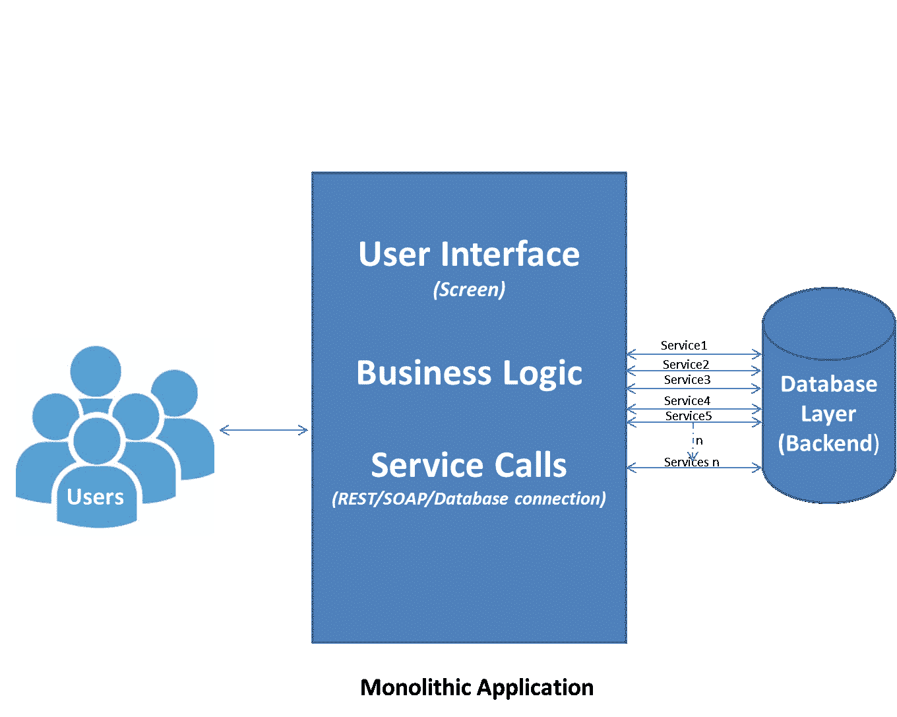
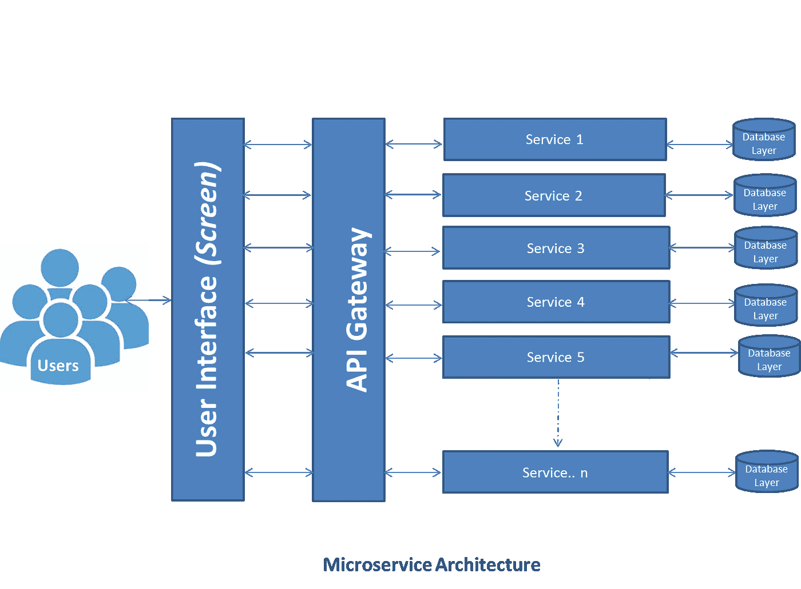

# 微服务架构讲解简单化！

> 原文：<https://medium.com/nerd-for-tech/microservice-architecture-explanation-in-simplistic-way-c85b52824683?source=collection_archive---------18----------------------->

*思考微服务架构的需求？*

您的组织是否有一个带有巨大 ear/war 的单片应用程序？您在不同阶段维护应用程序是否有困难？您的开发人员是否因为大量的应用程序代码而对缓慢的 IDE 响应感到沮丧？你不能执行快速交付和部署吗？你的建筑创作花了很多时间吗？您是否无法轻松适应新兴技术？您的新开发人员是否工作效率不高，花费大量时间仅仅理解应用程序流程和基本设置？您是否总是管理大的发布过程，即使是对应用程序进行小的更改？您在 DevOps 实现中遇到困难了吗？

如果大多数答案是肯定的，那么你肯定应该开始考虑将微服务架构作为一个潜在的解决方案。

*现在，什么是微服务，它将如何解决上述问题？*

微服务架构——是一种架构风格，它将一个整体应用程序构建或分解为一组松散耦合的服务来实现业务功能。微服务架构还加快了大型复杂应用程序的持续交付/部署。简单地说，开始考虑将您的应用程序分解成独立的组件，以便在细粒度级别上提供业务功能。使用下图对微服务进行最简单的解释。

该图显示了一个紧密耦合的应用程序，其中用户连接到一个包含用户界面、业务逻辑和后端调用服务的整体应用程序。这种体系结构倾向于具有所有上述问题。这对敏捷性和 aster 部署来说确实是一个挑战。

然而，下图显示了微服务生态系统，如果按照真正的 DevOps 原则适当实施，它可以解决大多数问题。

一般来说，微服务遵循 REST 原则，以定义的目标公开特定的业务功能。随着上市时间的缩短，增强和支持变得更加容易。开发者体验更好，简单易学。补充 DevOps 原则和最新的行业工具和技术，如 MuleSoft 和 Apigee。此外，微服务不是所有问题的解决方案，但它提供了具有高可扩展性和高效率的可靠解决方案。因此，它被许多初创公司和大型组织使用，如网飞、亚马逊。