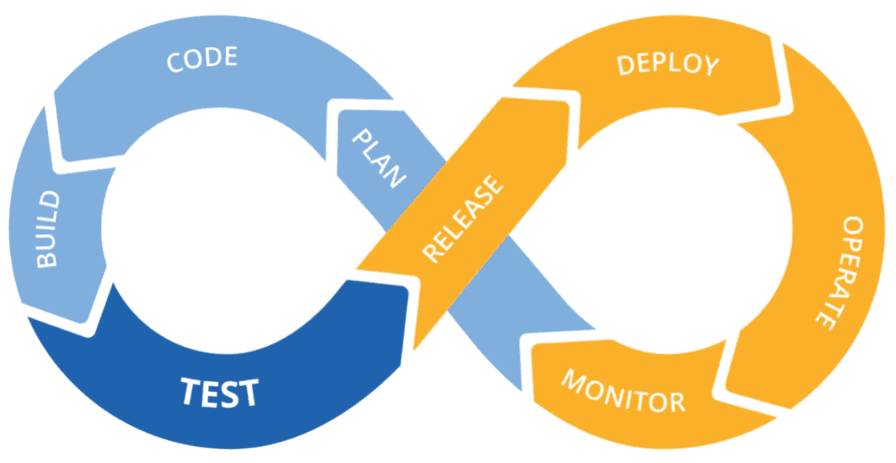
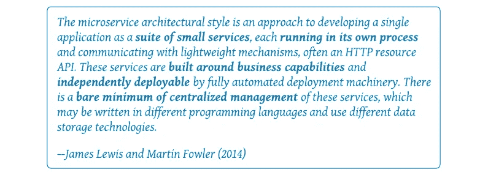

# 微服务和 CI/CD

> 原文：<https://medium.com/nerd-for-tech/microservices-and-ci-cd-caa1d2e12f10?source=collection_archive---------8----------------------->

## 创建工作伙伴关系

对于大多数组织来说，微服务是新的，他们可能需要一段时间来适应。就其本质而言，它们扰乱了我们正常的做事方式。 [*持续集成/持续部署*](https://en.wikipedia.org/wiki/CI/CD) *(CI/CD)就是那些会被打乱的东西之一。如果您感兴趣，让我们来看看微服务和 CI/CD 如何建立愉快的合作伙伴关系。*

进行 CI/CD 的组织了解他们解决的问题以及他们可以提供的价值。认为微服务会以任何方式降低 CI/CD 的需求或价值都是不明智的——如果有的话，开发微服务时创建的可执行工件数量的增加会增加这种需求。尽管如此，它们确实改变了我们需要实施 CI/CD 的一些方式，我们需要适应这一事实。

## 什么是微服务？

微服务不是魔术，但它们是将应用程序分解成可用组件的有效方法，然后这些组件可以连接在一起形成系统。微服务在软件开发社区中引起了极大的关注，因为它们承诺:

*   实现更快、更敏捷的软件开发。
*   帮助更快地迭代应用程序功能，减少麻烦。
*   为您的应用程序和用户开放云的真正力量和功能。

这些都是非常吸引人的好处，值得认真努力去获得。微服务模式也非常适合敏捷开发实践。但是对于软件开发来说，真的没有免费的午餐。微服务的基本属性确实会影响您进行 CI/CD 的方式。

> 首先，如果您想更深入地了解什么是微服务，我们建议您花 5 分钟时间阅读 [***微服务适合您吗？***](/nerd-for-tech/are-microservices-right-for-you-8fd0a6cb3183)
> 
> 剧透警告: ***真的* m *微服务不是用 Spring Boot 或 JAX RS 建造的！*** 尽管这两个框架都是构建传统面向服务架构应用程序的优秀方式，但它们并没有实现真正的 ***微*** *服务*。

## 是什么让 CI/CD 的微服务与众不同？

不要担心。您在 CI/CD 软件工具和培训上的投资没有白费，它们仍然可以完成您投资的工作。

使微服务从根本上不同的是它们的粒度、您正在使用的工件的数量以及它们的部署单元。单个微服务:

*   在域**有界上下文—** 中实现**单个任务**，这意味着有更多单独的代码单元需要管理。
*   **松耦合**是否很少或根本不了解其他微服务的定义，并通过消息传递而不是 RPC、函数调用或方法调用进行通信——这意味着它可以单独部署，而不是部署在更大的可执行文件中。
*   是自主的，可以在不同开发团队之间较少协调的情况下进行开发和修改——强化了小型且专注于单一任务的要求。
*   **可独立部署**并且可以单独测试、部署和回滚，而不会影响其他微服务——这意味着它必须可以单独测试，无需支持框架，并且必须可部署在云*容器中。部署、操作和监控通常最好通过像 Kubernetes 这样的容器编制器来管理。*

## 怎么办？

显然，服务需要 CI/CD 完全是微服务。同样显而易见的是，由微服务模式创建的可部署代码单元的激增可以使 CI/CD 成为一种逻辑上的必需品。唯一真正的选择是使用可用的商业和/或开源工具，还是开发自己的工具。除非有任何真正独特的组织约束，否则这个选择很容易。

对于任何新的架构、技术或技巧，最好从小处着手。微服务和云计算对您的组织来说可能是新事物。直接跳进游泳池的深水区可能会有风险。通常最好是从浅的一端开始，一步一步来，从小项目开始，重点学习如何调整您的 CI/CD 实践以适应微服务模式的独特属性，并在您进入构建和管理软件的新方法时强调沟通。努力是值得的。

## 附加阅读

如果你想阅读更多的微服务，我们推荐 [***云软件架构***](/nerd-for-tech/software-architecture-for-the-cloud-c9226150c1f3) 和 [***多云应用:第一部分，掌握演员模型***](/nerd-for-tech/building-cloud-native-apps-part-1-393d250cf107) 。