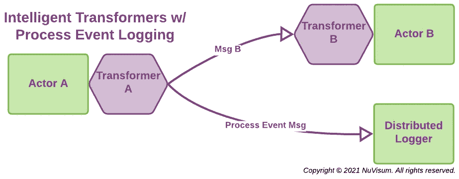

# 微服务和流程挖掘

> 原文：<https://medium.com/nerd-for-tech/microservices-and-process-mining-c6bab8410045?source=collection_archive---------7----------------------->

## 充分利用邮件和事件

**图片由** [**出品**](https://www.produktion.de/) 提供

*流程挖掘是您的组织不可或缺的一项管理功能，也是一种基于软件的方法，可获得组织价值链中流程的精确而全面的信息。它捕获并组织从员工、客户、供应商、业务合作伙伴和监管机构与用于运营组织的软件应用程序的交互中产生的数据。*

*如果做得好，它可以创建一个组织运营的实际事件和行动的连续而准确的画面，从而为提高卓越运营和管理合规性和流程质量提供基础，这是* [*成功数字化转型的基本促成因素*](/nerd-for-tech/the-memo-amazons-secret-sauce-e99bdc37c65f#6f9a) *。*

## 微服务和流程挖掘有什么关系？

一个动态松散耦合的 [*微服务架构*](/nerd-for-tech/microservice-architecture-622e4148f1) 使用 [*actor 模型*](/nerd-for-tech/building-cloud-native-apps-part-1-393d250cf107#fb54) 微服务，通过消息传递和事件队列进行通信。这些微服务可以分布在内部和混合云集群中。

正确实现后，消息和事件代表了应用程序中发生的所有操作和状态变化的总和——这是流程挖掘的真正宝库。我们只需要利用它们。我们甚至不需要修改单个微服务本身。

## 那么，我们如何挖掘过程数据的宝藏呢？

[*扩展的云 actor 模型*](/nerd-for-tech/building-cloud-native-apps-part-1-393d250cf107#963b) 定义了专门的 actor 类型，为您在实现微服务应用时创建的应用 actor 提供服务。明智地使用这些专门的服务使得收集消息和事件流变得可靠、简单和高效。用于此目的的特定云参与者类型有:

1.  [**智能变压器**](/nerd-for-tech/building-cloud-native-apps-part-1-393d250cf107#b578) 动作者对动作者做出反应的请求和事件消息进行操作。它们已经被用来在参与者对消息做出反应之前和之后实施 [*前置条件*](https://en.wikipedia.org/wiki/Precondition) 和 [*后置条件*](https://en.wikipedia.org/wiki/Postcondition) 。使用一个转换器将一个*流程事件*消息传递给一个分布式日志记录器只需要对转换器做很小的改动，对性能的影响也很小。
2.  [**分布式日志记录器**](/nerd-for-tech/building-cloud-native-apps-part-1-393d250cf107#1aa3) 参与者将事件和消息写入适当的分布式日志。为此，流程事件消息被写入指定的流程日志。每种分布式日志类型至少维护 3 个分布式实例，以保证适当的故障转移目标处于活动状态。日志消息保证只被写入每个分布式日志实例一次。如果一个失去联系的日志重新加入该日志集，它会自动与其对等日志同步。
3.  [**事件处理程序**](/nerd-for-tech/building-cloud-native-apps-part-1-393d250cf107#6841) 角色可以用来读取具体的分布式日志进行分析和处理。这抽象了底层的分布式日志记录技术，并保证正确、有序地读取适当的日志，并使用指定的过滤器来提供您需要的信息。

## 包扎

这是对流程挖掘和微服务之间协同作用的一个有意的简短介绍。我们希望它能让我们领略正确实现的微服务应用的灵活性和潜力。如果这引起了您的兴趣，我们建议您阅读:

*   [***微服务架构***](/nerd-for-tech/microservice-architecture-622e4148f1)**让微服务在云中工作**
*   *[***设计微服务***](/nerd-for-tech/designing-microservices-4130bc41c046) *设计和构建微服务的实用方法**
*   *[***云软件架构***](/nerd-for-tech/software-architecture-for-the-cloud-c9226150c1f3)**如何让云原生应用的实施变得更简单***
*   **[***构建多云应用:第一部分***](/nerd-for-tech/building-cloud-native-apps-part-1-393d250cf107)**掌握演员模型****

**如果您有任何意见或问题，我们很乐意回答。**