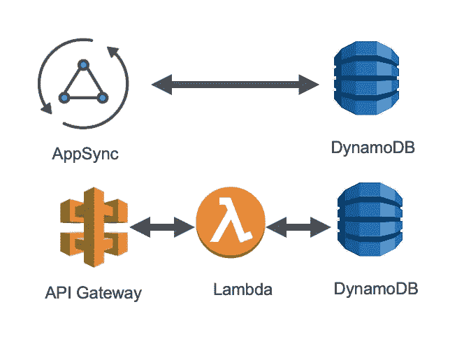

# 实践中的微服务设计模式因 AWS 无服务器而变得简单

> 原文：<https://medium.com/nerd-for-tech/microservices-design-patterns-in-practice-made-easy-with-aws-serverless-37bb1894569d?source=collection_archive---------4----------------------->

这是一个在实践中解释微服务设计模式的系列

## [***打造无服务器微服务《Hello World》休息端点:步步为营***](https://www.linkedin.com/pulse/create-serverless-microservice-hello-world-step-elhousieny-phd%25E1%25B4%25AC%25E1%25B4%25AE%25E1%25B4%25B0/?trackingId=sk%2Fcmx%2F5KTouNWuRYHXAwg%3D%3D)

 [## 创建无服务器微服务“Hello World”REST API:循序渐进

### 基本微服务的基本元素包括一个 API 端点和一个数据库。在这篇文章中，我将…

www.linkedin.com](https://www.linkedin.com/pulse/create-serverless-microservice-hello-world-step-elhousieny-phd%25E1%25B4%25AC%25E1%25B4%25AE%25E1%25B4%25B0/?trackingId=sk%2Fcmx%2F5KTouNWuRYHXAwg%3D%3D) 

## 2.[向微服务添加 Lambda](https://www.linkedin.com/pulse/create-serverless-microservice-hello-world-step-elhousieny-phd%E1%B4%AC%E1%B4%AE%E1%B4%B0-1c/?published=t)

 [## 逐步创建无服务器微服务“Hello World ”:向微服务添加 Lambda

### 本文是解释微服务设计模式 1 系列文章的一部分。创建无服务器微服务“你好…

www.linkedin.com](https://www.linkedin.com/pulse/create-serverless-microservice-hello-world-step-elhousieny-phd%E1%B4%AC%E1%B4%AE%E1%B4%B0-1c/?published=t) 

## 3.**利用 AWS AppSync 和 Amplify 构建****graph QL 微服务**

 [## 使用 AWS AppSync 和 Amplify 构建 GraphQL 微服务

### 由于我们创建了 REST 微服务，我想创建一个 GraphQL 微服务。AWS Amplify 和 AppSync 使它…

www.linkedin.com](https://www.linkedin.com/pulse/building-appsync-graphql-using-aws-amplify-rany-elhousieny/)  [## 使用 AWS AppSync 和 Amplify 构建 GraphQL 微服务

### 由于我们创建了 REST 微服务，我想创建一个 GraphQL 微服务。AWS Amplify 和 AppSync 使它…

ranyel.medium.com](https://ranyel.medium.com/building-a-graphql-microservice-with-aws-appsync-and-amplify-58883d16f472) 

## 4.扼杀者模式

 [## 扼杀者模式:实践中的微服务设计模式因 AWS 无服务器而变得简单

### 在本文中，我将解释由 Martin Fowler 发明的著名微服务迁移模式“扼杀者…

ranyel.medium.com](https://ranyel.medium.com/the-strangler-pattern-microservices-design-patterns-in-practice-made-easy-with-aws-serverless-97437a82b052) 

完整代码可以在[https://github . com/ranyelhousieny/micro services _ AWS _ server less](https://github.com/ranyelhousieny/Microservices_AWS_Serverless)找到

# 案例研究:

# 从整体架构迁移到微服务实际案例研究

 [## 从整体架构迁移到微服务实际案例研究

### 在本文和附带的视频中，我将经历一次从……迁移的真实经历

ranyel.medium.com](https://ranyel.medium.com/migrating-from-monolithic-architecture-to-microservices-hands-on-real-world-case-study-2aa81c579084) 

=======================================