# AWS 无服务器简化微服务设计模式:1。创建 REST API

> 原文：<https://medium.com/nerd-for-tech/microservices-design-patterns-made-easy-with-aws-serverless-5330128b4992?source=collection_archive---------0----------------------->

基本微服务的基本元素包括一个 API 端点和一个数据库。在本文中，我将展示如何构建一个“Hello World”微服务，我将在以后的文章中以此为基础来解释微服务设计模式。

本文是解释微服务设计模式系列的一部分

1.  [***【本文】打造无服务器微服务《Hello World》休息端点:步步为营***](https://www.linkedin.com/pulse/create-serverless-microservice-hello-world-step-elhousieny-phd%25E1%25B4%25AC%25E1%25B4%25AE%25E1%25B4%25B0/?trackingId=sk%2Fcmx%2F5KTouNWuRYHXAwg%3D%3D)

 [## 创建无服务器微服务“Hello World”:循序渐进

### 基本微服务的基本元素包括一个 API 端点和一个数据库。在这篇文章中，我将…

www.linkedin.com](https://www.linkedin.com/pulse/create-serverless-microservice-hello-world-step-elhousieny-phd%25E1%25B4%25AC%25E1%25B4%25AE%25E1%25B4%25B0/?trackingId=sk%2Fcmx%2F5KTouNWuRYHXAwg%3D%3D) 

完整代码可以在[https://github . com/ranyelhousieny/micro services _ AWS _ server less](https://github.com/ranyelhousieny/Microservices_AWS_Serverless)找到

==========================================

# 1.使用 API 网关构建无服务器 REST API 端点

可以为 REST 或 GraphQL 创建 API 端点。在本文中，我将使用 API Gateway 创建 REST 端点。如果您对 GraphQL 感兴趣，请遵循本文使用 AppSync 和 Amplify 构建 GraphQL 微服务[https://www . LinkedIn . com/pulse/building-app sync-graph QL-using-AWS-Amplify-rany-elhousieny/](https://www.linkedin.com/pulse/building-appsync-graphql-using-aws-amplify-rany-elhousieny/)

# 使用 AWS 控制台创建 API 网关

转到您的 AWS 控制台并搜索 API 网关

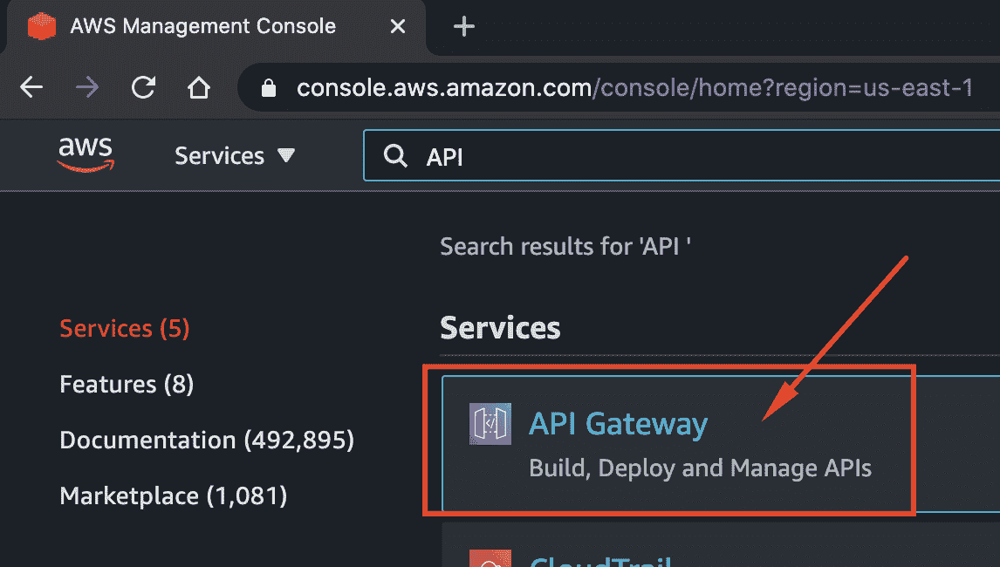

选择公共 REST API

按照下图中的步骤操作:

现在，您将看到创建动作和资源的屏幕。资源是您希望使用 API 访问的资源。选择创建资源

# 创建资源

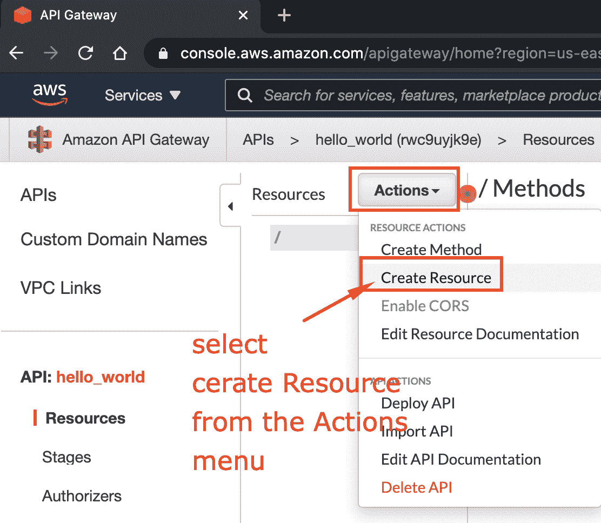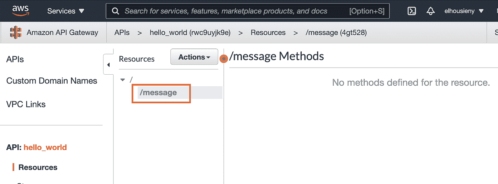

# 创建 REST 方法

一种方法是 http CRUD 动词(API)，例如(GET、POST、DELTE、UPDATE)。

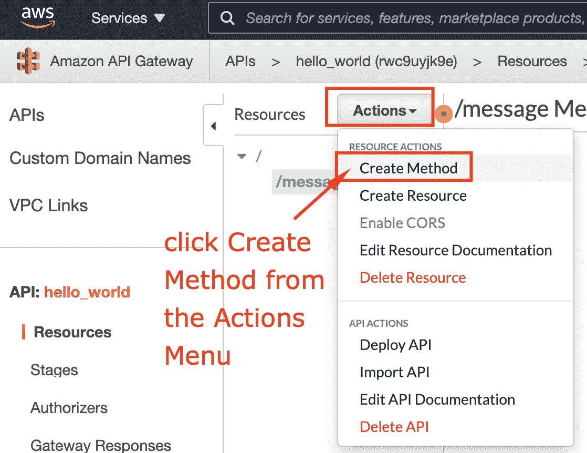

从消息菜单中选择获取方法

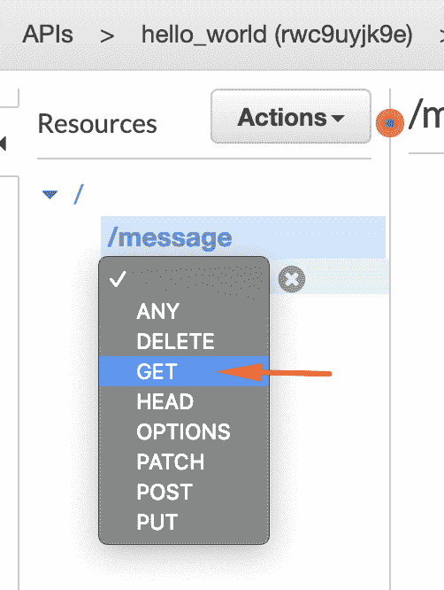

现在选择模拟响应

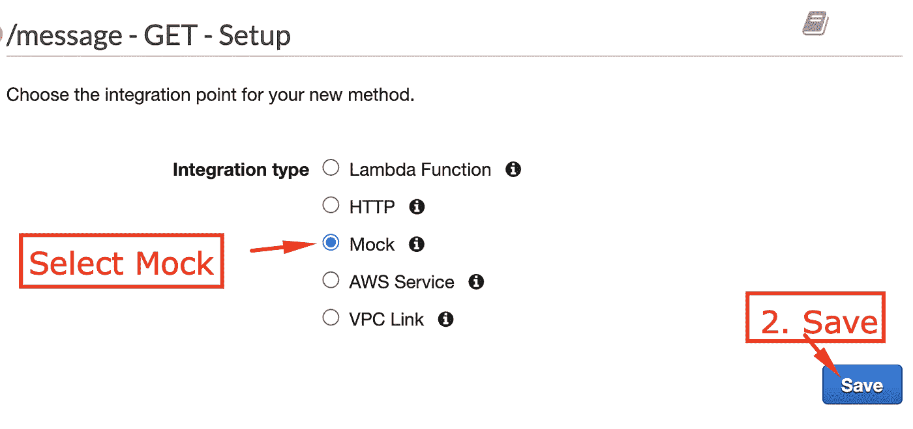

您将获得以下屏幕。不要担心稍后会解释它，但是现在让我们通过集成一个响应来返回一个简单的“Hello World”消息

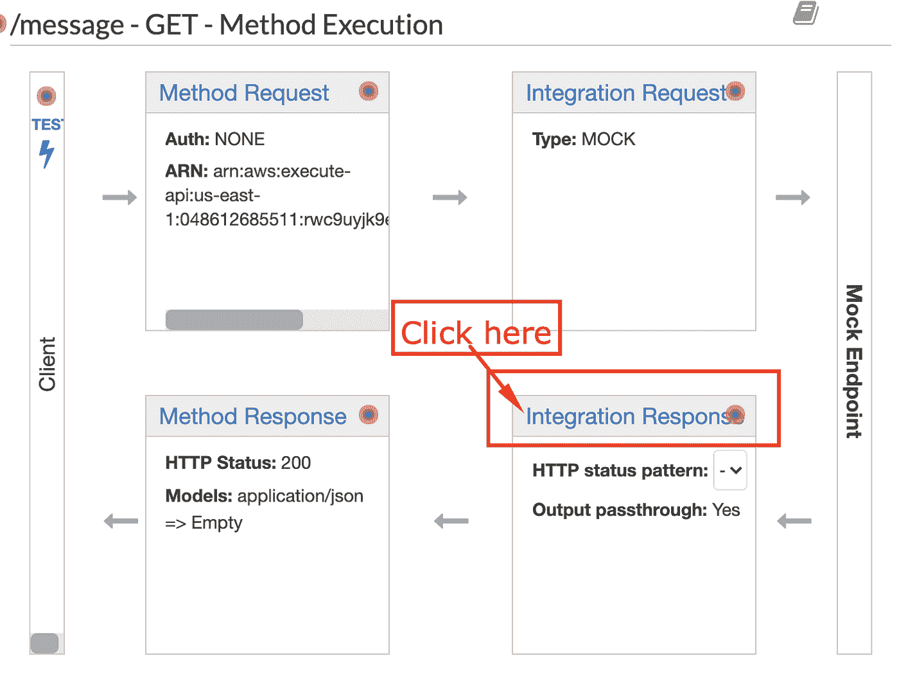

让我们在浏览器上部署和尝试

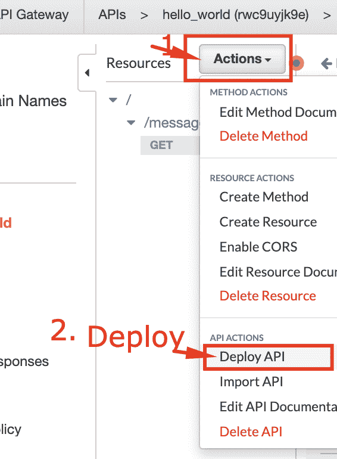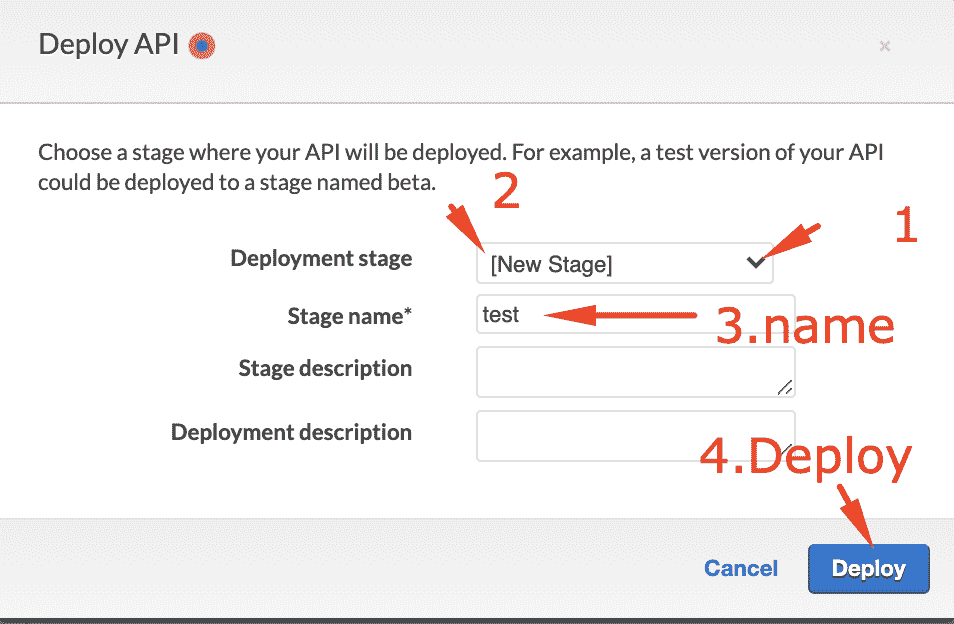

点击 url 并在末尾添加/消息

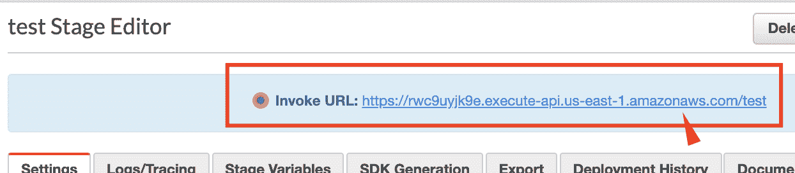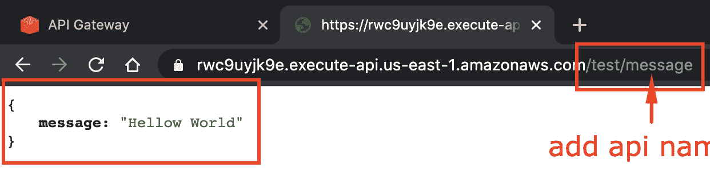

您可以使用 fetch 从 React 前端调用这个 API，如下文所述，但是将 url 更改为您刚才使用的 URL[这里](https://www.linkedin.com/pulse/fetch-data-redux-thunk-react-native-app-rany-elhousieny-phd%E1%B4%AC%E1%B4%AE%E1%B4%B0/)