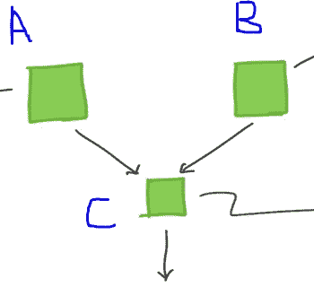
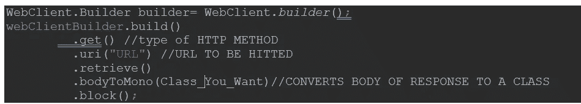

# 弹簧靴中的微服务 I

> 原文：<https://medium.com/nerd-for-tech/microservices-in-spring-boot-i-3fb961daaf99?source=collection_archive---------1----------------------->

微服务一般来说基本上是将一个软件分解成各种形式。它主要是在各种小型应用程序中分发一个整体应用程序，以降低应用程序的复杂性。小部分形成一个微服务，各个微服务一起运行一个应用。monolith 和微服务的主要区别在于 monolith 项目的复杂性在于应用程序内部，而基于微服务的应用程序的复杂性在于微服务网络之间。

例如:-脸书的前端必须运行在某个服务器 A 上，其后端必须部署在服务器 B 上。因此 A 和 B 是微服务..现在，为了让脸书运转起来，A 和 B 必须和谐地工作。来自 A 的请求必须由 B 来服务，反之亦然。更简单地说，如果我们在任何一个 IDE 中打开两个不同的 spring 应用，那么那些应用如果提供 HTTP 支持和 API 调用，那么它们就是微服务。虽然这个例子很简单，也不准确，但我希望它给出了一个微服务的公平例子。

为了让微服务协同工作，它们必须相互通信。微服务之间的通信可以通过 API 调用(主要)、通过服务器、第三方客户端或任何其他方式进行。准确地说，主要有三种方法

以编程方式调用 REST APIs。

使用 REST 客户端库(使用反应式编程。例如-假装客户端)。

使用 REST 模板

服务 A、B、C

要开始这个过程:-

1.使用任何工具创建 spring 应用程序。只需要基本的库。

2.使用不同的名称创建其他应用程序，并在 intellij 或任何合适的 IDE 中打开所有应用程序。

3.通过用硬编码数据加载这些服务并在不同端口上运行它们来创建虚拟应用程序，以便所有应用程序可以同时运行。在春天，我们可以通过使用

> server.port =所需端口编号

4.现在我们需要从一个微服务调用另一个微服务。如上所述，这可以通过 3 种方式实现。最广泛使用的方法是**通过 Rest 模板**。它是内置的，由于 Web 客户端的出现，它将被弃用，但它过去和现在都在使用，因此我们将使用它从一个微服务调用另一个微服务。因此，为了做到这一点，我们需要下面这段代码

> rest template rest template = new rest template()；
> restTemplate.getForObject("需要端点"，receiver class . class)；

在这里，getForObject 只用于 GET 方法。Rest 模板也提供了其他方法。上述参数是另一个微服务的端点或 URL，而接收方类可以是能够接收来自上述端点的响应的任何类。例如:-

> movie data data = rest template . getfor object(" http://localhost:8081/movie/2 "，movie data . class)；

这是使用模板的一种方式。它很简单，不言自明，但是 rest 模板也可以以各种其他方式使用。

这里需要注意的一点是，每次 API 调用发生时，整个程序*都在等待 API* 的响应——因为 Java 是**同步**的，不像 JS 那样，在我们完成上面那一行的执行之前不会跳转到下一个相邻的行。因此，为了避免上述复杂性，我们需要使用*反应式编程*使用 webclients 等，在那里我们使这些事情异步。\

**通过 WebClients 调用微服务**

如上所述，rest 模板已经贬值/即将贬值。因此，我们将看看如何使用 web 客户端来做上述事情。首先，我们需要导入或使用 spring 的 webflux 依赖项，它也被称为 Reactive web，在项目创建期间可以在 spring starter 中获得。同样的事情也可以从 maven 依赖网站使用。现在，为了使用这个特殊的结构，我们需要:-

浏览代码:-

。build()用于构建适当的 url，这里是微服务或所需端点的 URL。

。get()是 HTTP 方法的类型。它也可以是 get()、Post()等。

。url()是我们想要访问的 url。在我们的示例中，这是微服务的终点。

。reterive()带给我们来自 Url 的响应

。bodyToMono()类似于 js 中的 promises。这仅仅意味着我们得到了一些不是我们想要的类/类型的东西，但是将来它最终会变成我们想要的类型。它有助于异步调用，进而有助于反应式编程。

。block()阻塞代码的执行，直到 bodyToMono 检索到整个对象。此外，这里的**块防止异步调用**。为了使它真正异步，我们还需要返回一个 flux 或 async 对象。

用有效的例子解释上述代码:-

> random class movie = webclient builder . build()
> 。get()
> 。uri(" http://localhost:8082/movies random end ")
> 。检索()
> 。body tomono(random class . class)
> 。block()；

**需要注意的指针:-**

假设我们有一个类“price ”,我们的微服务 API 调用返回一个价格列表。为了得到这个，我们通常做的是:-

> price p = rest template . getforobject(" http://localhost:8083/ratingsData/users/foo "，price . class)；

但是在这里，我们有一个 ***列表*** 即将到来。因此，上述函数中的第二个参数给我们造成了一个问题，因为我们**不能**做 List.class 或 List < Price > .class。因此，为了避免这个问题，我们可以有两种方法:-

*A .使用 ParameterizedTypeReference:-*

简单来说，我们可以使用 ParameterizedTypeReference<list>>(){ }</list>

*B .创建接收值的新类:-*

也许最好的方法是创建一个新的类，它有一个我们想要的类型的 list/map 等变量，并使用对象来接收值。例如:-假设我们需要价格列表，所以我们生成一个类结果，将 List <price>作为变量，并将 Result.class 用作 rest 模板的参数。另外，请注意，如果我们在这里更改接收类型，我们还需要从 API/微服务本身更改发送类型。</price>

总结这篇文章，我们可以使用上面提到的方法调用微服务。有一点你可能已经注意到了，上面例子中微服务的 URL 是**硬编码的**。由于某些原因，这是一种极其糟糕的做法，应该避免。现在，这个话题本身是安静的*知识丰富的*，在这里讨论它超出了本文的范围，但是在本文的第 2 部分我们将会探讨这个问题，所以我希望你会期待续集和 ***感谢你阅读这篇文章*** :)。