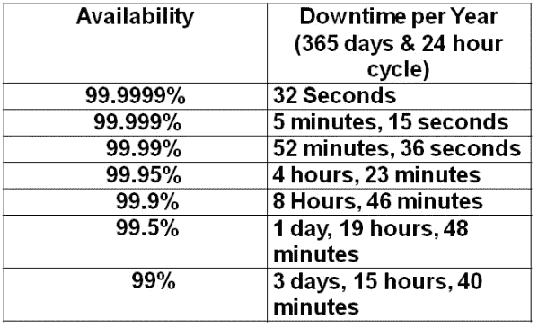

# 微服务(第 2 部分)——最佳实践

> 原文：<https://medium.com/nerd-for-tech/microservices-part-2-best-practices-4ac68eea0990?source=collection_archive---------13----------------------->

图 1:最佳实践(来源:Google)

为了成功实现微服务架构，开发人员需要遵循一套最佳实践。让我们来讨论一下这些最佳实践。

# 设计

在实现微服务架构之前，对系统的边界进行建模是非常重要的。设计系统的开发人员必须对特定领域的流程和规则有非常清晰的理解。设计应该是一个**领域驱动的设计**。

**领域驱动设计** -

*领域驱动设计是一种软件开发方法，它将开发集中在对领域模型的编程上，该模型对领域的过程和规则有丰富的理解。*

—马丁·弗劳尔。

# 硬编码值

*   硬编码值是计算机程序中的固定参数，不修改程序就不能更改。

在微服务架构中，代码应该总是动态的。应用程序中运行的服务实例集是动态变化的。这些实例具有动态分配的网络位置。因此，主机名、URL 等不应该被硬编码，因为它们可以动态改变。

# 记录

日志记录是软件开发过程的一个重要部分。在微服务架构中实现这个日志记录过程存在一些挑战。这是因为有许多服务，它们只通过定义明确的接口相互通信。因此，正常的测井程序将不适用。

假设应用程序有网络问题。开发人员可能会尝试查看日志并找出原因。但是日志文件夹可能包含来自不同服务的日志，因此很难识别正确的日志。

## **关联 ID**

一种在微服务架构中实现日志记录的有效方法。相关 ID 也称为事务 ID，包含在每个消息中。关联 ID 取自发起事件，这个惟一的 ID 记录在每个调用服务中。因此，更容易找到信息的流向。

## **记录有价值的信息**

记录太多的信息会影响系统的性能。然而，记录太少的信息会使开发人员在出现 bug 时难以识别错误。因此，日志应该包含适量的信息，这些信息可能对其他人识别进程有潜在的价值。

## 时间

“时间戳”是日志的重要组成部分。微服务是分布式的，因此时间可能不会以正确的方式跨所有服务同步。在这种情况下，日志文件可能包含顺序不正确的时间戳。为了克服这个问题，有 Lamport、矢量时钟等技术。

# 微服务中的版本控制

有两种执行版本控制的通用方法(不考虑架构)。

## 1.语义版本控制

语义版本化使用 **3 个非负整数**来表示一个版本。整数:

*   **主要:**上一版本与当前版本不兼容时增加。
*   **次要:**上一版本兼容当前版本时增加。
*   补丁:作为新版本一部分的一个 bug 修复。这个新版本也与以前的版本兼容。

通常在应用程序包含许多不同模块时使用。

## 2.日历版本控制

类似于语义版本控制，但是使用日历日期而不是非负整数。这些日期包含年、月和日的组合。通常在应用程序有时间限制时使用。这意味着支持和可用期是由持续时间驱动的，而不是由使用量驱动的。

> ***语义版本化更适合微服务架构。***

有一些特定于微服务的特殊版本控制技术。

*   基于 URL 的版本控制
*   标题驱动的版本控制。

**示例**

**假设:**有两个服务，即服务“A”和服务“B”。“A”服务使用来自服务“B”的数据。开发人员升级服务“B ”,它改变了服务 B 的数据库结构。

如果开发人员部署这个新系统，服务“A”将会中断。这是因为服务“B”中的数据库结构发生了变化。

**那么我们能做什么呢？**

我们可以使用版本控制。我们可以创建两个版本，并要求用户升级到新版本。所有用户升级到新版本需要一些时间。两个版本都将启动并运行到那时。有许多部署框架可以高效地完成这一过程。

# 微服务中的授权和认证

微服务架构包含不同的服务。如果每个服务都试图验证用户，系统将会很慢并且效率低下。因此，身份验证和授权过程应该以不同的方式实现。

在微服务架构中，

*   集中式服务用于执行这些过程。
*   有 WS02 身份服务器、OAuth2orize 等解决方案可以实现这一点。

最好的方法是有一个单独的身份验证服务。

# 依赖性管理

微服务架构的主要原则是让每个服务独立运行。它们基本上被建模为孤立的单元。因此，这些服务中的每一个都应该可以独立部署，没有共享的依赖关系。

# 签订可执行的合同

指客户和公司签订合同的过程。这份合同是可执行的。这个合同可能包括一组定义明确的测试。这些测试将在每个应用程序构建中执行。

# 容错

在任何给定的系统中，故障都是常见的。请考虑下表。

图 2:每年的停机时间

可用性为 99.999%的系统每年仍有 5 分 15 秒的停机时间。微服务架构包含多种服务。因此，这种停机时间通常要长得多。

***微服务:快速失效、无声失效、回退***

**可能的措施**

*   花费时间超过定义阈值的超时调用。
*   为每个依赖项维护一个线程池。
*   使用断路器在给定时间内阻止对目标服务的所有请求。

> 注意:接下来的文章将描述容错中使用的模式。

# 证明文件

指清楚地解释软件或服务应该如何操作的文档。它可以有文字或插图。这个文档对于开发人员和其他人员清楚地理解特定的服务非常重要。Swagger 是一个流行的开源工具，有助于记录任何规模的 API。这可用于在微服务架构中执行文档编制。

本文的下一部分(第 3 部分)解释了可用于微服务架构的流行设计模式。

我使用了 Krishntha Dinesh 先生的以下播放列表来收集所需的信息。

# 参考

 [## 微服务中的认证和授权- DZone 微服务

### 微服务架构作为实施解决方案的首选架构，已经获得了很大的市场份额…

dzone.com](https://dzone.com/articles/authentication-and-authorization-in-microservices)  [## 微服务日志记录:使分布式系统中的调试更容易

### 在过去的几年中，软件设计和交付的主要发展之一是从…

stackify.com](https://stackify.com/microservice-logging/)  [## bliki:域名驱动设计

### 领域驱动设计是一种软件开发方法，它将开发集中在对领域模型编程上…

martinfowler.com](https://martinfowler.com/bliki/DomainDrivenDesign.html)