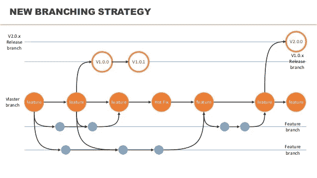

# 微服务(第三部分)——微服务的设计模式(聚合器模式)

> 原文：<https://medium.com/nerd-for-tech/microservices-part-3-design-patterns-for-microservices-aggregator-pattern-75229280399a?source=collection_archive---------9----------------------->

图 1:设计模式(来源:dribbble)

微服务是一种全新的应用开发方式。设计模式是这个新的实现过程的关键部分。我们来讨论一些常用的设计模式。

# 聚合器模式

微服务应用程序由几个独立的服务组成。这些服务耦合度较低，并通过定义良好的接口相互对话。服务也有自己的数据库。然而，在某些情况下，我们需要编写查询来从不同服务的多个数据库中获取结果。我们可以使用聚合器模式来实现这一点。

在聚合器设计模式中，特定的服务(服务 A)将接收请求。那么这个服务将随后向多个服务(服务 B，C)发出请求。然后它(服务 A)将组合结果并响应初始请求。实现聚合器模式有 3 种主要方式。

1.  **分散-聚集模式**
2.  **连锁模式**
3.  **分支模式**

让我们借助一个真实的例子来进一步理解这 3 个主要实现。

# 用例

假设我们需要为一家酒店实现一个基于微服务的系统。该系统包含以下服务。

1.  服务 1:获取客人信息。
2.  服务二:获取房间信息。
3.  服务三:获取美食信息。
4.  服务四:获取餐厅信息。

假设这些服务有两个主要消费者。

1.  客人管理系统。
2.  餐厅管理系统。

通常我们能做的是—

*使用 docker 创建这 4 个服务的多个实例并部署它们。*

**问题:**客人管理系统需要客人信息和房间信息。

## **解决方案**

在微服务架构中，我们总是实现转储管道和智能端点。因此，我们可以创建另一个服务来消费这两个服务(客人信息服务和房间信息服务)，并将响应返回给消费者。有两种主要的方法来实现这一点。

**选项 01:** 向客人信息和客房信息服务发送并行响应。然后将结果汇总并发送回。

这种实现称为**分散聚集模式**(也称为并行聚集)。它基本上是一个复合模式，描述了如何将一条消息广播给多个接收者，并将响应重新聚合回一条消息。

但是有一个问题。我们不能总是使用这种模式。

**如果客人信息服务依赖客房信息服务怎么办？**

现在我们不能发送并行呼叫。

**选项 02:**

1.  调用游客信息服务。
2.  获得一个唯一的代码(客户代码)以及响应。
3.  将客人代码交给客房信息服务部。
4.  然后获取房间信息。
5.  最后，汇总结果并发回。

这个实现被称为**服务链**。服务链比并行聚合慢。

**分支**

这基本上是聚合器和链设计模式的混合。在这种模式中，一个特定的服务可以在给定的时间与多个服务进行通信。我们可以使用一个名为“分行代码”的字段。那么请求的目的地将由这个分支代码决定(也可能是下一个服务调用地)。

图 2:分支

***业务需求变化***

**新要求:**餐厅管理层在执行其操作之前，需要一些来自客人管理层的信息。

现在，我们可以在不修改任何现有服务的情况下实现这一功能。这是通过创建另一个聚合服务来实现的。这个聚合服务将与必要的服务(在 Guest management 中)对话并获取信息。

部署应该在版本控制的帮助下完成。我们可以部署系统的两个版本，并要求客户端升级到新版本。两个版本都应该运行一段特定的时间(直到所有的客户端都升级到新版本)。最后，我们可以删除旧版本的系统。

## 聚合器模式的优势

*   减少客户端和服务之间的通信开销。
*   易于理解和实施。
*   快速发展。

本文的下一部分阐述了另一种广泛使用的设计模式，称为断路器模式。我使用了 Krishntha Dinesh 先生的以下播放列表来收集所需的信息。

# 参考

 [## 使用 AWS Lambda - DZone 微服务的微服务聚合器设计模式

### 聚合器设计模式可能是微服务实现中最常用的设计模式。这个…

dzone.com](https://dzone.com/articles/microservices-aggregator-design-pattern-using-aws)  [## Java EE 8 设计模式和最佳实践

### 聚合器模式顾名思义，这种模式建立了某种程度上更…

www.oreilly.com](https://www.oreilly.com/library/view/java-ee-8/9781788830621/d20a2b30-62e3-4abb-8629-22e054f7f695.xhtml)  [## 聚合器微服务

### 用户对聚合器服务进行一次调用，然后聚合器调用每个相关的微服务。真实的…

java-design-patterns.com](https://java-design-patterns.com/patterns/aggregator-microservices/)