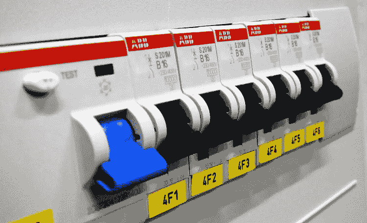
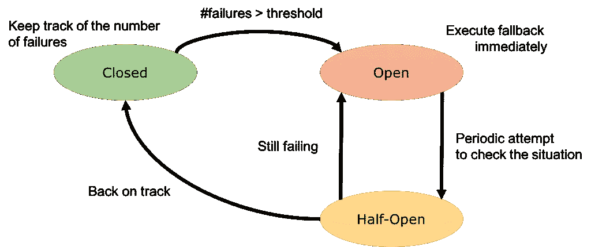

# 微服务(第 4 部分)——微服务的设计模式(断路器模式)

> 原文：<https://medium.com/nerd-for-tech/microservices-part-4-design-patterns-for-microservices-circuit-breaker-pattern-5456efafba48?source=collection_archive---------7----------------------->

图 1:断路器(来源:谷歌)

断路器模式是微服务架构中使用的另一种流行的设计模式。这种模式属于可持续设计模式的范畴。这意味着它有助于保持一个特定的服务不出现故障。可用性是微服务架构中的一个关键因素。因此，实现一种克服这些故障的方法是很重要的。

想想微服务架构。系统中不同的服务之间有许多远程调用。与内存中的调用不同，这些远程调用在给定的实例中很有可能失败。这些故障可能是由于网络问题、超时等原因造成的。还可能有意外事件导致的故障，这些故障的修复时间会很长。有时这些服务可能会完全失败。

在这种情况下，**请求服务应该接受这些失败并继续前进，而不需要等待特定的服务**。

有时，这些故障可能会传播并导致级联故障。

# 连锁故障

> ***一个由相互关联的部分组成的系统中的一个过程，其中一个或几个部分的故障可以触发其他部分的故障，以此类推。***
> 
> ***-维基百科***

示例:

考虑这样一种情况，服务 A 调用服务 B，但是服务 B 不能正常工作。现在，调用服务将等待超时，并发回一个响应，说它不可用。这没关系，因为这只是一个请求。

**如果 B 是高要求服务怎么办？**

服务 B 将接收大量请求。那么这个实现将导致这些并发请求被阻塞，直到超时。这会导致级联故障。

**为什么这是危险的？**

这些被阻塞的请求可能占用宝贵的系统资源，如线程、内存等。这可能会导致系统的其他部分出现故障。这就是为什么微服务总是遵循“**快速失败、无声失败、回退”**原则。

# 解决办法

## 断路器模式

*   这是克服上述问题的有用模式。它将确保服务不会重复尝试执行可能失败的操作。使用预定义的阈值(通常为 75%)。

**如果特定服务的失败次数超过给定阈值，请求服务将不会尝试命中失败的服务。相反，它将故障回复给消费者，并通知该特定服务不可用。**

然后，到达特定服务的后续请求将会自动回复，而不会等待。这个过程类似于房子的断路器，因此得名。

*   Ping 请求用于检查响应时间。一旦响应时间恢复正常，电路将被接通。

这个断路器基本上充当在不久的将来有可能失败的服务的代理。这意味着它将基本上跟踪失败服务的数量，并使用该信息来做出决定(要么继续，要么拒绝)。有 3 种主要状态。

图 2:断路器状态

**1。关闭**

代理将请求路由到服务，并查看操作的状态。它跟踪最近的故障。如果特定请求不成功，它将把不成功计数加 1。

如果最近不成功计数的数量超过阈值水平，代理将进入**打开**状态，并且还将启动超时定时器。当超时结束时，它将进入**半开**状态。

**2。打开**

通过抛出异常，请求将立即失败。

**3。半开**

有限数量的请求将被路由到该服务。如果成功，代理的状态将变为**关闭**。不成功的计数也将变为 0。如果请求失败，状态将变为**打开**。

考虑这样一种情况，服务试图从失败的实例中缓慢恢复。此恢复服务可能无法同时支持大量请求，因为它仍在恢复中。这种半开状态有助于避免对此服务的请求泛滥。

本文的下一部分阐述了另一种广泛使用的设计模式，称为代理模式。我使用了 Krishntha Dinesh 先生的以下播放列表来收集所需的信息。

# 参考

 [## 断路器

### 软件系统对运行在不同进程中的软件进行远程调用是很常见的，可能是在不同的…

martinfowler.com](https://martinfowler.com/bliki/CircuitBreaker.html#:~:text=You%20wrap%20a%20protected%20function,call%20being%20made%20at%20all)  [## 级联故障-维基百科

### 连锁故障是一个相互关联的部件系统中的一个过程，其中一个或几个部件的故障会导致…

en.wikipedia.org](https://en.wikipedia.org/wiki/Cascading_failure#:~:text=A%20cascading%20failure%20is%20a,other%20parts%20and%20so%20on)