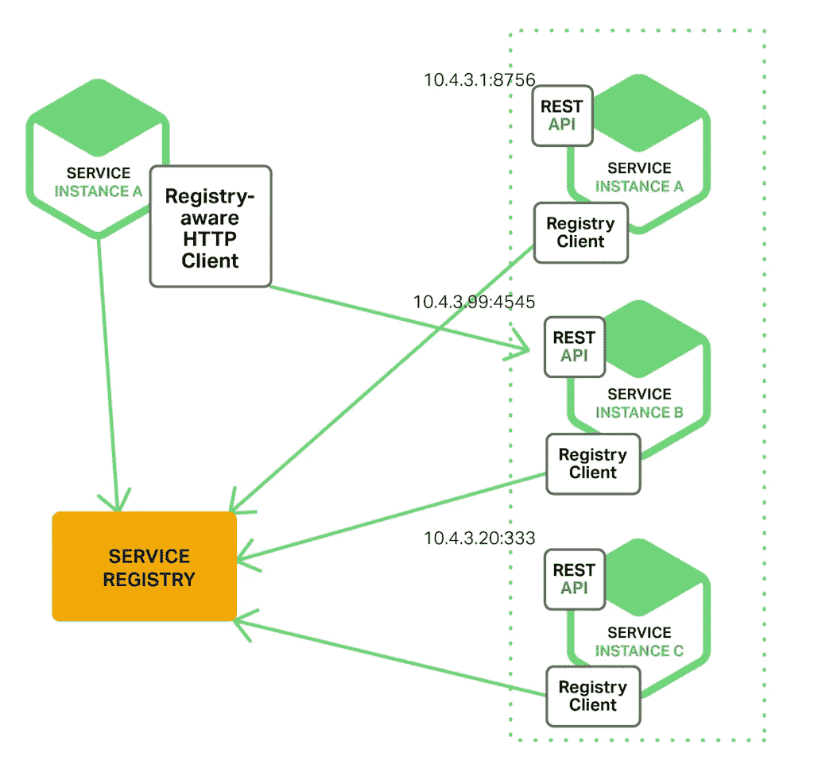
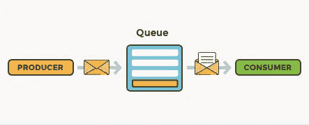

# 微服务(第 5 部分)——微服务的设计模式(代理模式)

> 原文：<https://medium.com/nerd-for-tech/microservices-part-5-design-patterns-for-microservices-proxy-pattern-12562f5987d2?source=collection_archive---------11----------------------->

图 1:代理模式(来源:Google)

代理模式只是聚合器模式的另一种变体。在这种模式中，聚合不会发生在客户端。将根据需求调用单独的微服务。

区别在于，

**聚合器模式:**调用多个服务来获得应用程序所需的响应。数据的汇总。

**代理模式:**无数据聚合。

让我们借助一个例子来理解代理模式。

想象一个场景，我们有一个大型的单片应用程序，管理团队决定将其迁移到新的微服务架构。我们可以使用不同的软件开发方法来实现这一点。如果我们使用敏捷方法，

*   开始一部分一部分地部署应用程序。这意味着一个接一个的功能。完成整个系统可能需要几个月的时间。
*   但是，在某些情况下，我们可能需要更改以前部署的服务。这可能会产生问题。

**举例:**考虑以下场景。

假设我们有一个微服务来获取酒店客人信息。绕过客户代码检索该信息。

然而，随着即将到来的变化，开发人员决定最好借助“客人 ID”而不是“客人代码”来检索客人信息。

**更新要求:**用客人 ID 而不是客人代码获取信息。

我们可以在版本控制的帮助下实现这一点。

版本 01:传递来宾代码。

版本 02:传递来宾 ID

但是，我们不能按原样部署该系统。我们必须使用代理模式并创建一个单独的代理服务。所有的消费者都必须通过这个代理服务。我们可以通过检查特定的字段值(访客代码或访客 ID)来配置代理将请求路由到正确的版本。这种实现有助于在不打扰客户的情况下部署服务。

**服务发现呢？**

图 2:服务发现(来源:NGINX)

每当我们创建一个服务时，使用外部团体来发现服务总是更好的。为什么？

轻松应对基础设施变更。在微服务架构中，主机名、IP 地址等可以改变。我们可以实现一个服务发现工具，并配置代理与该工具进行通信。那么该工具可以向代理提供服务的位置。HashiCorp 的 Consul、WSO2 治理注册中心是一些流行的服务发现工具。

# 要点

*   代理模式的实现类似于服务链。这带来了级联故障的风险。这可能会导致系统资源阻塞和一些服务失败。

解决方案，

## 消息队列

图 3:消息队列

它基本上是两个应用程序之间发送的消息队列。换句话说，它包含一个需要处理的对象列表(按照正确的顺序)。这有助于克服级联故障。但是在实现消息队列之前，必须考虑诸如队列失败之类的事实。因此，在这种类型的架构中，我们需要冗余机制。

*   在实现代理模式之前，开发人员必须注意线程池。这是因为线程的不正确实现会阻塞体系结构中的某些服务。作为解决方案，开发人员可以使用多线程池或线程移交机制。
*   超时也是代理模式的另一个重要概念。考虑这样一种情况，我们有一个代理服务，它将流量导向服务的两个版本。超时对于确保一个版本在失败时不会影响另一个版本是很重要的。

我使用了 Krishntha Dinesh 先生的以下播放列表来收集所需的信息。

# 参考

 [## 微服务架构中的服务发现- NGINX

### 微服务简介构建微服务:使用 API 网关构建微服务:进程间…

www.nginx.com](https://www.nginx.com/blog/service-discovery-in-a-microservices-architecture/)  [## 设计模式-代理模式

### 在代理模式中，一个类代表另一个类的功能。这种类型的设计模式属于结构化…

www.tutorialspoint.com](https://www.tutorialspoint.com/design_pattern/proxy_pattern.htm)  [## 代理模式-维基百科

### 在计算机编程中，代理模式是一种软件设计模式。一个代理，在其最一般的形式，是一个类…

en.wikipedia.org](https://en.wikipedia.org/wiki/Proxy_pattern)