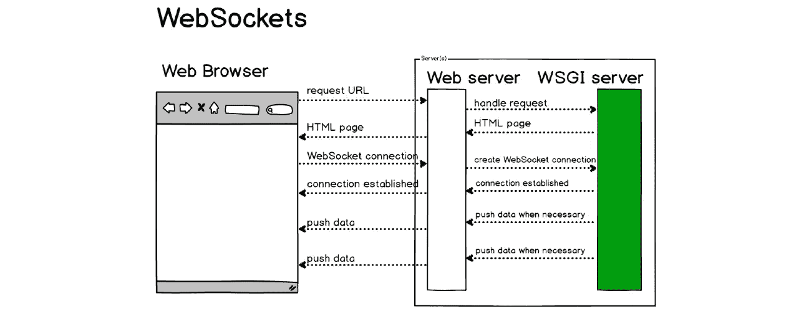
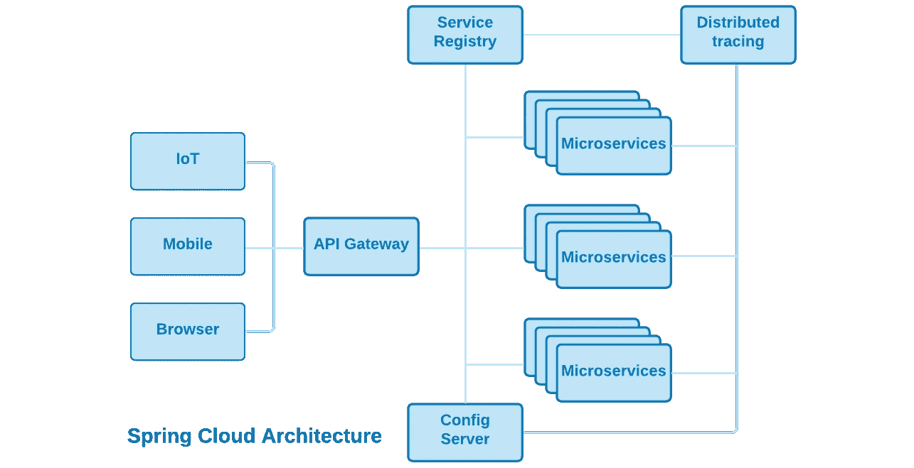

# Spring Boot 的微服务

> 原文：<https://medium.com/nerd-for-tech/microservices-with-spring-boot-3ee657a3e8a?source=collection_archive---------0----------------------->

## Spring Boot 是构建微服务应用程序最流行的方式

***微服务架构师和开发者的大部分招聘信息都要求有 Spring Boot 的经验。但是，Spring Boot 是实现微服务应用的最佳方式吗？我们来看看答案。***

## 微服务解决什么样的问题？

微服务架构模式通过以下方式解决了当今一些更紧迫的软件开发、部署和操作问题:

1.  **通过优化*敏捷软件开发、交付和维护*实践，缩短软件开发周期**。
2.  **通过简化软件*测试*、*持续集成*和*持续交付*，实现快速应用特性迭代**。
3.  **利用云*容器*和*容器编排*提供的自动化部署、伸缩和故障转移**功能。

## 微服务如何解决这些问题？

如果做得正确，微服务模式满足或超过了著名备忘录的所有要点和目的，这有助于为亚马逊无与伦比的业务敏捷性奠定基础。这份 [***备忘录***](/nerd-for-tech/the-memo-amazons-secret-sauce-e99bdc37c65f#6f9a) *非常值得花点时间去阅读。这是微服务具有良好商业意义的根本原因。*

为了实现其目标，单个微服务:

*   在单个**域有界上下文**中实现一个**任务**(或一组密切相关的任务)。这是微服务的一个基本特征，它促进了高层次的*粒度*和*关注点分离*，从而保留了微服务的*自主性*和*独立可部署性*。
*   **是松耦合的**，通过消息传递或事件进行通信，并且很少或不需要了解其他微服务的定义——强制*关注点分离*。
*   是**自主的**，并且可以在相关开发团队之间较少协调的情况下进行开发和修改——促进合理的*敏捷开发实践*。
*   **可独立部署**并且可以单独测试、部署和回滚，而不会影响其他微服务——支持基于云的*自动化部署、扩展和故障转移*。

记住这四个基本约束。如果应用程序组件不满足这些要求，它可能仍然是一项服务，但它不是微服务，也不太可能提供微服务架构模式承诺的所有好处，因此很难(如果不是不可能)实现云中微服务的全部承诺。

## 什么是 Spring Boot？

[Spring Boot](https://spring.io/projects/spring-boot) 是一个由 Pivotal 软件公司维护的开源微框架。它为 Java 开发人员提供了一个平台，可以开始使用可自动配置的生产级 Spring 框架应用程序。有了它，开发人员可以更快地提高工作效率，而不会浪费时间来准备和配置他们的 Spring 应用程序。

Spring Boot 通过隐藏构建和配置在 Java servlet 容器中运行的服务的复杂性，使得创建[面向服务的架构](https://en.wikipedia.org/wiki/Service-oriented_architecture)(或 SOA)服务更干净、更容易——Spring Boot 创建了可部署在云容器中的可执行 JAR 文件。

> ***讨论:*** 术语**容器**不应与 **Web 容器**(也称为 **servlet 容器**)混淆，后者是与 Java Servlets 交互的 Web 服务器的组件。Web 容器创建 servlet 实例，加载和卸载 servlet，创建和管理请求和响应对象，并执行其他 servlet 管理任务。Spring Boot 的支持者经常错误地认为他们的服务部署在**容器**中，因为它们在 **servlet 容器**中执行。

## Spring Boot 怎么了？

绝对没有，只要你明白你是在构建和部署传统的 SOA 服务——而不是微服务。Spring Boot 是构建和部署 SOA 应用程序的绝佳选择，但是每个 Spring Boot 生成的可执行 JAR 都包含一个嵌入式 Web 服务器和 Spring 框架的一个子集。不是微服务。

那么，Spring Boot 的 SOA 服务与真正的微服务所需的属性相比如何呢？让我们来看看:

*   Spring Boot SOA 服务被优化来实现同步 HTTP 请求-响应消息传递模型。设计良好的服务利用 REST 架构模式通过定义的 REST API 公开服务。只有一个警告，这是一件好事。需要注意的是它的同步请求-响应消息模型，这是性能的一个基本限制因素。真正的微服务可以通过 [WebSockets](https://en.wikipedia.org/wiki/WebSocket) 实现 REST APIs，并且被设计成实现客户端和服务器之间的高性能[异步通信](/nerd-for-tech/designing-microservices-4130bc41c046#dc4c)。

*   单个 Spring Boot SOA 服务不能独立部署，也不能在不影响其他服务的情况下单独测试、推出和回滚。*虽然你可以单独打包每个服务，但是每个可部署的可执行文件都将包含它自己的嵌入式 Web 服务器和它所使用的任何 Spring framework 库——这远不是最佳的解决方案。*Spring Boot 应用程序可以部署在云容器中，由 Kubernetes 进行编排。但是，应用程序不能在单个服务级别进行扩展，当然也不能在单个服务级别实现故障转移。

*   因为单个 Spring Boot 服务不能独立部署，所以它们不能独立测试、部署和回滚。这是实现微服务预期优势的最严重障碍之一。
*   Spring Boot 服务是否是自治的，是否可以在相关开发团队之间进行有限协调的情况下进行开发和修改，这是组织内部的设计原则和开发实践的问题，而不是 Spring Boot 本身的问题。但是 Spring Boot 服务不能独立测试、部署和回滚的事实使得实现高水平的服务自治和开发敏捷性变得更加困难。
*   Spring Boot 的服务器端本质上是一个分层的架构。您希望使用的 Spring 生态系统的部分与您的 spring Boot 服务一起部署。了解这种方法的好处和代价是很重要的。这些 Spring 库代表了可重用的功能，这些功能需要您花费时间和金钱来实现——假设您有可用的技能和资源。它们代表了实实在在的好处。尽管您不太可能需要整个库中的所有特性、功能和代码，但是您仍然需要将整个库(包括它所依赖的其他库)与您的 Spring Boot 服务一起部署。这一点都不微观,它肯定会影响微服务架构模式的松散耦合*约束。明智地选择。*

## 包扎

Spring Boot 是构建传统 SOA 应用程序的绝佳方式。在混合云计算出现之前，它是一种价值更高、风险更低的方式。这篇文章并不想诋毁 Spring Boot 是一个设计良好的微观框架。也不打算批评它实现和管理传统 SOA 服务的能力。

然而，这篇文章想要澄清的是，尽管 Spring Boot 可能是构建 20 世纪 SOA 服务的一种很好的方式，但它并不是为实现微服务而设计的。Spring Boot 的官方文件称其目的是:

*   创建独立的 Spring 应用程序。
*   直接嵌入 Tomcat、Jetty 或 Undertow(无需部署 WAR 文件)。
*   提供自以为是的“初学者”依赖项，以简化您的构建配置。
*   尽可能自动配置 Spring 和第三方库。
*   提供生产就绪特性，如指标、健康检查和外部化配置。
*   绝对不需要代码生成，也不需要 XML 配置。

那些熟悉构建 SOA (Spring 或 Jakarta)应用程序的人知道这可以节省多少劳动力。但 Spring Boot 无法创建真正的云原生 21 世纪微服务应用所需的自主、独立开发、独立可测试、独立可部署、独立可扩展和独立可切换(用于故障切换)的微服务。

如果您的组织需要利用混合云计算和敏捷开发的优势，Spring Boot 不是答案。

Spring Boot 是为一个已经过去的计算环境和时代而设计和实现的。基本问题是一个粒度问题——您可以管理组件开发、测试、部署、伸缩和故障转移的组件粒度级别。在其他条件相同的情况下，粒度越细越好。

未来在云端，真正的微服务在实现云计算的好处方面远远优于 SOA 服务。

如果你有兴趣阅读更多关于微服务和云计算的优势，我们建议你看看[设计微服务](/nerd-for-tech/designing-microservices-4130bc41c046?source=user_profile---------0-------------------------------)和[为云设计软件架构](/nerd-for-tech/software-architecture-for-the-cloud-c9226150c1f3?source=user_profile---------2-------------------------------)的帖子。

谢谢你。