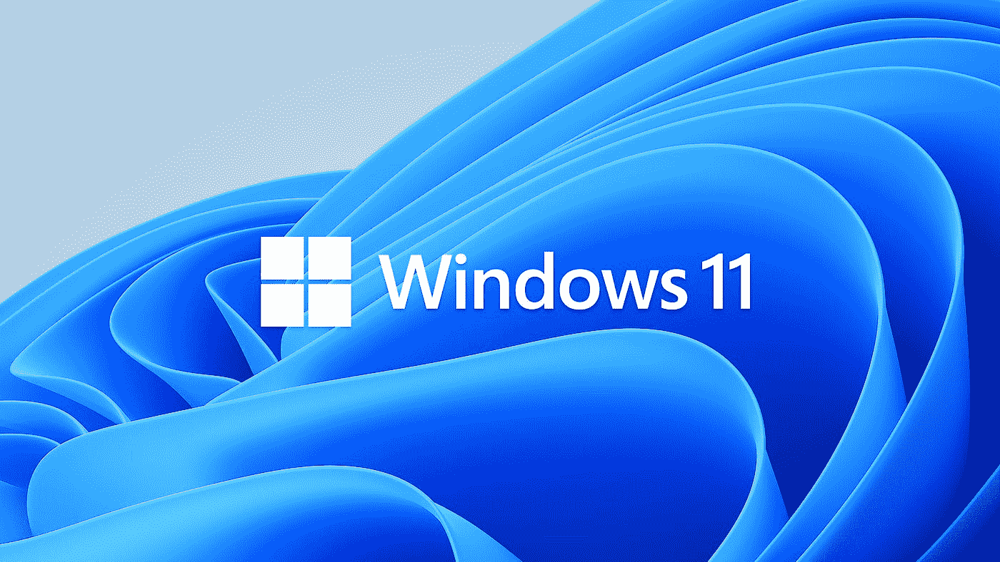
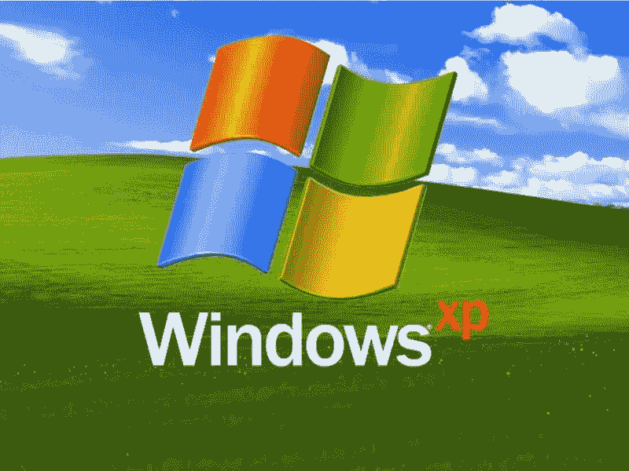
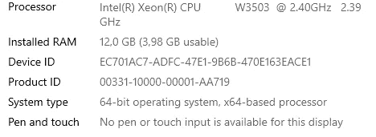

# 微软，从 Dos 到 Windows 11

> 原文：<https://medium.com/nerd-for-tech/microsoft-from-dos-to-windows-11-35e876b4c219?source=collection_archive---------18----------------------->

## 多年的创新和技术产品和服务的实现。

XP 绝对是我从 3.1 切换到 95、98 后经历过的，也是我最爱的。绿草地是一张标志性的壁纸，人们可以用它来证明在“生态”成为一种趋势和生活方式之前，微软就是绿色的。

XP 安装过程中的音乐可以让你格式化你的磁盘并重新安装，因为它听起来非常好。

从 Dos 到 Windows 10，随着许多新的创业公司、产品、服务以及我们采用的这种云思维，技术行业发生了巨大的变化。微软已经通过其操作系统 Windows 实现了这一系列创新，这不仅仅是一扇窗户，而是通向未来的一扇门。在未来，最好的技术产品是那些能够制造和集成其他产品和服务的产品。这是技术驱动的创新的最重要特征，我们在这二十年里看到了一个由计算能力和自动化驱动的世界，这个世界目前正在转变为一个人工智能和互联物体的世界。微软刚刚发布了 [Windows 11](https://www.microsoft.com/fr-fr/windows/windows-11?OCID=2_201_pchc_windows_app_omc_win) ，这个伴随我们童年的神秘操作系统的新版本。Windows 11 声称将带来许多新功能，这些新功能考虑到了我们经历的困难的疫情时间，并向我们强调，也许我们应该改变我们的工作方式。

我的电脑采用至强处理器，主频 2.10 GHz，内存不到 4 Go，无法运行 Windows 11，希望你的可以。如果你想确定你已经为 Windows 11 做好准备，这里是[的链接](https://www.microsoft.com/fr-fr/windows/windows-11?OCID=2_201_pchc_windows_app_omc_win)。

科技行业发展如此之快，以至于我很容易也很快就被抛在后面，就像我的电脑一样，但它真的帮助我通过写作和阅读与你保持联系，直到这一天的到来，它可以让我设计和制作游戏，设计和运行机器学习和人工系统。这款即将上市的电脑可能会运行 Windows 11。

出于学习的目的，跟踪 windows 11 的采用趋势对你可能是有用的(对我来说，这将丰富我正在进行的关于 [OS 采用](/nerd-for-tech/microsoft-vs-apple-os-adoption-a2e73a51cdee)的研究)，你可以猜到将会有很多迁移工作到来，因为肯定会有很多企业转向 Windows 11。

**PS:** 希望你能从我的这些迁移工作中受益，我现在正在编辑一个 Windows 11 视频广告，你很快就可以在我的 [Youtube 频道](https://www.youtube.com/channel/UCi78a_YU3nGqMcJ0Xr_kO4A)上看到。