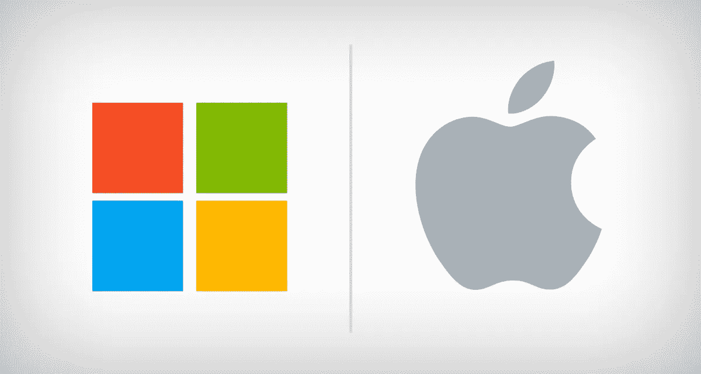

# 微软 VS 苹果操作系统的采用

> 原文：<https://medium.com/nerd-for-tech/microsoft-vs-apple-os-adoption-a2e73a51cdee?source=collection_archive---------24----------------------->

## 当盗版帮助软件卖得更好时

微软 VS 苹果

一半给微软，一半给苹果，这就是今天引发个人电脑革命的每一家初创公司的操作系统用户基础的重新分配。由于愿意保护自己的操作系统，并将其封装在一台设计精良的电脑中，苹果失去了网络效应及其固有的正反馈优势。我曾经听赛斯·戈丁说过，艺术的敌人不是盗版，而是晦涩。我不认为苹果是一个默默无闻的品牌，但我只是通过阅读 ariel Katz 所做的一项非常好的研究，了解了盗版对软件采用的影响，当时我正在研究网络对软件采用的影响，因为我正在研究有关 windows 采用的数据。通过这些关于过去 windows 版本采用情况的数据，我清楚地看到了两个不同 windows 版本的模式。如果苹果的操作系统对其他 OEM 制造商开放，也会出现同样的情况。在今天的 SaaS 时代，用户的设备上没有你的专有操作系统并不是一个非常关键的问题，因为人们可以说苹果可以采用 SaaS 的策略，设计一个非常好的 SaaS 应用生态系统，即使是 Windows 用户也可以从他们的电脑上访问。但是转换成本是需要考虑的，操作系统专利公司已经赢得了用户的第一次接触、许可和关注。我们安装了多少应用程序，是因为我们有一个安卓系统，还是因为我们有一个 IOS 系统，还是因为这个微软手机操作系统？

“Torrenters”真的可以成为你的软件和游戏公司或创业公司的朋友。当他们将为盗版而战时，你提供的游戏和软件将从中受益匪浅，因为你知道“托伦特”主要是技术早期采用者和推广者。他们有时是黑客，可以及早发现你的游戏和软件中的漏洞和安全问题。

跟踪种子是我感兴趣的事情，因为我认为没有人关心他们，因为他们掌握着关于游戏、软件、书籍和任何数字产品消费指标的宝贵信息。我对网络效应的兴趣引导我去研究它们，我真诚地发现了许多有见地的想法和关键可行的策略，用于更好地营销游戏和[营销软件](https://mkrdiop.medium.com/marketing-software-better-f5c80d13b045)

PS:我在本文中谈到的关于操作系统采用的数据很可能是 Book Dojo 即将出版的一本数据驱动书籍的基础材料。

如果你需要加入 Book Dojo，那就加入一家特定领域的创业公司[这里是](http://clickmetertracking.com/kiej)。

很快第一本数据驱动的书[来了](http://clickmetertracking.com/7yyy)

预订 Dojo，一个只提供邮件服务的创业公司