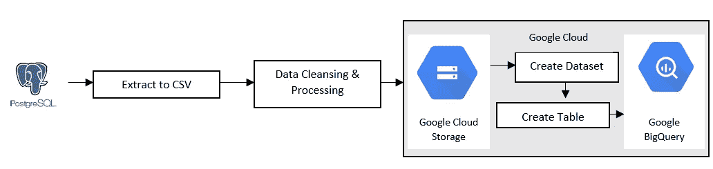
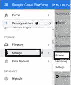
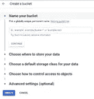
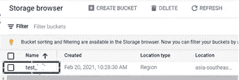
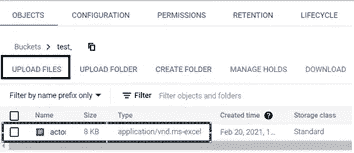
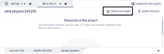
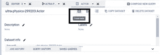
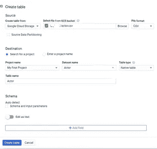
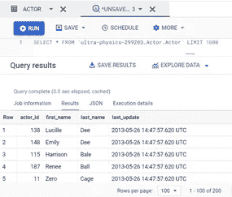

# 迁移数据— PostgreSQL 到 BigQuery

> 原文：<https://medium.com/nerd-for-tech/migrate-data-postgresql-to-bigquery-46e731d83958?source=collection_archive---------4----------------------->

转到云

PostgreSQL，也称为 Postgres，是一个高度稳定的数据库，由开源社区 20 多年的开发提供支持。是大规模分析数据的流行工具之一。

然而，随着数据量和速度的增加，it 需要大量的工作和专业知识来优化并使其在期望的时间内运行分析查询。因此，这可能会直接或间接地影响您的事务工作负载。这就是为什么大多数组织更喜欢使用单独的系统来处理分析工作负载。

也许解决方案就在云中。云中的额外优势，如扩展的灵活性、最小的前期成本等。因此，许多公司选择将数据从 PostgreSQL 转移到 BigQuery。

这个领域的主要竞争者 BigQuery 是由 Google 云平台提供的。BigQuery 是一个完全托管的、无服务器的数据仓库，能够对数 Pb 的数据进行可扩展的分析。它是一个平台即服务(PaaS ),支持使用 ANSI SQL 进行查询。它还内置了机器学习功能。BigQuery 于 2010 年 5 月发布，并于 2011 年 11 月正式发布。BigQuery。专为业务灵活性而设计的无服务器、高度可扩展且经济高效的多云数据仓库。

**执行 PostgreSQL 到 BigQuery 迁移的方法。**

执行 PostgreSQL 到 BigQuery 迁移的方法

我们可以使用命令行从 PostgreSQL 表和标准文件系统文件中迁移数据，并且可以使用带有 SQL 函数或 PL/pgSQL 过程的普通 SQL 语句，这为提取数据提供了很大的灵活性，可以作为完全转储或增量方式。

上图展示了将 Postgres 迁移到 BigQuery 的高级步骤:

1.从 PostgreSQL 提取数据

2.选择性地清理和转换数据

3.上传到谷歌云存储(GCS)

4.从 GCS 上传到 BigQuery 表。

**让我们详细看看每一步。**

**第一步:数据提取**

Copy 命令是在 PostgreSQL 表和标准文件系统之间移动数据的最有效方式。“复制到”命令将选择查询的结果或表的内容复制到该文件中。

> *将 actor 复制到' ~Your Folder\actor.csv '中，分隔符为'，' csv 头；*

**第二步:清理和转换数据。**

除了为适应业务逻辑而进行的转换之外，在准备提取数据时，还需要记住一些基本的事情。

1.  BigQuery 希望 CSV 数据采用 UTF-8 编码。
2.  Postgres 和 BigQuery 之间的列类型略有不同。大多数类型都有等价类型或可转换类型。

**第三步:上传到谷歌云存储(GCS)**

1.  首先，你必须登录你的 GCP 账户。在左侧边栏中，单击“Storage”并转到浏览器。

谷歌云存储

2.创建 bucket(如果没有),并选择要上传文件的 GCS bucket。点击桶。

创建存储桶

水桶

3.在 bucket details 页面中，您必须单击 Upload files 按钮并从您的系统中选择相关文件。上传完成后，文件将被列在存储桶中。

上传文件

**步骤 4:从 GCS 上传到 BigQuery 表**

您可以使用 web 控制台用户界面。

1.  从左侧面板转到 BigQuery 控制台。

BigQuery

2.如果数据集不存在，则创建数据集。

创建数据集

3.然后“创建表”选项将出现在查询编辑器下方。

创建表格

选择源数据

BigQuery 提供了 3 个选项来写入现有的表:

1.  如果为空则写入
2.  追加到表中
3.  覆盖表格。

**第五步:在 BigQuery 中运行 SQL 脚本**

在 BigQuery 中运行 SQL 脚本

在当今这个数据驱动的商业时代，从数据中获取价值应该是快速的，并且摩擦最小。像 BigQuery 这样的数据仓库可以在这方面发挥极其重要的作用。然而，将数据移动到基于云的平台需要多个步骤，如提取数据、清理/转换数据和上传。它需要大量的工程资源和时间来确保整个过程中数据的正确性和一致性。但这相当于利益相关者将获得的利益。

**结论**

当今时代，技术发展非常迅速，有许多工具可用于迁移数据。我们建议您探索将数据从 PostgreSQL 转移到 BigQuery 的方法，并做出适合您需求的正确选择。