# 从整体架构迁移到微服务实际案例研究

> 原文：<https://medium.com/nerd-for-tech/migrating-from-monolithic-architecture-to-microservices-hands-on-real-world-case-study-2aa81c579084?source=collection_archive---------1----------------------->

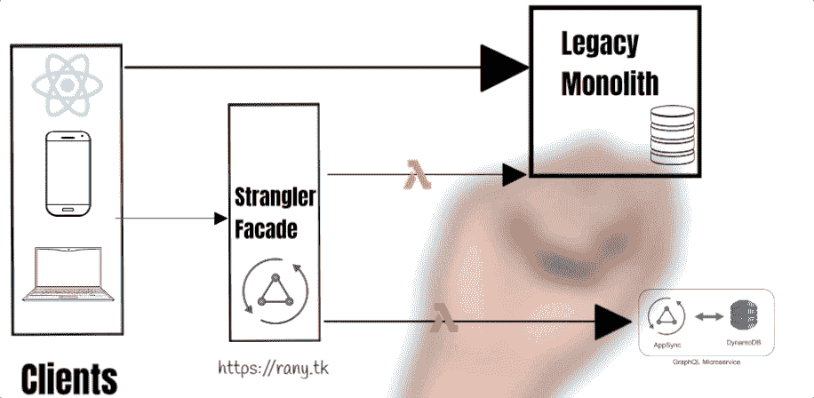

在本文和附带的视频中，我将讲述我从单片架构迁移到微服务的真实经历。这将是一个实践视频

# 什么是独石？

" ***独石*** "你可能最近经常听到这个词，或者它的另一个同义词" ***独石建筑*** "。这是一个公司依赖于一个服务或数据库并成为瓶颈的场景。这个时候，将这种独石分解成微服务的需求就成了一种必然。在下面的短片中，我解释了什么是单片架构:

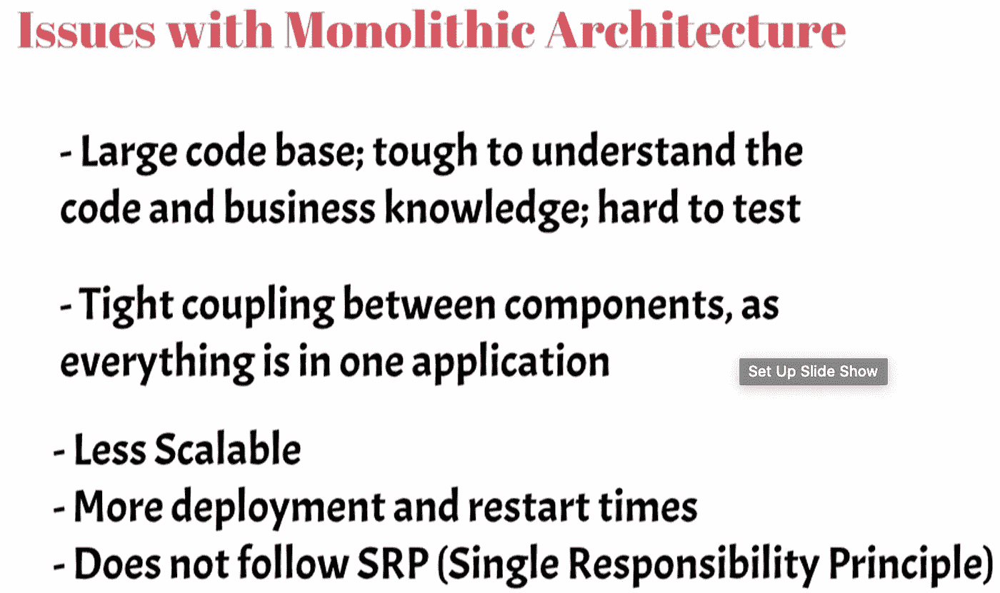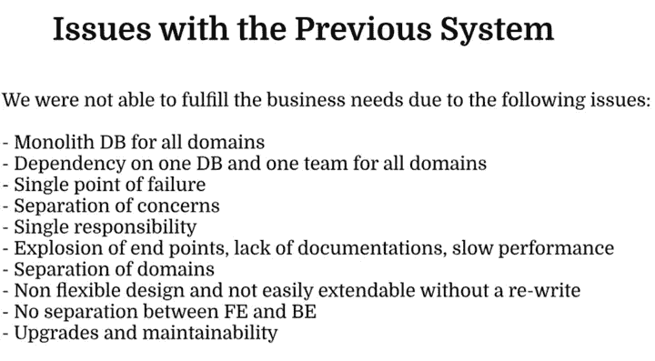

我向投资者委员会展示的幻灯片中解释了所有细节:

[https://rany.tk/static/MonlithToMicroservices.pdf](https://rany.tk/static/MonlithToMicroservices.pdf)

1.第一张幻灯片解释了设计目标

## 设计目标

-减少时间/成本，创造使用社区数据的新方式

-减少终点

-提高性能

-网络效率

-移动和网络客户端友好界面

-无版本控制

-可维护性

-适应变化

-实时使用(不需要单独的缓存层)

-领域驱动的架构

-管理社区的一个事实来源

-支持客户端的所有现有功能

*   可扩展以满足新需求

## 我试图解决的问题是:

## 问题陈述

由于以下问题，我们无法满足业务需求

a.适用于所有域的 Monolith DB

b.所有域依赖于一个数据库和一个团队

c.单点故障

d.关注点分离

e.单一责任

f.端点爆炸、缺少文档、性能缓慢

g.域的分离

h.不灵活的设计，没有重写就不容易扩展(PC — CC)

一、铁和铍没有分离

j.升级和可维护性

设计原则——客户端应该不需要知道应用程序特定的细节就可以使用 API

API 将成为所有 APFM 应用程序使用的社区数据的真实来源

-只负责 API，只与社区合作

-对添加开放，对修改关闭

-应支持将数据逐步移出 YGL

- API 应该与其他系统松散耦合

-应具有容错能力，并能自动扩展

-应支持面向消费者的 web 工作负载

-设计可用性和分区容差，并最终保持一致

-支持并发

-应该是安全的，带有身份验证和授权

-基于角色的数据过滤

-它应该具有成本效益

-它应该包含日志和仪器

-网络效率，一次呼叫，最大限度地减少客户端聚合和数据处理

-它应该是容易的或自动记录的，应该是可发现的

*   它应该可以被工程师测试

## 领域驱动设计

首先，我完成了事件风暴，并使用领域驱动的方法导出了领域。

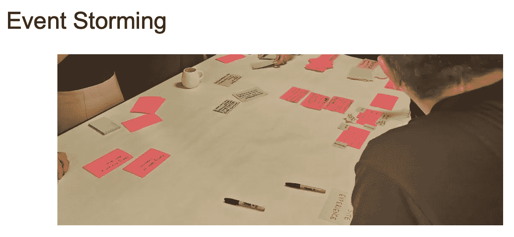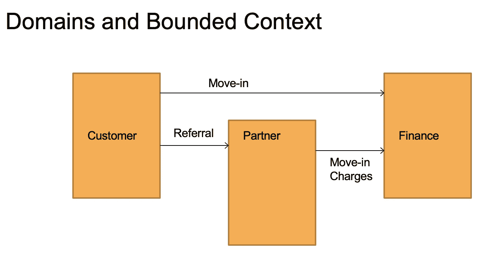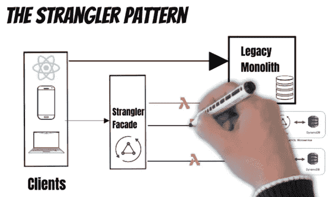 [## 扼杀者模式:实践中的微服务设计模式因 AWS 无服务器而变得简单

### 在本文中，我将解释由 Martin Fowler 发明的著名微服务迁移模式“扼杀者…

ranyel.medium.com](https://ranyel.medium.com/the-strangler-pattern-microservices-design-patterns-in-practice-made-easy-with-aws-serverless-97437a82b052) 

**API 网关模式**

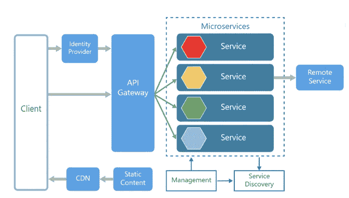

考虑到前面的需求，我有两个关于 API 的选择(GraphQL 和 RESTful APIs 幻灯片 10]

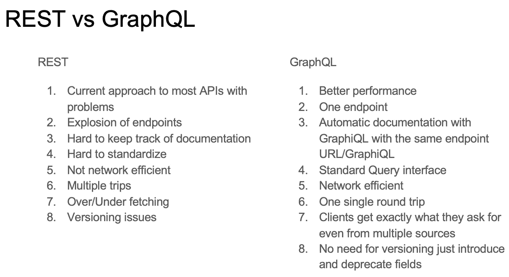

## 第二个选择是无服务器还是容器:

[幻灯片 11]

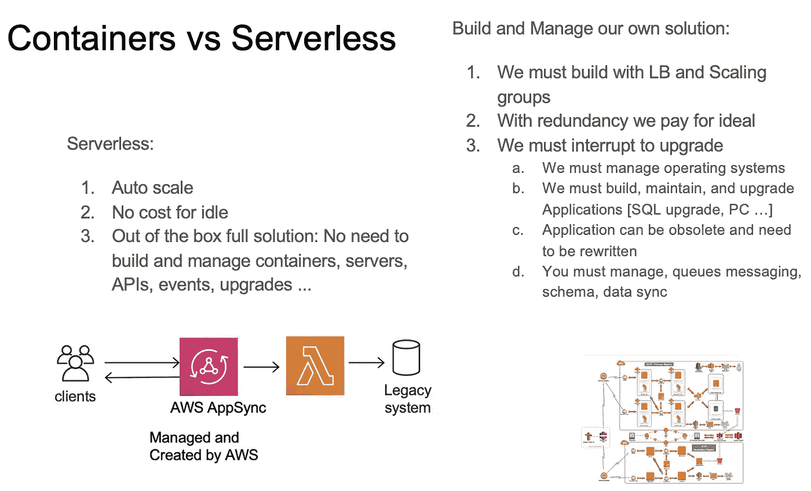

## 概念证明

最后，我创建了 POC，并在投资者、CTO、CEO 和董事面前演示了如何创建微服务。

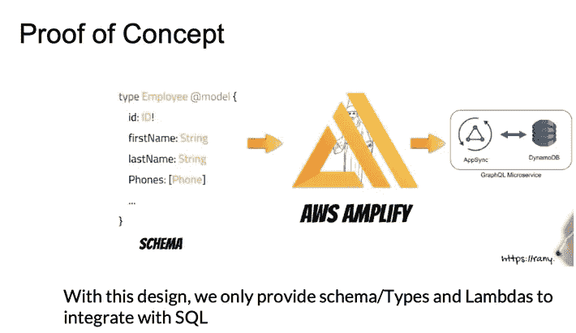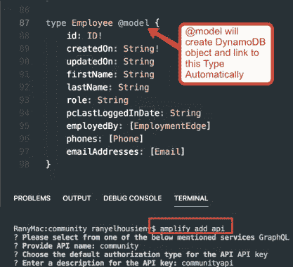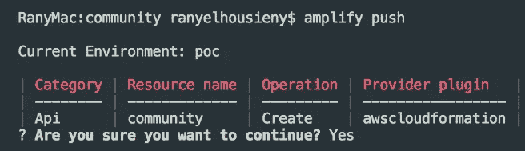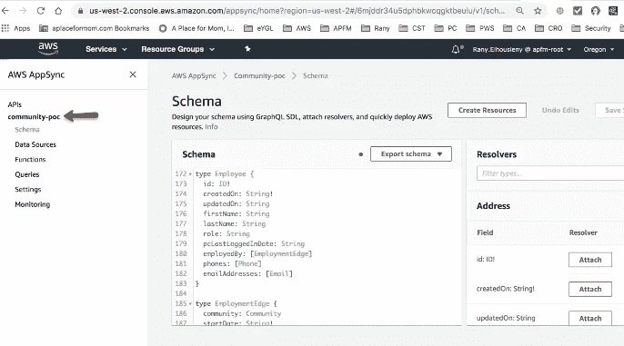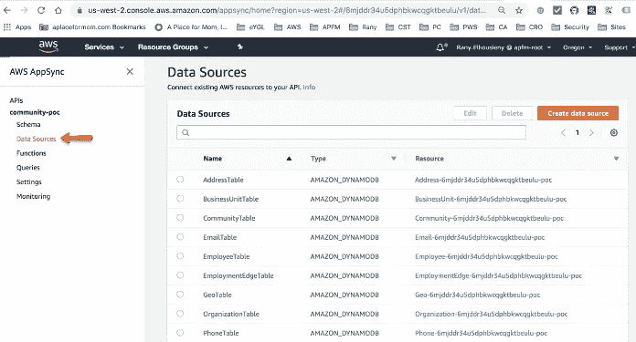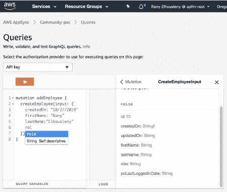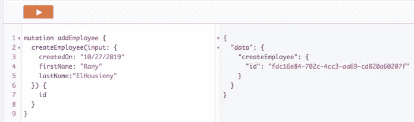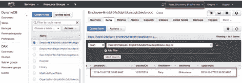

## 数据库复制和迁移步骤

详见[本文](https://www.linkedin.com/feed/update/urn:li:ugcPost:6812124363677143040?updateEntityUrn=urn%3Ali%3Afs_feedUpdate%3A%28*%2Curn%3Ali%3AugcPost%3A6812124363677143040%29)

 [## 兰尼·埃尔豪斯尼，PhDᴬᴮᴰ在 LinkedIn 上:从整体服务迁移到微服务的步骤

### 从整体服务迁移到微服务的步骤...

www.linkedin.com](https://www.linkedin.com/feed/update/urn:li:ugcPost:6812124363677143040?updateEntityUrn=urn%3Ali%3Afs_feedUpdate%3A%28*%2Curn%3Ali%3AugcPost%3A6812124363677143040%29) 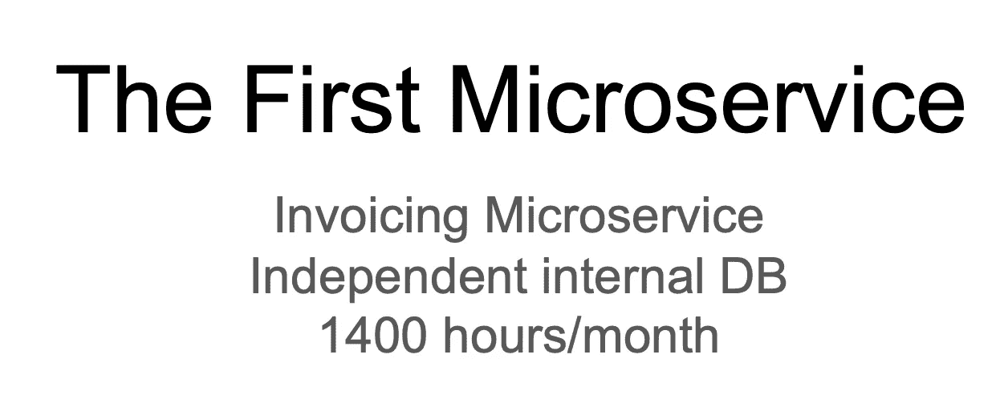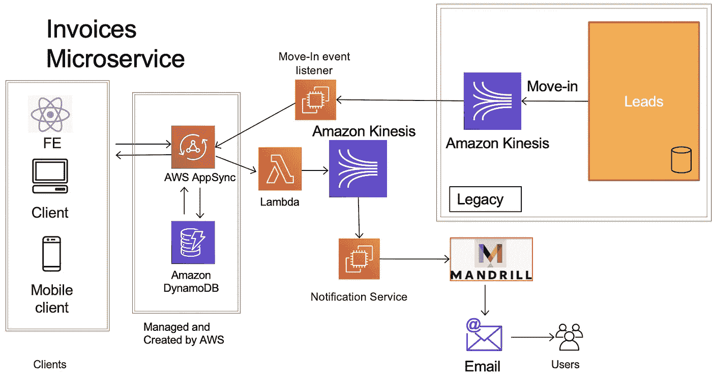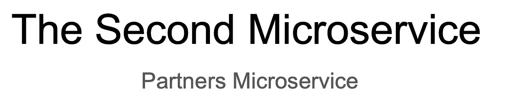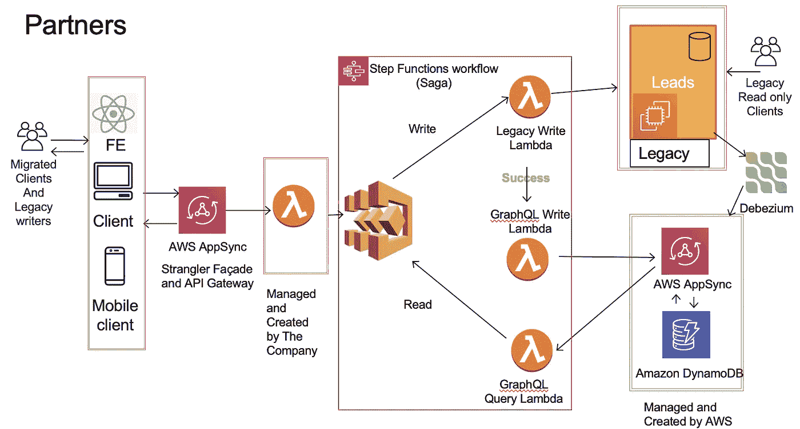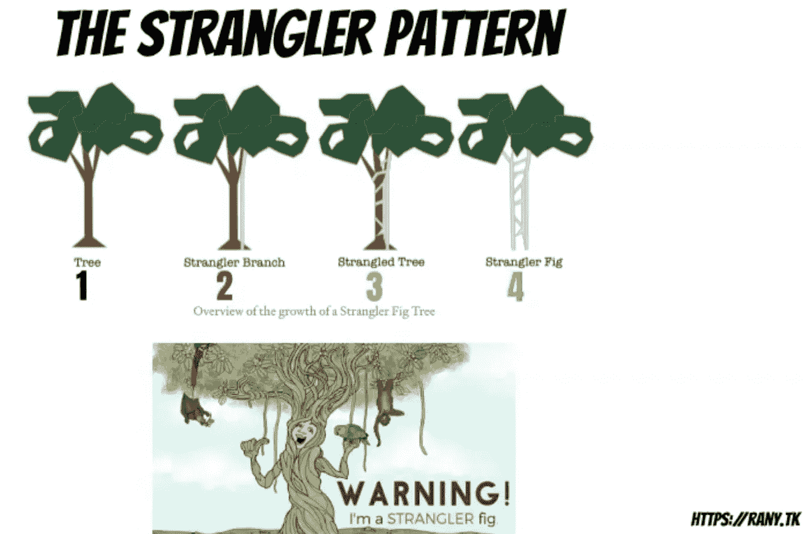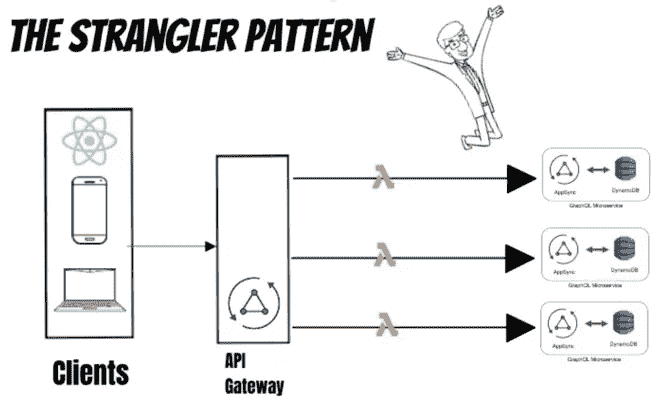 [## 扼杀者模式:实践中的微服务设计模式因 AWS 无服务器而变得简单

### 在本文中，我将解释由 Martin Fowler 发明的著名微服务迁移模式“扼杀者…

ranyel.medium.com](https://ranyel.medium.com/the-strangler-pattern-microservices-design-patterns-in-practice-made-easy-with-aws-serverless-97437a82b052) 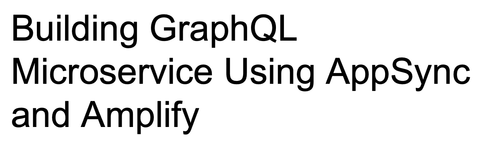 [## 使用 AWS AppSync 和 Amplify 构建 GraphQL 微服务

### 由于我们创建了 REST 微服务，我想创建一个 GraphQL 微服务。AWS Amplify 和 AppSync 使它…

www.linkedin.com](https://www.linkedin.com/pulse/building-appsync-graphql-using-aws-amplify-rany-elhousieny/) 

## 渐进式数据迁移

1.  创建模式并决定实体

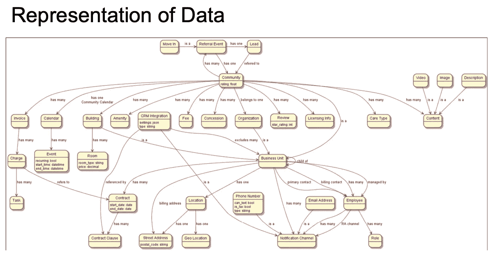

2.下面的文章解释了我们如何从 monolith DB 迁移到新的数据库。

 [## 从整体服务迁移到微服务的步骤

### 本文将解释我从单片系统迁移到新的域微服务所遵循的步骤。我会…

www.linkedin.com](https://www.linkedin.com/pulse/steps-migrating-from-monolith-microservices-rany-elhousieny-phd%E1%B4%AC%E1%B4%AE%E1%B4%B0/) 

**参考文献**:

 [## bliki:奇异应用

### 当辛迪和我去澳大利亚的时候，我们在昆士兰海岸的雨林里呆了一段时间。一个自然的…

martinfowler.com](https://martinfowler.com/bliki/StranglerFigApplication.html)  [## 扼杀者无花果迁移模式

### 这是一系列从整体到微服务迁移模式的一部分。

dianadarie.medium.com](https://dianadarie.medium.com/the-strangler-fig-migration-pattern-2e20a7350511)  [## 使用 AWS AppSync 和 Amplify 构建 GraphQL 微服务

### 由于我们创建了 REST 微服务，我想创建一个 GraphQL 微服务。AWS Amplify 和 AppSync 使它…

ranyel.medium.com](https://ranyel.medium.com/building-a-graphql-microservice-with-aws-appsync-and-amplify-58883d16f472)  [## 兰尼·埃尔豪斯尼

### https://www.linkedin.com/in/ranyelhousieny/·https://rany.elhousieny.com AWS 解决方案架构师认证…

www.youtube.com](https://www.youtube.com/channel/UCJ6bFYSkBws-ug6fqJ_9CNg)  [## 兰尼·埃尔豪斯尼-中等

### 在本文和附带的视频中，我将经历一次从……迁移的真实经历

ranyel.medium.com](https://ranyel.medium.com/) 

作者:

 [## 兰尼·埃尔豪斯尼，PhDᴬᴮᴰ -软件工程高级经理- Zulily | LinkedIn

### 𝙈𝙞𝙘𝙧𝙤𝙨𝙚𝙧𝙫𝙞𝙘𝙚𝙨解决方案架构师𝘼𝙒𝙎𝙎𝙤𝙡𝙪𝙩𝙞𝙤𝙣𝙨𝘼𝙧𝙘𝙝𝙞𝙩𝙚𝙘𝙩𝘾𝙚𝙧𝙩𝙞𝙛𝙞𝙚𝙙…

www.linkedin.com](https://www.linkedin.com/in/ranyelhousieny/)  [## 兰尼·埃尔豪斯尼简历

### 使用 MongoDB，Elastic Search，AWS，React，CSS3，html 5……

rany.elhousieny.com](https://rany.elhousieny.com/)