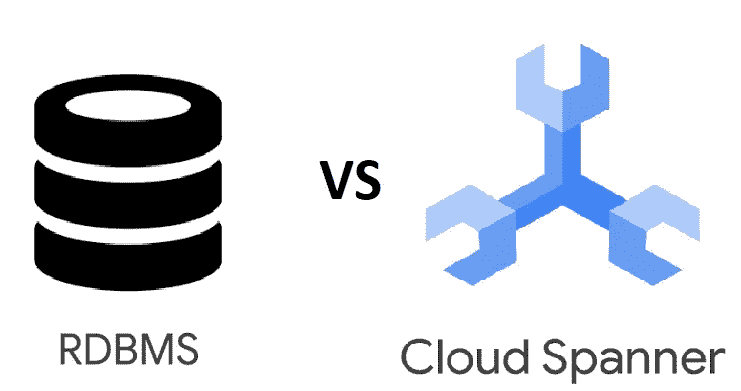

# 迁移到云扳手？以下是你需要知道的。

> 原文：<https://medium.com/nerd-for-tech/migrating-to-cloud-spanner-heres-what-you-need-to-know-215259c46d34?source=collection_archive---------9----------------------->

**云扳手**在适当的情况下可能是一个很好的选择，但如果没有经过适当的调查就选择了它，很多事情都会出错，使它成为一个糟糕的选择。

像其他迁移一样，不能将数据库转移到 Spanner 上。

使用传统 RDBMS 的组织将具有某些特性，例如:

*   顺序
*   外键
*   UDF(用户定义的函数)
*   扳机
*   存储过程
*   美国学术团体委员会

还有一些已经实现了。将这些传统数据库迁移到 Cloud Spanner 需要我们了解 Spanner 是否提供相同的功能，如果不提供，有哪些等效功能。

让我们看几个例子:

## 顺序

顾名思义，**序列**是分配给表中每一行的唯一整数值，以确保唯一性。云扳手不支持 RDBMS 之类的序列。

这是因为 Cloud Spanner 通过主键按字母数字顺序存储数据，然后该表被拆分到不同的机器上。

因此，当您使用一个**序列**作为主键来排序您的表时，数据总是进入同一个分割，并增加一个分割的负载，从而导致**热点**。

> **不要选择值单调递增或递减的列作为高写入速率表的第一个关键部分。**

## 外键

Cloud Spanner 支持像 RDBMS 这样的外键来定义两个表之间的关系。或者，Cloud Spanner 的表交叉也有助于定义两个表之间的关系。

我们可以选择交错或外键，但不能两者都选。

交错和外键是一样的吗？答案是**否**

*   表交错只支持一个父代，而外键支持任意数量的父代。
*   交错仅在使用主键时发生，但在定义外键时，用户可能会也可能不会选择使用主键。
*   交叉存取时，父表和子表的数据位于同一位置，这与外键的情况不同。
*   交错的问题是，要删除它，必须删除整个子表，而外键则不是这样。

## 触发器、存储过程和 UDF

云扳手不支持触发器，存储过程和 UDF 的。

如果您的生产数据库有很多这样的东西，那么您可能需要重新考虑迁移到 Cloud Spanner。

## 访问控制列表

与 RDBMS 不同，在 RDBMS 中，ACL 甚至可以应用于表或行级别，Spanner 只支持数据库级别的访问控制。