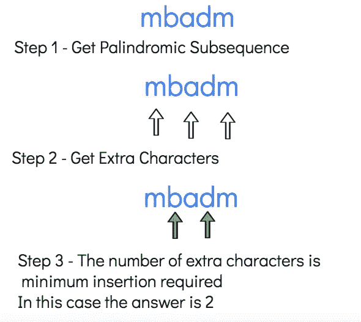

# 形成字符串回文的最少插入步骤——第 66 天

> 原文：<https://medium.com/nerd-for-tech/minimum-insertion-steps-to-make-a-string-palindrome-day-66-f4b3ac170a33?source=collection_archive---------4----------------------->


[设计生态学家](https://unsplash.com/@designecologist?utm_source=medium&utm_medium=referral)在 [Unsplash](https://unsplash.com?utm_source=medium&utm_medium=referral) 上拍摄的照片

今天的问题是最长公共子序列的另一个变体。

[1312](https://leetcode.com/problems/minimum-insertion-steps-to-make-a-string-palindrome/)**。创建字符串回文的最小插入步骤**

给定一个字符串`s`。在一个步骤中，您可以在字符串的任何索引处插入任何字符。

返回*使`s`回文的最小步数*。

回文字符串是一个向前和向后都一样的字符串。

**例 1:**

```
**Input:** s = "zzazz"
**Output:** 0
**Explanation:** The string "zzazz" is already palindrome we don't need any insertions.
```

**例二:**

```
**Input:** s = "mbadm"
**Output:** 2
**Explanation:** String can be "mbdadbm" or "mdbabdm".
```

**例 3:**

```
**Input:** s = "leetcode"
**Output:** 5
**Explanation:** Inserting 5 characters the string becomes "leetcodocteel".
```

**例 4:**

```
**Input:** s = "g"
**Output:** 0
```

**例 5:**

```
**Input:** s = "no"
**Output:** 1
```

**约束:**

*   `1 <= s.length <= 500`
*   `s`的所有字符都是小写英文字母。

几天前我们已经解决了最长的回文子序列。如果你需要复习，你可以点击这个[链接](https://atharayil.medium.com/longest-palindromic-subsequence-day-63-python-b5da4959c2a5)。我们将分两部分解决给定的问题。问题的第一部分是使用最长的回文子序列。让我们回忆一下最长回文子序列的代码。

```
class LongestPalindromeSubseqFinder:
    def longestPalindromeSubseq(self, s: str) -> int:
        memo = [[0 for j in range(len(s)+1)]for i in range(len(s)+1)]
        rev_s = s[::-1]
        for i in range(1, len(memo)):
            for j in range(1, len(memo[0])):
                if s[i-1] == rev_s[j-1]:
                    memo[i][j] = memo[i-1][j-1]+1
                else:
                    memo[i][j] = max(memo[i][j-1], memo[i-1][j])
        return memo[-1][-1]
```

在上面的代码中，我们将得到最长的回文子序列的长度。

剩下的字符是什么？剩余的字符不构成回文子序列的一部分。如果我们可以得到一个不构成回文子序列的额外字符的列表，我们可以通过插入这些额外字符将字符串转换成回文字符串。

让我们举一个例子，



最少插入示例

解决这个问题的第二部分是找到完整字符串的长度和最长公共子序列的长度之差。

让我们来看看代码片段。

```
class MinInsertionsFinder:
    def minInsertions(self, s: str) -> int:
        memo = [[0 for j in range(len(s)+1)]for i in range(len(s)+1)]
        rev_s = s[::-1]
        for i in range(1, len(memo)):
            for j in range(1, len(memo[0])):
                if s[i-1] == rev_s[j-1]:
                    memo[i][j] = memo[i-1][j-1] + 1
                else:
                    memo[i][j] = max(memo[i][j-1], memo[i-1][j])
        return(len(s) - memo[-1][-1])
```

如果问题是找到最小删除使字符串回文，我们可以使用相同的逻辑。

**复杂性分析。**

**时间复杂度**

我们正在遍历一个大小为 N 的 2D 数组，因此时间复杂度为 O(N)，其中 N 是字符串的大小。

**空间复杂性。**

我们正在创建一个大小为 N 的 2D 数组，因此空间复杂度为 O(N)，其中 N 是字符串的大小。

链接到阿迪亚·维尔马的视频