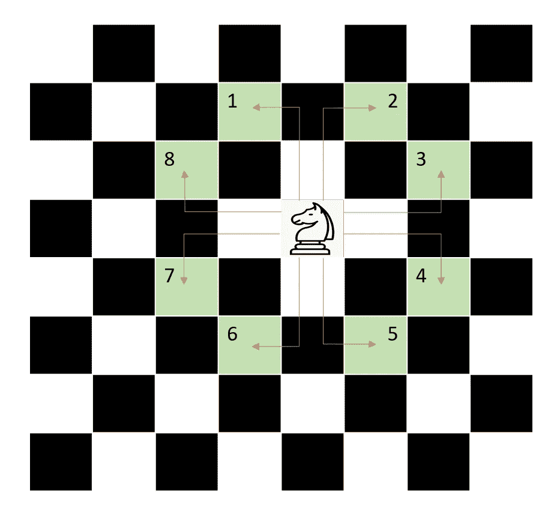
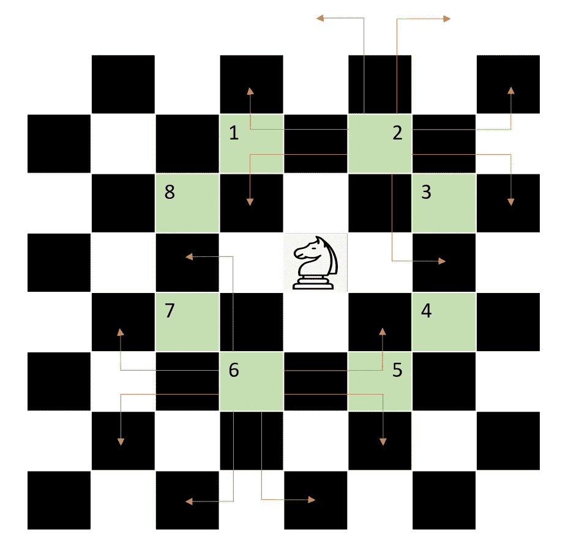

# 最少骑士招式——每日挑战五月

> 原文：<https://medium.com/nerd-for-tech/minimum-knight-moves-daily-challenge-may-4499e5217df5?source=collection_archive---------9----------------------->


照片由[亨利·胡斯塔瓦](https://unsplash.com/@enzo74?utm_source=unsplash&utm_medium=referral&utm_content=creditCopyText)在 [Unsplash](https://unsplash.com/s/photos/knights?utm_source=unsplash&utm_medium=referral&utm_content=creditCopyText) 上拍摄

今天的问题来自每日 Leetcode 编码挑战赛——五月版。这是一个中等标签的问题。让我们看看问题陈述。

## [1197。](https://leetcode.com/problems/minimum-knight-moves/)最小骑士招式

在一个坐标从`-infinity`到`+infinity`的**无限**棋盘中，你在`[0, 0]`方格中有一个**骑士**。

一个骑士有 8 种可能的移动方式，如下图所示。每一步都是在主方向走两个方格，然后在正交方向走一个方格。

返回移动骑士到方格所需的最少步数`[x, y]`。答案肯定是存在的。

## 示例:

```
**Input:** x = 5, y = 5
**Output:** 4
**Explanation:** [0, 0] → [2, 1] → [4, 2] → [3, 4] → [5, 5]
```

## 了解问题:



考虑到当前位置为 x，y，骑士的移动可以根据坐标增量总结如下:

```
1\. (x-1, y+2) ==> (-1, +2)
2\. (x+1, y+2) ==> (+1, +2)
3\. (x+2, y+1) ==> (+2, +1)
4\. (x+2, y-1) ==> (+2, -1)
5\. (x+1, y-2) ==> (+1, -2)
6\. (x-1, y-2) ==> (-1, -2)
7\. (x-2, y-1) ==> (-2, -1)
8\. (x-2, y+1) ==> (-2, +1)
```

正如我们看到的，在给定的坐标下，骑士可以移动到 8 个不同的位置。从那里它可以移动接下来的七个位置(1 将是起始位置或它来的位置)。使用 BFS 遍历可以找到最少的步骤数。



此外，由于初始位置在(0，0)，我们可以将移动限制在正区域或第一象限。如果我们取目标坐标的绝对值，我们就可以这样做。我们可以这样做，因为我们只需要找到最少的步骤。此外，我们跟踪访问位置。

## 代码实现:

```
def minKnightMoves(x, y):
    x , y = abs(x), abs(y)
    possible_moves = [
        (1, 2), (2, 1), (-1, 2), 
        (-2, 1), (-1, -2), (-2, -1), 
        (1, -2), (2, -1)
        ]

    que = collections.deque([[0, 0, 0]])
    visited = set()
    visited.add((0, 0))
    while que:
        qx, qy, d = que.popleft()
        if x == qx and y == qy:
            return d
        for dx, dy in possible_moves:
            nx, ny = qx + dx, qy + dy
            if (nx, ny) not in visited and nx >=-2 and ny>=-2:
                visited.add((nx, ny))
                que.append([nx, ny, d + 1])
```

## 复杂性分析:

*   时间复杂度:O(max(x，y))。这是因为骑士覆盖的每个地方的半径都是 2x 或 2y。这个圆内的细胞数是 x 或 y 的最大值。
*   常数空间:O(max(x，y))在任何一层我们都存储从上一层可以到达的所有节点。

## 方法 2

从方向来看，我们可以优化，只在(-1，-2)或(-2，-1)方向移动。换句话说，目的地总是在第一象限。当我们到达(0，2)或(2，0)或(1，1)时，骑士不能再向(0，0)移动，否则可能会进入负轴。如果我们在(0，2)把夜晚移到(2，1)，那么从那里它可以移到(0，0)。这需要两步。这同样适用于(1，1)和(2，0)。类似地，对于(0，1)，需要 3 个步骤才能回到(0，0)

```
def minKnightMoves(self, x: int, y: int) -> int:
    known_point_moves = {(0, 0): 0, (1, 1): 2, (1, 0): 3, (0, 1): 3, (2, 0): 2, (0, 2): 2} def dfs(x, y):
        if (x, y) in known_point_moves: 
            return cache[(x, y)]
        res = min(dfs(abs(x-1), abs(y-2)), dfs(abs(x-2), abs(y-1))) + 1
        known_point_moves[(x, y)] = res
        return res
    return dfs(abs(x), abs(y))
```