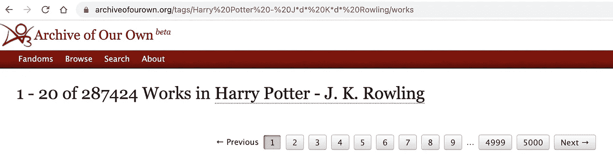
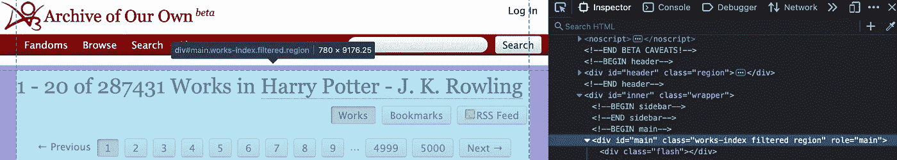
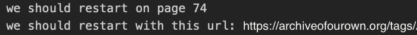
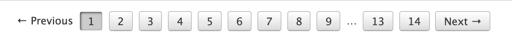
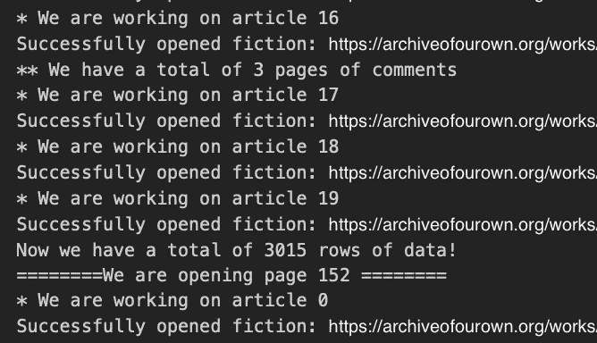

# AO3 矿业概况第 1 部分:数据采集

> 原文：<https://medium.com/nerd-for-tech/mining-fanfics-on-ao3-part-1-data-collection-eac8b5d7a7fa?source=collection_archive---------11----------------------->

当开始这个项目时，我有两个目的，一是开始网络抓取/文本挖掘，二是从我阅读和喜爱的科幻小说中获取一些见解。

我一直在看《用 Python 做 Web 抓取》这本书，我发现我们自己的 (AO3)的[档案馆是一个很好的游乐场，因为它没有令人困惑的用户界面或使事情复杂化的大量 Javascript 另外，所有的 HTML 类和 id 都非常合理和有组织，这让我后来很感激。](https://archiveofourown.org/)

我写这篇文章主要是为了记录这个过程和问题，让任何偶然来访的人或我未来的自己去思考(或嘲笑；).该代码是非常具体的 AO3 的网络结构。但是我认为它对那些想从头开始快速浏览网络抓取的人或者对进行类似的粉丝研究感兴趣的人来说是有用的。无论如何，谁能抵挡住如此充满活力、多样化、不断增长的用户生成文本信息的诱惑呢？

# 理解链接形成

网络抓取的核心就像用提供的 URL 下载网络内容一样简单。因此，作为关键的 URL 是最重要的探索。

幸运的是，AO3 的标签系统使得链接的形成相当简单。



这里的基本格式只是 https://archiveofourown.org/tags/###INSERT 标签# # #/的作品

经过一番探索，我也明白了以下几点:

(1)每个页面都有一个固定的、不可定制的最多 20 个作品，导航到另一个页面通常可以通过添加“？page = #页码“以下”/works

(2)要搜索特定的关键词，我们可以使用这个网址:https://archiveofourown.org/works/search?utf8 = % E2 % 9C % 93 & work _ SEARCH % 5b QUERY % 5D = ###在此插入搜索查询# # #

(3)为了访问实际的虚构内容，我们需要工作 ID 以及一些附加参数来有效地访问整个内容——“view _ adult = true & view _ full _ work = true。”如果我们希望评论也被抓取，可以添加“show_comments=true”。

# 理解 HTML 结构

每个网页都是不同的，所以我不会太深入地去发现每一个标记。这是一个繁琐但必要的步骤，以正确识别我们想要检索的信息，并说明任何违规行为。

火狐开发者版是一个很棒的工具。您可以选择一个元素并立即在源代码中找到它的标签。



例如，我们会很快发现一个页面上的所有作品都列在

1.  元素，具有“文章”的“角色”

初步了解 DOM 和类、id、角色等的命名约定有助于消除后面步骤中的错误。

# 刮基本统计

探索到此为止，现在我们可以开始实际工作了。

同样，下载内容非常简单。一种方法是使用 Python 的 urllib 库。

```
import urllib.requestreq = urllib.request.Request(url, headers=headers)
resp = urllib.request.urlopen(req)
content = resp.read()
```

但是有两个主要问题:

首先，对于拥有数百个页面的流行粉丝，我们可能会很快遇到“HTTP 429 太多请求错误”

我试过 HTTP 库的重试。这确实是非常容错的，但它在没有通知我的情况下给了我几个空白页。可能是因为我把补偿因子设置得太低了，服务器直到稍后才允许我的请求通过。我需要更加熟悉“请求”的功能，以便有效地解决这个问题。

```
from requests.adapters import HTTPAdapter
from requests.packages.urllib3.util.retry import Retry
import requestssession = requests.Session()retry = Retry(connect=7, backoff_factor=5)adapter = HTTPAdapter(max_retries=retry)session.mount('http://', adapter)
session.mount('https://', adapter)
```

第二，活跃的粉丝可以不时地获得新作品，而数据挖掘项目可能需要更长的时间才能完成。如果我们进行动态分析(例如，今天获取一条信息，第二天再请求不同的检索)，我们可能会意外地获取不同的页面内容。

因此，一种更好的方法可能是发出所有请求并将页面内容一次存储在一个地方。

以下是我最终用来下载和存储页面内容的内容:

我采用了相对手动的方式来处理 429 错误。它会像这样报告断点:



休息一会儿后，我可以调整 start_page 变量，从我们停止的地方重新开始。

另外需要注意的是，AO3 要求请求之间有 5 秒的间隔，因此有了 time.sleep()。所以不要忘记首先—

```
import time
import csv
```

一旦我们将所有内容保存到 html 文件中，我们就可以将它们读回内存，并开始应用任何感兴趣的功能:

```
totalPages = ###for i in range(1, totalPages+1):
    pageName = "./SomeContent/"+str(i)+".html"
    with open(pageName, mode='r', encoding='utf8') as f:
        print('Now we are opening page', i, '...')
        page = f.read()
        process_basic(page)
```

我感兴趣的第一件事是收集统计数据，如声望、点击率、书签，并将它们与 ID、标题和作者等基本信息一起组织到一个地方。

我们将需要我们的老朋友进行模式识别:

```
from bs4 import BeautifulSoup
import re
```

首先，我用指定的标题行创建了一个新文件:

```
header = ['Title', 'Author', 'ID', 'Date_updated', 'Rating', 'Pairing', 'Warning', 'Complete', 'Language', 'Word_count', 'Num_chapters', 'Num_comments', 'Num_kudos', 'Num_bookmarks', 'Num_hits']with open('SomeName.csv','w', encoding='utf8') as f:
    writer = csv.writer(f)
    writer.writerow(header)
```

然后制作前面提到的 process_basic 函数:

我对这个函数采用了页面方式(因此所有的列表都是这样)，但是您也可以按行方式运行它，处理每个工作并将每一行写入 CSV 文件。

代码块变大的另一个原因是所有的错误处理。任何没有荣誉或评论的作品都不会有这些属性，因此会抛出错误，拖延整个过程。显然，也可能有没有字数或没有作者的作品。在处理异构数据源时，保守和细致是必要的。

最后几行只是为了检查，它帮助我发现“请求”下载失败的空 HTML 页面。

# 删除文本

可以从搜索结果页面中抓取文本数据，如标签和摘要。其他的，包括实际的工作内容和评论，需要打开每个小说自己的链接，这将再次引入潜在的中断，我们必须做好准备。

与前面类似，让我们首先为我们想要抓取和存储的数据设置基本模式:

```
header_row = ['ID', 'Tags', 'Summary', 'Date_published', 'Content', 'Comments']with open('SomeText.csv','w', encoding='utf8') as f:
    writer = csv.writer(f)
    writer.writerow(header_row)
```

在第一层，我们可以为标签和摘要构建简单的函数:

这是你的决定如何最好地存储标签，使用其他分隔标记或全部在一个字符串中，与我们稍后将处理的注释相同。

还要注意的是，当使用 BeautifulSoup 的。在这种情况下，一些空白行将作为可导航字符串返回，如果您尝试应用，将会出现错误。给他们发短信。在这种情况下，我们可以忽略这些空白。

另一个一级函数是用于注释的。有两种情况——一种是当有 0 或 1 页评论时，另一种是当有更多评论时，我们需要发出新的页面请求。

但两者都需要访问特定小说的页面内容:

这两个函数都将 open_fic 函数提供的 BeautifulSoup 对象作为输入。第二个函数依赖于第一个函数，并为每个页面传递一个新的 URL。

找到要翻多少页有点棘手。目前，我利用导航栏找到了“下一个”之前的最后一个数字。



现在，最后一步是将所有这些信息汇编到一个地方，并写入一个 CSV 文件。虽然它可以在一个步骤中实现，但为了更有效地处理错误并在正确的位置重新开始循环，我将它们分成了两个级别:

一些注意事项:

1.  AO3 不知何故在工作细节页面中隐藏了发布日期，这就是为什么这段信息没有和其他统计数据一起获取。
2.  处理评论时出错:如果有一页或没有评论，我们就不必麻烦地使用 turn_page_comments()。(它会抛出一个错误，因为在这样的页面上没有导航栏。)
3.  Process_articles()将遍历每一页上的小说。Start_index 将是页面上文章的索引，因此如果我们在任何一点中断，我们可以将 start_index 重置到正确的起始位置。Start_index2 表示将被馈送到 article_to_row()函数，然后被馈送到 turn_page_comments()内部循环的评论页面。*有趣的是，在评论迭代过程中，我没有遇到任何“请求过多”的错误。可能速率限制只适用于搜索页面？*

将所有这些放在一起，我们可以通过一页一页地读取我们存储的页面来快速启动这个过程:

创建“ix”是为了指示 process_article 函数根据手动更改的 start_index 对当前页面仅运行一次，然后切换回从每页的第一篇文章开始。

由于五秒钟的间隔要求，这一过程可能需要很长时间来打开和处理每个作品，特别是当我们必须循环浏览数百页的评论时。准备好几个小时甚至一整夜的等待，这取决于总共有多少页。打印报表至少可以让我们了解过程:



万岁！这就是它的结尾，您可以根据需要合并数据集和更改数据类型，例如:

```
basic_stats.Date_updated = pd.to_datetime(basic_stats.Date_updated, format='%d %b %Y')basic_stats.Word_count = basic_stats.Word_count.apply(lambda x: int(x.replace(',','')))text_df.Date_published = pd.to_datetime(text_df.Date_published, format='%Y-%m-%d')df = basic_stats.merge(text_df, how='inner', on='ID')
```

然后，该开始做饭了！