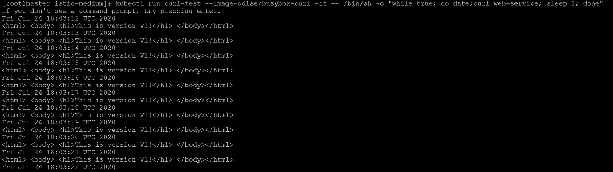
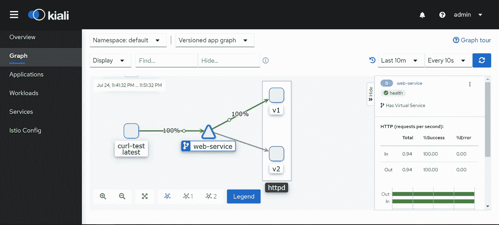

# 使用 Istio 流量镜像对 Kubernetes 中的实时流量进行镜像

> 原文：<https://medium.com/nerd-for-tech/mirroring-of-live-traffic-in-kubernetes-using-istio-traffic-mirroring-36f8c4d32fe8?source=collection_archive---------0----------------------->

## 为什么需要流量镜像？

在上一篇文章[**Kubernetes 中使用 Istio**](/@pavan1999.kumar/weighted-routing-in-kubernetes-using-istio-5d9bdb495032) 的加权路由中，我们已经了解了如何通过让 25%的客户使用版本:v2 来将流量从版本:v1 迁移到版本:v2。当客户对新版本感到满意时，我们将总流量从版本:v1 迁移到版本:v2，零宕机。假设您部署了一个电子商务网站，现在是黑色星期五。你的网站比平时有更多的顾客。使用版本:v2 的客户面临着诸如 UI 缓慢、图像加载不当等问题。导致这些问题的原因是应用程序没有经过实时流量测试。在预生产环境中，已经进行了负载测试，但是使用的是历史流量/人工流量。很难预测应用程序将如何响应实时流量。感谢 Istio 的流量镜像功能。流量镜像也称为阴影，是一个强大的概念，允许功能团队以尽可能小的风险将更改引入生产。通过流量镜像功能，实际应用的实时流量被发送到镜像服务。

## 使用 Istio 流量镜像的优势:

1.  以尽可能小的风险带来生产环境的变化。
2.  降低维护生产前环境的成本和工作量。
3.  使用实时流量测试新版本的应用程序。
4.  识别应用程序中的错误和问题会更快。

您现在可能会想，当流量同时发送到实际服务和镜像服务时，发送给客户的响应会出现混乱。这里可以看到 Istio 的真正魔力。当实时流量被发送到镜像服务时，镜像服务不响应请求。它仅仅是实时流量的接收器。

让我们现在开始行动吧。

> 在您决定启用 Istio 的特性之前，请确保使用以下标签来标记您的名称空间 **istio-injection=enabled。**当您标记名称空间时，注入 webhook 被启用，在该名称空间中创建的任何新 pod 将自动启用 sidecar 代理(envoy 代理)。

现在部署包含服务版本:v1 内容的网页的 Pod

版本:v1 的 Pod 规格文件

通过 ClusterIP 服务公开您的 pod，因为我们将在集群内使用 curl 命令测试流量镜像。您可以将服务公开为负载平衡器，并在浏览器中测试它。因为我已经在 Oracle Virtual Box 中安装了我的 Kubernetes 集群，所以我将通过 ClusterIP 公开 pod，并使用 curl 命令来测试流量镜像。

现在，当 curl 命令被执行时，请求只被发送到版本:v1

> *【root @ master istio-medium】#****kubectl run curl-test—image = odise/busybox-curl—RM-it—/bin/sh-c " while true；做 curl 网络服务；睡眠 1；搞定"*** *<html><正文> < h1 >这是 V1 版！</h1></body></html>
> <html><body><h1>这是 V1 版！</h1></body></html>
> <html><body><h1>这是 V1 版！</h1></body></html>
> <html><body><h1>这是 V1 版！</h1></body></html>
> <html><body><h1>这是 V1 版！</h1></body></html>
> <html><body><h1>这是 V1 版！</h1></body></html>
> <html><body><h1>这是 V1 版！</h1>/body>/html>*

让我们配置虚拟服务和目标规则来配置流量镜像

让我们试着理解上面的文件在做什么。当 Istio 安装在您的 Kubernetes 集群中时，会部署许多 CRD。我们现在要关注的 CRD 是虚拟服务和目的地规则。虚拟服务为 Kubernetes 服务定义了一组流量路由规则。和目的地规则指定一旦满足路由规则，流量应该被路由到哪里。让我们详细研究一下 YAML 的档案。

**虚拟服务:**

a)名称:指定虚拟服务的名称

b)主机:流量发送到的主机。这里的主机是我们的 Kubernetes 服务的 DNS 名称

c) http:它是 http 流量的路由规则列表

d)子集:在相应的目的地规则中定义的业务应该被定向到的子集的名称

e)权重:要转发给服务版本的通信量

f)镜像:应该镜像流量的目的地服务

g) mirror_percent:由镜像字段镜像的流量的百分比

**目的地规则:**

a)名称:目标规则的名称

b)主机:流量发送到的主机。这里的主机是我们的 Kubernetes 服务的 DNS 名称

c)子集:代表服务的各个版本的命名集

d)子集名称:子集的名称

e)标签:用于选择窗格的标签图

现在部署一个具有新版本 v2 的新 pod。该 pod 将由 web-service 服务选择器选取。

> [root @ master istio-medium]#**ku bectl run curl-test—image = odise/busybox-curl-it—/bin/sh-c " while true；do 日期；curl 网络服务；睡眠 1；done "**
> Fri 07 月 24 日 18:03:12 UTC 2020
> <html><body><h1>这是 V1 版！</h1></body></html>
> Fri Jul 24 18:03:13 UTC 2020
> <html><body><h1>这是 V1 版！</h1></body></html>
> Fri 7 月 24 日 18:03:14 UTC 2020
> <html><body><h1>这是 V1 版！</h1></body></html>
> Fri Jul 24 18:03:15 UTC 2020
> <html><body><h1>这是 V1 版！</h1></body></html>
> Fri 07 月 24 日 18:03:16 UTC 2020
> <html><body><h1>这是 V1 版！</h1></body></html>
> Fri Jul 24 18:03:17 UTC 2020
> <html><body><h1>这是 V1 版！</h1></body></html>
> Fri 7 月 24 日 18:03:18 UTC 2020
> <html><body><h1>这是 V1 版！</h1></body></html>
> Fri 2020 年 7 月 24 日 18:03:19 UTC<html><body><h1>这是 V1 版！</h1></body></html>
> Fri 07 月 24 日 18:03:20 UTC 2020<html><body><h1>这是 V1 版！</h1></body></html>
> 世界协调时 2020 年 7 月 24 日 18:03:21

对版本:v1 的请求

我们可以推断出所有的请求都指向版本:v1，版本:v2 在做什么。让我们看看版本:v2 的日志

> [root @ master ~]#**kubectl logs-f httpd-v2-c httpd**
> 
> 127 . 0 . 0 . 1—[24/Jul/2020:18:03:12+0000]" GET/HTTP/1.1 " 200 58
> 127 . 0 . 0 . 1—[24/Jul/2020:18:03:13+0000]" GET/HTTP/1.1 " 200 58
> 127 . 0 . 0 . 1—[24/Jul HTTP/1.1 " 200 58
> 127 . 0 . 0 . 1—[24/Jul/2020:18:03:19+0000]" GET/HTTP/1.1 " 200 58
> 127 . 0 . 0 . 1—[24/Jul/2020:18:03:20+0000]" GET/HTTP/1.1 " 200 58

你看到了吗？

你看到了吗？我的版本:v2 pod 从哪里获得流量？Istio 幕后的数据平面和控制平面正在让这一切成为现实。应用程序的实际版本响应客户的请求。同时，流量的副本也正在发送到版本:v2。这就是我们可以在版本:v2 中看到流量的原因

让我们想象一下基亚利的交通流量。这是 Istio 提供的一个插件，用于更好地可视化你的服务网格。

> ***istioctl 仪表盘 kiali***

显示交通流量的 Kiali 仪表盘

恭喜，我们已经成功地用实时交通测试了我们的应用。现在让我们应用 [**加权路由**](/@pavan1999.kumar/weighted-routing-in-kubernetes-using-istio-5d9bdb495032) 将流量从版本:v1 缓慢迁移到版本:v2

# 先决条件

 [## Istio 服务网格简介

### 什么是 Istio 服务网格？

medium.com](/@pavan1999.kumar/introduction-to-istio-service-mesh-2bc68d2ffdac)  [## 如何使用 istioctl 安装 Istio

### 正如我在之前的文章中所讨论的，我们将致力于一些实时场景，在这些场景中，我们将能够…

medium.com](/@pavan1999.kumar/how-to-install-istio-using-istioctl-1557db1cd62d) 

# 被推荐的

 [## Kubernetes 中使用 Istio 的加权路由

### 让我们假设您的客户正在使用您的应用程序的版本:v1。应用程序的新版本:v2 是…

medium.com](/@pavan1999.kumar/weighted-routing-in-kubernetes-using-istio-5d9bdb495032)  [## 伊斯蒂奥的 MTLS

### 通过插入现有 CA 证书在 Istio 服务网格中设置相互 TLS

medium.com](/@pavan1999.kumar/mtls-in-istio-970f0666b867)