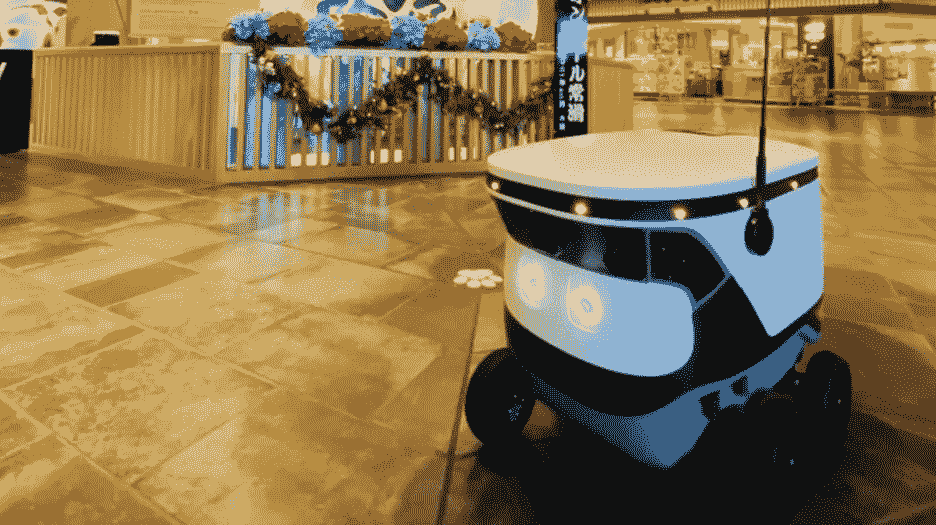

# 三菱电机与创业公司 Cartken 合作进入机器人送货领域

> 原文：<https://medium.com/nerd-for-tech/mitsubishi-electric-partners-with-startup-cartken-to-enter-robotic-delivery-3a025d213963?source=collection_archive---------2----------------------->

据 TechCrunch 报道，日本三菱电机正在启动一项探索自主机器人价值的试点计划。该公司将与初创公司 Cartken 合作，在日本的一家商场发布少量 Cartken 的送货机器人，提供室内和路边食品配送。它们最初是为星巴克的顾客准备的。

三菱电机表示，客户将能够使用他们的星巴克应用程序为他们的订单选择机器人送货，Cartken 机器人将在商场内外的送货点与客户见面。据首席运营官的 Anjali Jindal 纳伊克和 Cartken 的联合创始人说，试点从永旺购物中心 Tokoname 开始。该公司计划扩大业务，为购物者提供路边取货服务。

Cartken 是三菱电机首次涉足送货机器人，将帮助该公司探索该技术的案例，同时进军日本蓬勃发展的自动送货市场。

“三菱电机希望通过使用 Cartken 机器人在日本创建一个新的机器人交付市场，”三菱电机移动创新部门的负责人 Naoki Fujita 告诉 TechCrunch。“这对我们来说是一个新的开始，我们可以利用三菱各业务部门的知识、技术甚至客户关系来见证这个项目的成功。我们可以为这项技术拓展新的市场。”

虽然在合作的第一阶段，三菱电机作为 Cartken 技术的经销商，但在下一步，两家公司打算共同开发更多的技术，以支持三菱电机未来的合作。例如，他们目前正在开发设施技术，帮助卡特肯的机器人与电梯互动。

Cartken 去年与 REEF Technologies 合作，将其自动驾驶机器人带到迈阿密市中心进行食品配送，这不仅将受益于三菱电机在电气设备方面的专业知识，还将帮助这家初创公司在日本业务中站稳脚跟。

在永旺购物中心开始试点将有助于实现这一目标。永旺是亚洲最大的零售商之一，其零售网络不仅覆盖数百家商场，还包括便利店和超市。

“选择永旺购物中心是因为它的完美生态系统可以在很多场景下测试机器人，”纳伊克告诉 TechCrunch。“此外，永旺梦乐城允许进行一系列使用情况调查，目的是快速增加机器人，让更多游客体验送货服务。到 2022 年，这个数字将会扩大。”

Cartken 的 C 机器人被三菱电机选中，因为它们在室内和室外环境中的安全性和可靠性都得到了很高的评级。这家初创公司表示，其机器人可以自主进出商场，但它们都配备了远程监控系统，必要时可以由人类操纵。

“到目前为止，我们只遇到了少数需要紧急远程援助的情况，”纳伊克说。“需要备用路线的新建筑就是远程操作员干预的一个例子。同样，远程协助用于安装阶段，使我们能够在几天内完成部署。”

## 高质量的标签数据始终是关键因素

对于各行各业的辅助驾驶、客服聊天机器人等技术，在特殊场景下对数据质量的期望越来越高。高质量的标签数据将是人工智能公司的核心竞争力之一。

## 结束

将你的数据标注任务外包给 [ByteBridge](https://tinyurl.com/2p8wrnmm) ，你可以更便宜更快的获得高质量的 ML 训练数据集！

*   无需信用卡的免费试用:您可以快速获得样品结果，检查输出，并直接向我们的项目经理反馈。
*   100%人工验证
*   透明标准定价:[有明确的定价](https://www.bytebridge.io/#/?module=price)(含人工成本)

## 为什么不试一试？

来源:https://www . robot-China . com/news/202201/21/69558 . html