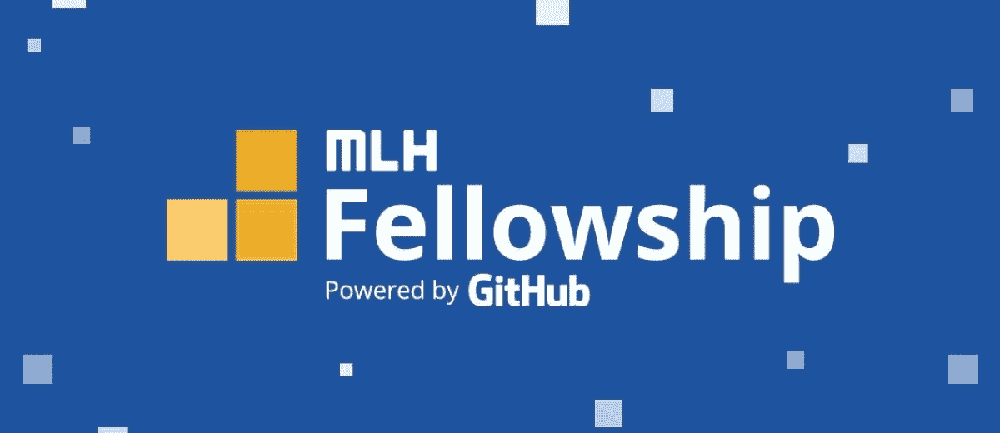

# MLH 奖学金经历:生产工程方向

> 原文：<https://medium.com/nerd-for-tech/mlh-fellowship-experience-production-engineering-track-d397d018ad52?source=collection_archive---------1----------------------->

奖学金和生产工程方向综合指南

# 什么是 MLH 奖学金？

MLH 奖学金是一个为期 12 周的实习项目，在这个项目中，你可以通过合作提高技能。该伙伴关系是脸书、Github 和 AWS 以及其他组织之间的合作倡议。

该社区有助于技术发展，帮助新开发人员获得曝光度、知识和结合，以产生高质量的代码，帮助世界各地的人们。这是一个为学生提供展示技能的全球平台的机会。

# 你为什么需要做奖学金？

研究员被分成称为“pod”的小组，在称为“pod leader”的专业人员的指导下，作为一个团队为项目做出贡献通过对世界各地使用的真实项目的贡献，pod 成员学习新的技术技能。伙伴计划还通过炉边谈话、小组讨论、导师会议、研讨会等活动提供有趣的交流机会。除了多个技术实践研讨会之外，MLH 还经常进行软技能和团队建设练习。所以，如果你想在享受乐趣的同时取得进步，这个项目就是为你准备的！

# 什么是生产工程轨道？

生产工程是现场可靠性工程和 DevOps 的混合体。简而言之，这一切都是为了确保您的服务可靠且可扩展。

角色从问题中浮现:你如何在*某*机器上运行*某*软件来提供*某*服务？在一些设备的规模上，管理员通过运行一些命令来进行设置。但是，在拥有数千台服务于 10 亿人的机器的众多数据中心的规模上，操作软件的问题变成了一个复杂的难题，只有生产工程师才能解决。

在这个伙伴计划中，你将学习保持脸书、WhatsApp 和 Instagram 等产品运行所需的技能。在课程结束时，你将获得宝贵的技术技能和生产工程职业所需的经验。

# 为什么选择生产工程专业？

生产工程是科技公司招聘的最受欢迎的技能之一。该路线由编码、操作系统功能和网络的健康组合组成。

如果你最终从事生产工程，你将比全球近 99.99%的技术社区拥有优势。你的知识将在软件工程师从未接触过的众多领域中突飞猛进。如果你对技术有很深的好奇心，你是那种喜欢摆弄东西的人，如果你曾经熬夜到凌晨 3 点，因为你真的想弄清楚为什么你的台式电脑行为古怪，那么 pe 适合你。

另外，你还可以和脸书的生产工程师进行一对一的互动！

 [## 生产工程档案

### 生产工程师与工程团队和合作伙伴合作，以支持可靠性、可扩展性、性能…

engineering.fb.com](https://engineering.fb.com/category/production-engineering/) 

# 资格标准

生产工程计划方向的资格标准与其页面上列出的其他计划略有不同。要获得参与资格，您必须满足以下标准:

*   **年龄:**必须是 18 岁以上的学生
*   **居留权:**不能居住在被美国禁运的国家。
*   **时间承诺:**应该将每周所需的小时数(30 小时)承诺给项目。
*   **沟通:**应精通英语，书面和口语。
*   **编码经验**:应能熟练使用至少一种编程语言进行编码。
*   **环境:**应为会议提供一个安静的工作空间&编码。
*   **A/V 设置:**应具有视频通话质量互联网连接、网络摄像头、&麦克风。

# 应用进程

我是在奖学金前的最后几周申请的，但我不建议这样做，因为你的申请越早被审核，你就能越早完成面试并进入项目。它在滚动的基础上工作。

整个申请过程大约持续两到三周，包括以下步骤:

*   申请表格:第一步是填写表格，提交你的简历并回答论文问题。完成申请大约需要一个小时。
*   **提交代码样本**:在申请表被审核后，你提交一个被评估的代码样本。
*   **第一次面试**:通过书面申请的申请者将被邀请参加一次简短的视频面试。与人力资源面试类似，这一轮面试持续约 15 分钟，是面试官了解你以及你为什么想成为该团队一员的机会。
*   第二次(技术)面试:这个详细的技术面试通过检查你的代码样本来评估你的技术知识和技能。(他们可以问你 GitHub 上的其他项目，所以一定要看看。)
*   **录取邮件**:选出最优秀的申请，发送录取通知书。

专业提示:花点时间在申请表的作文题上。这是申请中最关键的部分，第一轮淘汰从这里开始。

## 论文问题

在我的申请表中，我一共遇到了五个长答案问题:

*   简要描述该代码示例的作用。

在这里我谈了我提交的项目，它为什么有用，以及我使用了什么技术。

*   简要描述一下您在创建这个代码示例时学到了什么。

我首先解释了我面临的挑战，因为这是我与 ResNets 的第一个项目，以及我从技术角度经历的过程。

我的项目旨在帮助患有阿斯伯格综合症的儿童更好地应对社交场合，所以我也谈到了我对技术如何改善人们生活的认识。

*   你为什么想成为 MLH 研究员？

为此，我谈到了 MLH 如何为学生提供一个研究最新软件工程技术的机会。在我的研究中，我看到 MLH 大学前几年提供的项目帮助以前的参与者提高了技能和兴趣，弥合了大学和行业之间的差距，我觉得这对我很有必要。

*   学习是 MLH 奖学金的主要焦点。你最近学到了什么，如果被录取，你想教给其他人的？

那时我已经用计算机视觉技术做了很多工作，所以我专注于此。

*   关于你还有什么我们应该知道的吗？

在这里，我谈了我的志愿服务经历，我的职业目标，以及我的一些个性。

[申请表](https://www.tfaforms.com/4844143)

我提交供参考的项目:

 [## GitHub-nandhiniswaminathan/人脸识别

### 转移:-用于面部情感识别的深度归纳网络基于图像的面部情感识别(FER)旨在…

github.com](https://github.com/nandhiniswaminathan/face-recognition) 

# 定期津贴

被录取的研究员会收到一笔小额津贴，由你的轨道决定。

# 三个月的奖学金

每周我们都学习新技术，并在我们的投资组合网站中实施它们，我们每天都与我们的 pod 开会讨论并分享我们的进展。在整个项目过程中，我们会定期举办技术研讨会和网络活动，我们可以根据脸书导师的空闲时间与他们预约办公时间。

每周 pod 成员也有机会组织一次展示和讲述，与他们的同伴分享他们想分享的任何东西。我们在 pod 中讨论的一些主题包括 3D 折纸、重力波、神话和子弹日志。

# 计划的第一个月

## 第一周

我们从学习 Github 基础知识开始，后来参加了一个黑客马拉松，任务是使用 Python、Flask、HTML 和 CSS 构建我们的投资组合网站。小组组长将小组分成更小的子小组，我们互相竞争团队中的最佳项目。

赢得黑客马拉松的项目:【https://devpost.com/software/web-portfolio-bm3hpz 

在最初的几个星期，我们还安排了与每个成员和组长的会面，这样我们可以更好地相互了解。

## 第二周

我们接受了一次培训，完成了每周的任务。这是我们那周讨论的一些话题。

*   虚拟专用服务器(VPS)和 CentOs 8 流服务器。
*   使用 AWS 进行设置并设置 EC2 实例。
*   Bash 脚本简介。
*   将您的投资组合站点部署到 AWS。
*   设置反向 Nginx 代理。
*   使用 Certbot Nginx 并添加 SSL 证书

## 第三周

本周的重点是使作品集网站成为一种服务，并通过登录和注册页面向作品集网站添加数据库。

*   使用诸如 Gunicorn 之类的 WSGI 服务器将我们的 portfolio 站点设置为服务。
*   将 SQLite 数据库添加到作品集网站。
*   使用 Postman、bash 脚本和 cURL 进行端点测试。

## 第四周

在这一周，我们学习了 Docker 以及如何容器化我们的网站。

*   介绍 docker 和 Kubernetes，并使用 Docker 来装烧瓶。
*   使用 Docker 容器化数据库。
*   使用 Docker 集装箱化 NGINX。

# 计划的第二个月

## 第五周

本周是关于自动化持续集成和部署到我们的 GitHub 库。我们还了解到:

*   当有人发出拉请求时，在我们的代码上构建一个 Linter 检查。
*   使用连续部署工作流自动部署项目。

## 第六周

本周我们学习了大量的网络和防火墙知识。

## 第七周

本周是职业周，我们参加了实践面试、实践行为面试和简历评审。

## 八周

本周的重点是故障诊断以及如何对投资组合的性能问题进行故障诊断。

# 计划的最后一个月

## 第九至第十一周

我们有三周的时间利用过去两个月在最终黑客马拉松中学到的一切作为一个团队来构建一个项目。

## 第十二周

本周，各队参加了“夺旗”活动，并向全 MLH 展示了我们的最终项目。

(我所在团队的项目，哪个团队获胜:[https://devpost.com/software/streeteats](https://devpost.com/software/streeteats))

## 毕业

这个事件发生在 twitch 上。对所有人来说，这是一个苦乐参半的时刻。

## 班级照片

所以，如果你想要一个值得你去实习的机会，那么 MLH 奖学金是你可以申请的最好的项目之一。你会学到很多东西，遇到很棒的人，整个 MLH 团队真的很酷，很支持你！

黑客快乐！