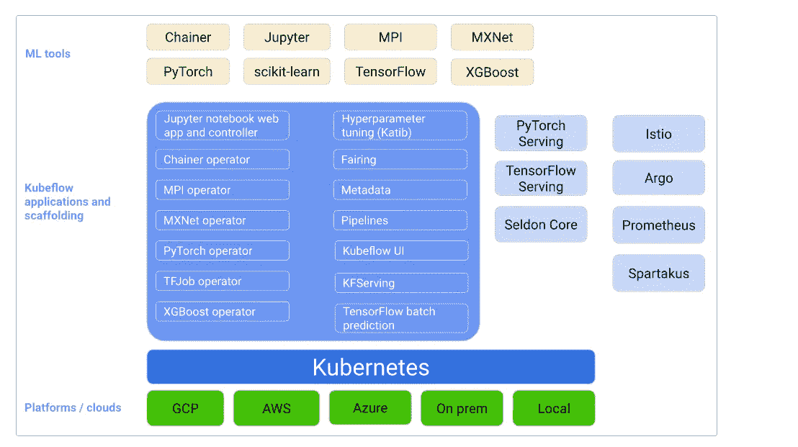
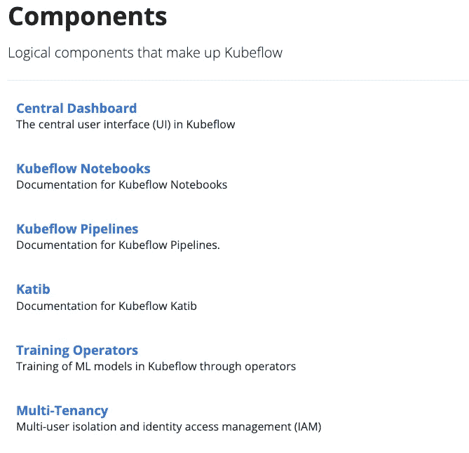
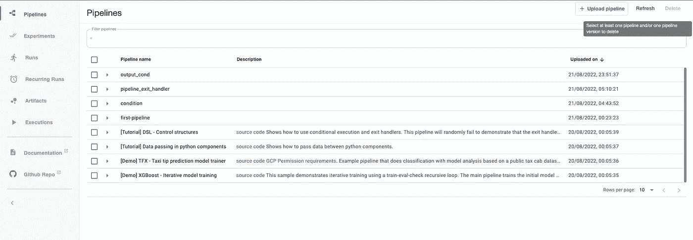
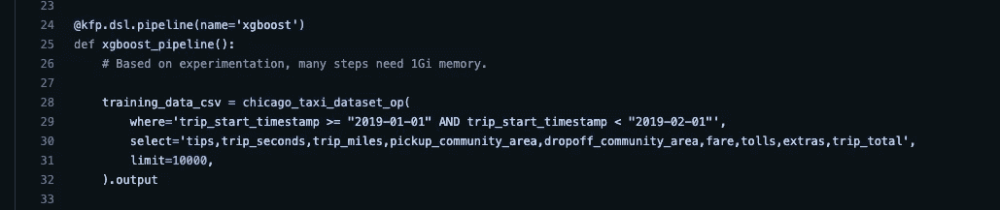
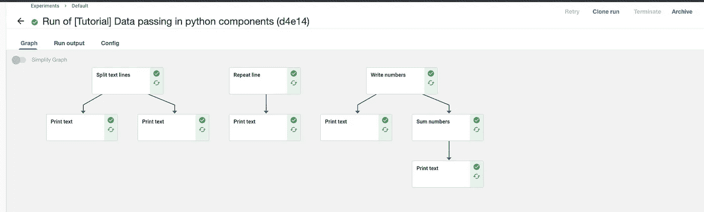
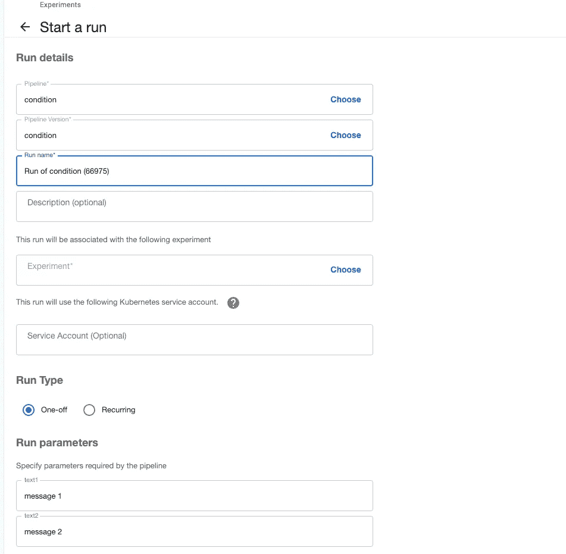
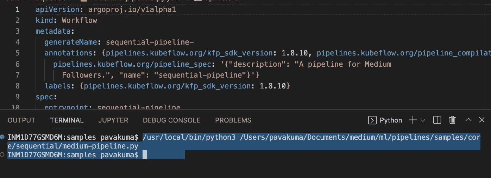
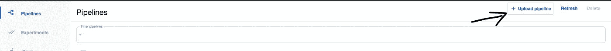
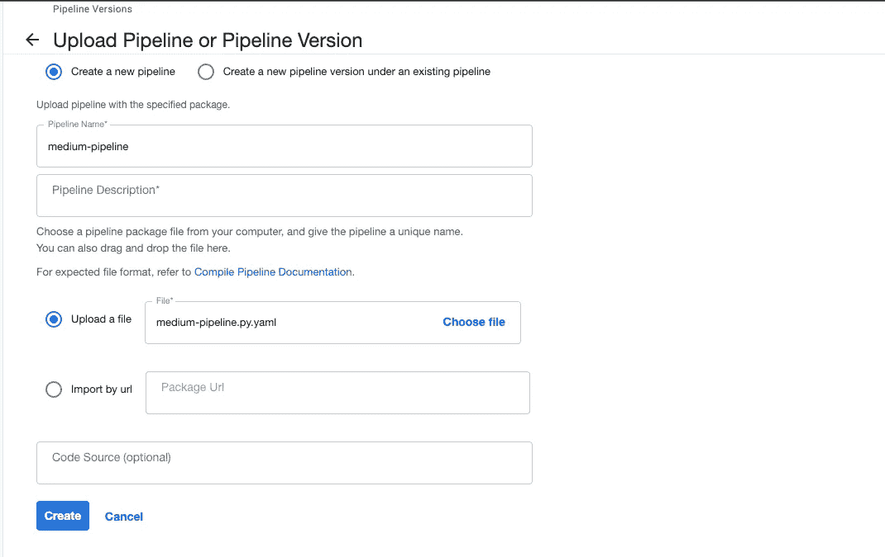
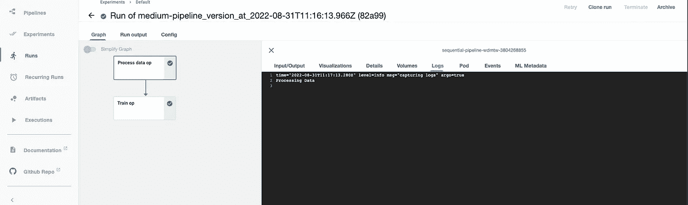

# MlOps:使用 kubeflow 的机器学习管道

> 原文：<https://medium.com/nerd-for-tech/mlops-machine-learning-pipelines-using-kubeflow-fc06508a3f0d?source=collection_archive---------0----------------------->

使用 Kubeflow 对 Kubernetes 进行有效的 MLOps

机器学习！！机器学习！！机器学习！！


是的，这是目前的情况。无论我走到哪里，我都能看到机器学习。嗯，AI 和 ML 现在已经成为任何应用程序最重要的组件。一个电子商务网站需要一个 ML 模型，像网飞这样的网站使用 ML 模型向他们的客户推荐内容。有很多这样的例子，ML 在促进业务发展中扮演着非常重要的角色。但是构建 ML 模型的生命周期有多简单呢？在集装箱化的生态系统中也是这样吗？唷，真是一场噩梦。对于典型的 ML 模型，这些是基本步骤

a)培训

b)测试

c)上菜

假设上述所有步骤都是独立的工作流。将它们收集到一个管道中是非常不可能的。别担心，库伯流来救我们了！！Kubeflow 项目致力于使在 Kubernetes 上部署机器学习(ML)工作流变得简单、可移植和可扩展。Kubeflow 是 Kubernetes 的 ML 工具包。



Kubeflow 组件

我们将在本文中重点介绍的一个组件是 Kubeflow 管道。



Kubeflow 组件

# 整个故事是关于什么的？(TLDR)

1.  了解 Kubeflow 管道。
2.  开发一个样本模型。

# 先决条件

1.  一个 Kubernetes 集群(EKS、AKS、Kind 等)。
2.  安装 Kubeflow 管道。

# 故事资源

1.  GitHub 链接:【https://github.com/pavan-kumar-99/medium-manifests 
2.  GitHub 分支: [kubeflow](https://github.com/pavan-kumar-99/medium-manifests/tree/kubeflow)

## 安装 Kubeflow

您可以根据您的 Kubernetes 发行版[在这里](https://www.kubeflow.org/docs/started/installing-kubeflow/#install-a-packaged-kubeflow-distribution)选择最合适的安装 kubeflow 的方式。我有一个本地集群，我只使用这里的文档[安装了 Kubeflow 管道。](https://github.com/kubeflow/manifests#install-individual-components)

一旦安装了 Kubeflow 管道，用户界面看起来就会像这样



Kubeflow UI

在运行您的第一个 kubeflow 管道之前，您应该了解一些重要的术语。现在让我们来理解它们。

## 管道:

kubeflow *pipeline* 是对 ML 工作流的描述，包括工作流中的所有组件以及它们如何以图形的形式组合。管道包括运行管道所需的输入(参数)以及每个组件的输入和输出的定义。



已经在 Kubeflow 示例目录中创建的示例管道

## 组件:

一个*管道组件*是一个自包含的代码集，执行 ML 工作流(管道)中的一个步骤，比如数据预处理、数据转换、模型训练等等。组件类似于函数，因为它有名称、参数、返回值和主体。


样本组件

## 图表:

*图*是管道运行时执行的 Kubeflow 管道 UI 中的图形表示。该图显示了管道运行已经执行或正在执行的步骤，箭头指示了每个步骤所代表的管道组件之间的父/子关系。



库伯流图示例

## 运行:

一次*运行*是流水线的一次执行。运行包括您尝试的所有实验的不可变日志，并且设计为独立的，以允许再现性。您可以通过查看 Kubeflow Pipelines UI 上的详细信息页面来跟踪运行的进度，在这里您可以看到运行时图、输出工件以及运行中每个步骤的日志。



库贝夫流程运行

好了，我们现在对库伯流中的术语有了一个基本的理解。现在让我们运行我们的第一个 kubeflow 管道。

## 运行 Kubeflow 管道

所有 ML Kubeflow 管道都是使用 Kubeflow 管道 SDK 构建的。 [Kubeflow Pipelines SDK](https://kubeflow-pipelines.readthedocs.io/en/stable/source/kfp.html) 提供了一组 Python 包，您可以使用它们来指定和运行您的机器学习(ML)工作流。一个*管道*是一个 ML 工作流的描述，包括组成工作流中步骤的所有*组件*以及这些组件如何相互作用。

好吧，让我们现在理解代码。我们正在创建 2 个组件作为该代码的一部分，即 process_data_op、train_op(目前只打印了一些语句)。如上所述**一个*管道组件*是一个自包含的代码集，它执行 ML 工作流(管道)中的一个步骤，比如数据预处理、数据转换、模型训练等等。**

之后，我们使用 sequential_pipeline 函数创建一个 Kubeflow 管道。在该功能中，我们通过调用前面创建的组件来定义管道所需的步骤。我们还通过在函数之后使用**来定义依赖关系。**

```
$ git clone [https://github.com/pavan-kumar-99/medium-manifests.git](https://github.com/pavan-kumar-99/medium-manifests.git) \
-b kubeflow$ cd medium-manifests$ python3 [medium-pipeline.py](https://github.com/pavan-kumar-99/medium-manifests/blob/kubeflow/medium-pipeline.py) 
```

就是这样。我们现在正在编译管道并生成管道 yaml。



YAML 从库伯弗洛管道产生的管道

让我们现在上传这个管道 YAML。



上传管道 Yaml



将管道上传到 Kubeflow

一旦上传了管道，您就可以从 Kubeflow 管道 UI 运行管道。



Kubeflow 管道输出

这就是我们的管道在图表中的样子。所有的事件。日志，可视化(如果创建的话)现在也可以在控制台上看到。

这是一个非常简单的库伯流管道。本文将确保在开始使用 Kubeflow 管道之前有足够的知识。在我关于 Kubeflow 系列的下一篇文章中，我将采用一个实时用例，解释我们如何使用 Kubeflow 来设计一个 E2E ML 解决方案(也包括使用 TFServing 的模型服务)。

直到下一次…..

# 被推荐的

[](https://pavan1999-kumar.medium.com/hashicvault-secrets-in-kubernetes-with-csi-driver-ec917d4a2672) [## 与 CSI 驱动程序在 Kubernetes 中的哈希 cVault 秘密

### 使用 Vault CSI 驱动程序向 Kubernetes Pods 注入秘密

pavan1999-kumar.medium.com](https://pavan1999-kumar.medium.com/hashicvault-secrets-in-kubernetes-with-csi-driver-ec917d4a2672) [](/nerd-for-tech/pki-certs-injection-to-k8s-pods-with-vault-agent-injector-d97482b48f3d) [## 使用保险库代理注入器向 K8s Pods 注入 PKI 证书

### 使用保管库代理注入器将 PKI 证书动态注入到 Kubernetes Pods

medium.com](/nerd-for-tech/pki-certs-injection-to-k8s-pods-with-vault-agent-injector-d97482b48f3d) [](/nerd-for-tech/terraforming-the-gitops-way-9417cf4abf58) [## 地球化吉托普斯之路！！！

### 使用 Atlantis(拉式请求自动化)通过 GitOps 建立 Terraform。

medium.com](/nerd-for-tech/terraforming-the-gitops-way-9417cf4abf58) [](/nerd-for-tech/deep-dive-into-thanos-part-i-f72ecba39f76) [## 深入灭霸——第一部分

### 使用灭霸和普罗米修斯操作员监控 Kubernetes 的工作负载

medium.com](/nerd-for-tech/deep-dive-into-thanos-part-i-f72ecba39f76)