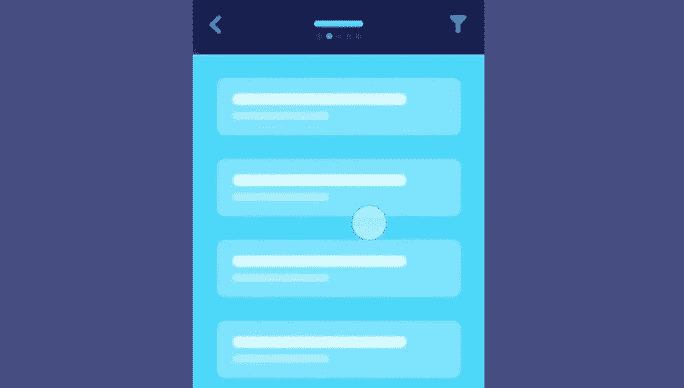
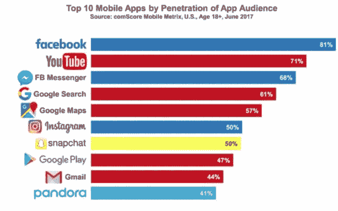
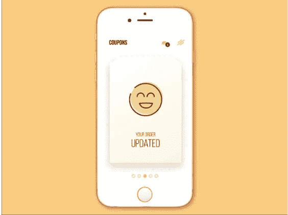

# 构建直观应用的 10 个惊人的移动应用设计技巧

> 原文：<https://medium.com/nerd-for-tech/mobile-app-design-tips-de7fe8da60d6?source=collection_archive---------0----------------------->

正如时尚趋势永远不会一成不变；企业也观察到不断的变化。不断地，一些创新帮助企业脱颖而出。

这些主要创新之一是移动应用程序。这些解决方案成功转变了企业提供服务的方式。因此，对他们来说，包含一些设计技巧来让受欢迎程度成倍增长变得至关重要。

这些元素有助于移动应用成为企业的盈利解决方案，并允许用户操作它们。你会惊讶地注意到，根据 [**Statista**](https://www.statista.com/forecasts/1262892/mobile-app-revenue-worldwide-by-segment) 的数据，到 2025 年 ，应用市场的收入将达到 6130 亿美元左右。

这足以描述该解决方案在用户和企业中的总体受欢迎程度。几乎每个人和企业都在使用应用程序，因此包含一些设计策略是个好主意。它将帮助用户无缝、便捷地浏览应用程序。

在下面的几行中，我们列出了 10 个最好的提示，在你创建移动应用程序的设计过程中会有所帮助。这将有助于您构建一个推动价值和收入最大化的解决方案。

> ***黑仔手机 App 设计重要的原因***

**吸引用户的注意力**
一个拥有最好的视觉效果、信息图表等的应用程序，首先会成功地吸引用户。因此，让你的设计让用户长时间粘着它。

**提升品牌形象**
记住，你的手机 app 就是你品牌的标识。因此，如果设计吸引人，品牌形象会自动提升。因此，简而言之，一个好的 [**手机 app 设计**](https://www.xongolab.com/blog/how-to-create-stunning-mobile-app-design/?utm_source=Medium&utm_medium=WB&utm_campaign=XL-30june) 在很大程度上有助于增强这一点。

**确保客户满意**
这可能是拥有出色设计的移动应用赋予企业的一个重要优势。任何企业的最终目标都是尽可能以最好的方式满足客户的需求。因此，它们包括无缝自动化客户满意任务的技术、方法和解决方案。

*企业需要专注于打造杀手级移动应用设计的其他原因有:*

*   为应用程序提供专业的外观。
*   通过应用程序，功能变得易于执行。
*   建立一个忠诚的客户群变得很容易。

 [## 7 UI/UX 设计趋势打造黑仔移动应用

### 这种对最新 UI/UX 设计趋势的深刻分析将减少跳出率，增加转化率…

javascript.plainenglish.io](https://javascript.plainenglish.io/ui-ux-design-trends-to-build-mobile-app-bba6562b6f04) 

随着移动应用成为目前满足日益增长的用户需求的最佳方式，因此，包括允许无缝满足这些需求的设计策略。因此，要明白一个好的设计可以方便企业主满足他们的要求，确保客户满意度和保持最佳水平。

因此，你看，移动应用程序的设计需要尽可能地吸引人，这样客户才能与应用程序建立联系，理解应用程序的基本目标，并能够无缝地操作它。从长远来看，所有这些都将有助于企业扩大其客户群，改善他们提供服务的方式，确保 it 能够最大化其投资回报，并在最短的时间内产生最大的利润。

要做到这一点，记住一些提示就变得很重要。

以下是关于如何设计视觉上吸引人的手机应用程序的 10 大技巧。

## 10.简化导航

请看下图:

图片来源:dribbble.com

看看通过应用程序进行导航是多么容易。因此，记得保持简单。换句话说，让你的应用导航简单。这将允许您的用户无缝地在屏幕之间滚动。并排地，他们也能够没有障碍地定位他们正在寻找的项目。

## 9.保持用户界面整洁

记住，清晰就是一切。这是一个好的手机设计的先决条件。因此，尽量保持用户界面的简单和最小化。这将使用户与应用程序的交互变得极其容易。

因此，建议在进行此操作时牢记这些方面-

*   每屏 1 到 2 个动作才是你应该关注的。
*   避免添加不必要的内容。
*   保持标题和正文的清晰。

所有这些将确保用户理解应用程序是关于什么的，从而确保可用性最终尽可能保持简单和无缝。

## 8.保持大触摸面积

这是另一个大多数设计师需要记住的建议。这是因为较小的控件使用户难以操作应用程序。因此，相比之下，如果大小很大，用户会发现在应用程序中点击不同的功能很方便，事实上，也可以无缝地使用应用程序。

您可能想知道为什么建议让点击目标保持手指友好？这个问题的答案是-人类手指垫的平均尺寸为 10 x14 毫米，指尖的平均尺寸为 8-10 毫米。因此，建议触摸目标为 10×10 毫米。它将确保用户可以无缝地操作应用程序。

## 7.记得做用户熟悉的事情

尽管发挥创造力没有坏处，尤其是在设计应用程序的时候，但还是建议坚持使用一些元素，包括那些能让用户轻松操作应用程序的元素。

根据 [**BusinessofApps**](https://www.businessofapps.com/data/app-statistics/) 的研究，最好的移动应用在设计上保持了一致性。这反过来让用户可以轻松无缝地操作应用程序。

图片来源:businessofapps.com

因此，建议保持设计的一致性。换句话说，保持设计的相似性，这样用户操作应用程序就不会有任何困难。

## 6.保持响应式设计

兼容性是移动应用程序中最重要的一个方面。所以在设计 app 的时候需要考虑到。换句话说，你必须努力使你的应用程序能够跨平台运行，比如 android 和 iOS。

同时，通过应用程序的整体浏览体验将得到极大的优化，特别是当你在不同的平台和屏幕尺寸上操作应用程序时，可以这么说。

## 5.保持简单

建议设计师使用 K.I.S 模型，也称为保持简单模型。这是因为这个设计元素包含了极简主义的本质。

这同样使用户能够无缝地执行多项任务，执行真正简单的步骤。因此，简而言之，尽可能保持设计简单是一个非常好的想法。这将有助于最小化整体加载时间，尤其是当用户操作应用程序时。

## 4.将文本放大

易于阅读和理解的文本，如果包含在较小尺寸的移动应用程序中，将有助于用户以完全无缝的方式清楚地了解应用程序的基本内容。

因此，把重点放在字体大小上(iOS 11 分，Android 14 分)。这是你需要注意的，因为较小的文本可能会伤害用户的眼睛，而较大的文本可能会占用整个屏幕空间，从而影响整体阅读的连贯性。

因此，建议将重点放在保持文本尽可能大，以保持用户的透明度，特别是当他们使用应用程序时。

## 3.保持视觉

见下图:

图片来源:dribbble.com

观察这张图片，你会明白一个设计结合一个令人惊叹的配色方案有助于它脱颖而出。因此，在构建移动应用程序时，也要关注这一元素。

换句话说，使用醒目的视觉元素。这将有助于用户保持参与。最重要的是，它将留住他们，并确保他们在操作应用程序时获得无缝体验。

## 2.使用简单的表格

当谈到设计技巧时，这可能是另一个需要考虑的重要方面，这些技巧可以帮助你创建一个能够带来最大收入并有助于最大化整体投资回报率的应用程序。

因此，建议使用简单化的形式。这将允许他们轻松地输入所有不同的信息。

因此，建议使用表单控件来完成这项任务，尤其是在打字量最少的情况下。这将节省用户在表单中添加信息的时间，因为表单将以非常简单的方式读取用户想要处理的信息。

## 1.根据安全问题更新设计

这是你在设计应用时需要关注的另一个领域。这是因为如果不关注安全部分，整个开发过程将会变得困难。因此，确保尽可能地与后端团队协调。尝试从他们那里了解如何避免您的应用程序遇到任何数据泄露。

因此，简而言之，尽可能地监控安全问题。这将帮助您简化开发过程，并确保设计符合安全标准。

***另外，建议在设计你的手机 app-*** 时也要牢记这几点

*   通过您的设计提供一致的用户体验，以便他们可以无缝地浏览应用程序。
*   让内容具有可读性。因此，重点是保持字体大小最佳，其次是选择一种易于阅读的字体，让用户容易理解应用程序的内容。
*   第一印象就是一切。因此，确保尽可能快地保持应用程序的功能。这将让用户了解应用程序是什么。

当创建一个移动应用程序时，包含所有这些方面，设计将是完美的。最重要的是，至少可以说，整体用户体验将是无缝的。最后，你的应用将会成功地赢得很高比例的用户，然后成功地获得最大的收入。

了解了为什么好的移动应用程序设计如此重要的原因，以及在这一过程中可以帮助你的提示，了解一些通过直观的移动应用程序设计表现非常好的企业是很好的。

 [## 2022 年你应该知道的革命性 7 大移动应用设计趋势

### “如果你认为好的设计是昂贵的，你应该看看坏设计的成本”——捷豹路虎首席执行官 Ralf Speth 博士…

xongolab.medium.com](https://xongolab.medium.com/mobile-app-design-trends-8db3eec5fd26) 

> ***凭借独特的移动应用设计表现出色的企业示例***

## Spotify

简化用户在应用程序中的导航并添加相关内容使用户体验无缝，Spotify 是一款通过其独特的设计以最佳方式抓住用户注意力的应用程序。这尤其是通过其简单的功能实现了提供点播音乐服务的目的。

## 松弛的

不必要的内容是这个应用程序最大限度避免的。同时，它帮助用户简单地找到他们想要的东西。换句话说，用户从应用程序中获得承诺的元素本身。

因此，看看这些例子，我们相信你明白为什么一个直观的移动应用程序设计是一个好主意。

> ***片尾语***

一个好的设计意味着一个移动应用赢得了一半的胜利。它允许用户轻松操作解决方案，执行不同的任务而不会遇到问题，等等。它同样适用于无缝交付服务的企业，使他们的服务接触到更大比例的用户，最重要的是让用户更清楚地了解他们的应用是什么。

然而，适当的研究，包括一些元素，如了解最近的设计趋势，使导航简单是很重要的。失败会阻碍无缝应用的运行。

因此，努力保持设计的直观性，让用户发现应用程序易于操作和导航。

最后，保持内容最少，确保设计保持视觉吸引力。这将有助于你的应用在最短的时间内获取最大比例的用户。它还将提高您的投资回报率，并使您的收入最大化。

遵循这些策略将使您的企业成为一个遵循最佳设计技术的企业，以创建一个易于使用的解决方案，并确保最大限度地留住客户。