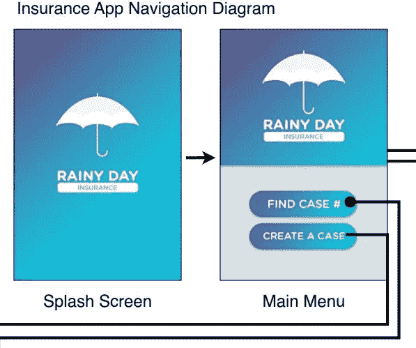
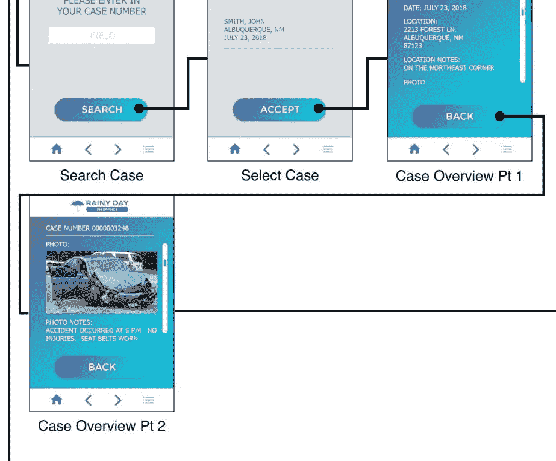
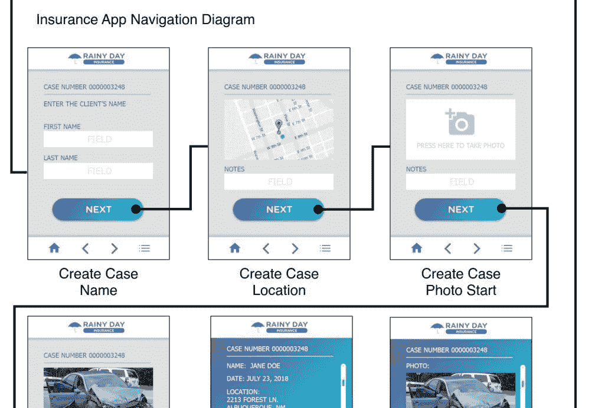

# Unity 进度报告中的移动应用开发

> 原文：<https://medium.com/nerd-for-tech/mobile-apps-development-in-unity-progression-report-84a8f636bc69?source=collection_archive---------6----------------------->

在完成了 FPS 僵尸射手项目([僵尸进展报告:敌方原型和新玩家角色 Unity 3D](/geekculture/zombie-progression-report-enemy-prototype-and-new-player-character-unity-3d-9111fb32d9f2) )之后，GameDevHQ 计划的下一个项目这次有点不同。

这一次，我们将专注于开发移动应用程序。

> 主要目标

1.  更加熟悉移动环境开发
2.  了解更多关于 AWS 以及如何使用它(Amazon Web Services)
3.  了解如何使用手机拍照并将照片上传到 Unity 应用程序
4.  使用地理位置
5.  了解 AR 并创建 AR 应用程序

> 第一个项目

这个新旅程中的第一个项目是一个保险应用程序，其中的最终用户是保险公司。

在该应用程序中，公司将能够创建新的案例文件和搜索案例文件。

以下是该项目的一些草图:

请关注这份进展报告和以下文章，了解更多关于 AWS 集成到 Unity 中的信息以及一些很酷的特性。