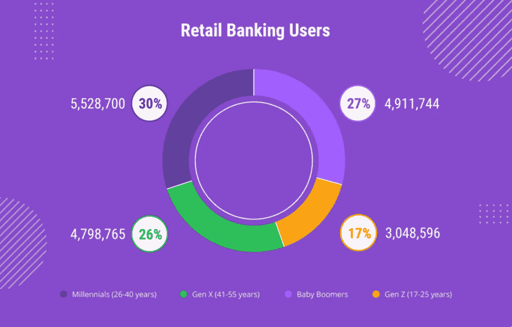
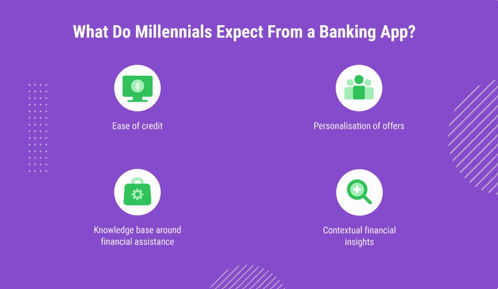
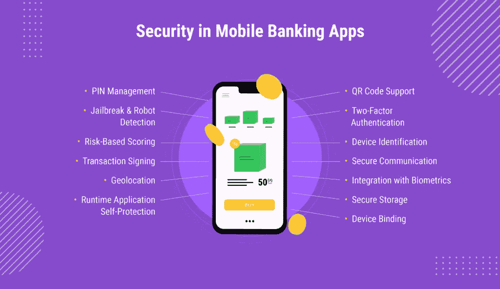

# 疫情期间的手机银行:客户需求概览

> 原文：<https://medium.com/nerd-for-tech/mobile-banking-during-the-pandemic-overview-of-the-customers-wants-and-needs-3fc5088e51c3?source=collection_archive---------2----------------------->

与经济的其他领域一样，银行业的数字化转型在疫情期间加速了。今天，如果你因为新冠肺炎停工而不能去银行，银行会通过手机应用程序来找你。但是这个 app 长什么样呢？

这篇文章旨在向你展示什么是今天的移动银行，以及如何构建一个对用户有所不同的应用程序。

请继续阅读，了解银行应用采用情况的最新统计数据，并了解如何在[移动银行应用开发](https://emerline.com/industries/fintech)期间做出正确的选择。

# 受疫情影响的手机银行统计数据

根据[发射](https://liftoff.io/)发布的报告，2019 年消费者访问金融应用超过 1 万亿次，而应用注册量增长了 71%。这种增长目前正在加速，例如在美国，花在金融应用上的时间增长了 35%。此外，日本和韩国也出现了惊人的增长，增幅高达 85%，这些增长率不再令人震惊。

考虑到实际银行分支机构的 ATM 取现和客流量已经减少，电子商务和非接触式支付已经显著增加，对移动银行解决方案的需求不再有任何疑问。确切地说，发表在《悉尼先驱晨报》上的一篇文章指出，2021 年 ATM 的使用量比前一年下降了约 40%。相比之下，非接触式支付的价值增加了 65%。

换句话说，在新冠肺炎疫情期间，人们表现出对非接触式支付的更大偏好，这一说法得到了澳大利亚借记卡提供商 Eftpos 提供的数据的进一步支持，[声称其移动支付业务](https://retailworldmagazine.com.au/400-growth-in-mobile-payments/)增长了 400%。因此，毫无疑问，移动银行应用现在有需求，而且将继续有需求。问题是，如何构建一个好的应用程序，为您的客户提供使用上的便利，并确保您的业务成功。

让我们从手机银行必备功能的变化来寻找这个问题的答案。

# 不同人群中手机银行应用的必备功能

通过从各种人口统计细分市场的需求角度来观察移动银行的前景，银行可以很容易地确定客户需求，以及确定其在线产品的差距。因此，以下是银行应该考虑解决的关键人群:

## 婴儿潮一代

这部分客户占所有客户的 27%,重要的是，他们中的许多人比他们的年轻同行更不了解技术。他们过去通过更传统的渠道办理银行业务，现在则要求家人帮助他们使用数字银行。

那么，银行需要解决的日常金融需求是什么呢？它们是:

*   提供银行账户准入
*   提供超级基金账户的使用权
*   账单支付
*   贷款支付
*   生活费用资助

值得注意的是，虽然这一细分市场对金融机构的忠诚度很高，但对安全问题的关注度最高。如果银行希望这些客户采用数字银行，它们需要启用教程，提供个性化的虚拟帮助(网络聊天或视频聊天)。

## X 世代

这部分人占总人口的 26%,处于收入的顶峰。他们的银行需求集中在以下几个方面:

*   查看帐户
*   账单支付
*   资金转移
*   贷款和信贷支付
*   主动资金管理

因此，银行和金融机构针对这一细分市场的数字银行需求包括数字信贷应用、资金管理、金融洞察力和可用性。此外，虚拟援助的可用性肯定会帮助这一部分不太精明的数字用户。

## 千禧一代

这些是所有细分市场中最懂技术的客户。他们也因寻找新的贷款或抵押贷款以及储蓄和投资机会而闻名。那么这个细分市场的主要需求是什么呢？

## Z 世代

这部分用户占银行用户的 17%,他们仍在涉足专业领域。这些客户非常精通数字技术，并乐于尝试创新功能。为了确保忠诚度，金融机构需要专注于个性化的自助服务方法，使数字化入职和产品信息变得容易。

另一个重要注意事项是，这部分人(以及千禧一代)是银行未来的收入来源。因此，了解单个客户的行为、偏好和预期的未来工具需求至关重要，这可以通过复杂的[人工智能和 ML 技术](https://emerline.com/solutions/ai-ml)来实现。

此外，银行可以进一步使用交互式工具，如计算器、客户反馈表和聊天机器人来提供体验和传递营销信息。

# 共同的线索:安全问题

美国联邦贸易委员会(FTC)警告美国人警惕[新冠肺炎诈骗](https://www.consumer.ftc.gov/features/coronavirus-scams-what-ftc-doing)，在这个已经混乱的时期，这些诈骗可能针对所有人口的金钱。这些警告涉及方方面面，从提供疫苗到假冒慈善机构和传统的电子邮件诈骗。

那么如今兴起的手机银行 app 中有哪些安全程序呢？

拥有这些功能意味着您的用户不必经常担心他们的移动银行详细信息是否处于危险之中，这对于所有人口统计层的现代移动银行受众来说才是真正重要的。

我们希望这篇文章能让你描绘出如今手机银行用户的期望。为了让事情变得更加简单，我们决定为您提供一个由我们的团队在疫情期间创建的移动银行应用程序的真实示例。

# 移动银行应用旨在减少银行服务的不合理的高额账单

在疫情期间，我们的团队参与了 iOS 和 Android 移动应用程序的开发，这些应用程序补充了客户用于上传和跟踪银行服务账单的 web 解决方案。该应用背后的关键理念是为最终用户提供机会，通过具有以下功能的任何设备降低银行服务的成本:

*   银行服务账单的即时上传
*   跟踪与金融机构互动相关的特定客户问题
*   存储附件(向应用程序的最终用户提供的银行服务的详细信息)
*   客户代表通过网络或手机解决方案进行独立的账单审核和反馈

有了这个解决方案，我们的客户获得了接触更广泛受众的机会，因为该解决方案的两个版本(web 和移动)为最终用户提供了方便。
我们的团队在开发移动银行应用程序方面拥有丰富的专业知识，已经帮助多家客户提供了完善的金融解决方案。如果你对我们如何帮助你实现最聪明的技术想法感兴趣，我们随时[在这里](https://emerline.com/contact-us)帮助你。

最初发表于[https://emerline.com](https://emerline.com)。