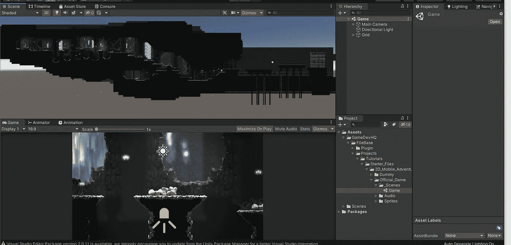
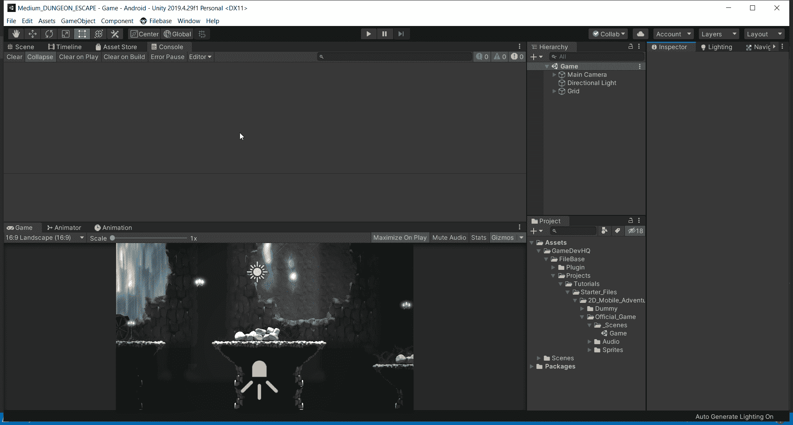
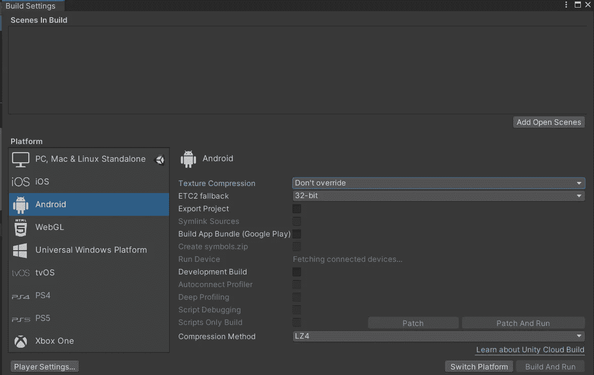
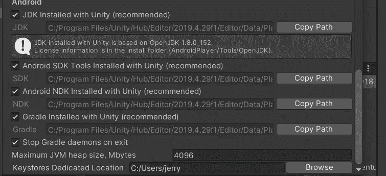
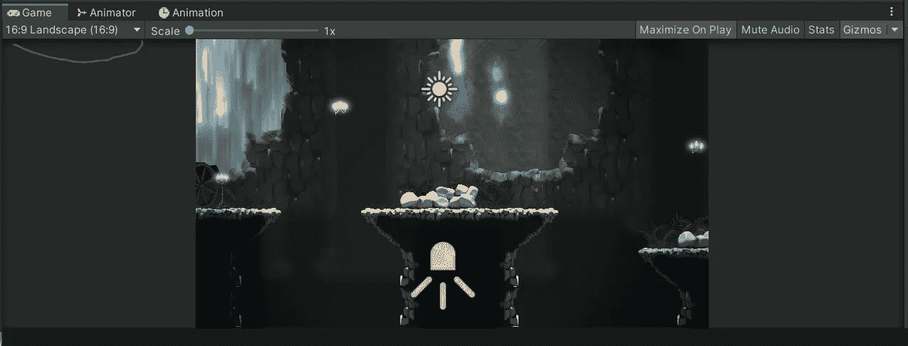

# Unity 中的手机游戏:Android 就绪

> 原文：<https://medium.com/nerd-for-tech/mobile-games-in-unity-android-ready-88d4fa402983?source=collection_archive---------20----------------------->

我现在已经从我一直在工作的那个样本场景切换到这个资产包的正式游戏场景。当你第一次打开它的时候，你会看到一个制作精美的关卡，使用的技术和我们在之前的文章中看到的一样。Tilemaps 的力量是惊人的！

我将介绍如何为 Android 开发设置这个项目。我将转到“文件”下的“构建设置”。

找到 Android，点击“切换平台”。

这将把你的目标版本设置为 Android。这可能需要几分钟时间。您也可能会遇到一些错误。大多数情况下，错误都与正在安装的 Android JDK 的正确版本或 SDK 问题有关。

例如，当我完成平台切换时，我遇到了一个错误，因为没有安装正确的 SDK 工具。我的解决办法是进入“编辑>>偏好>>外部工具> >”，然后导航到窗口的“Android”部分。我只需要勾选“安卓 NDK 安装了 Unity(推荐)”旁边的框。这让我的错误消失了。

根据您使用的 Unity 版本，您可能会遇到不同的错误。

现在我已经准备好在 Android 设备上进行开发了。

现在我要改变我的长宽比。我把我的设置为 16:9 的风景。

从这里我可以走了！