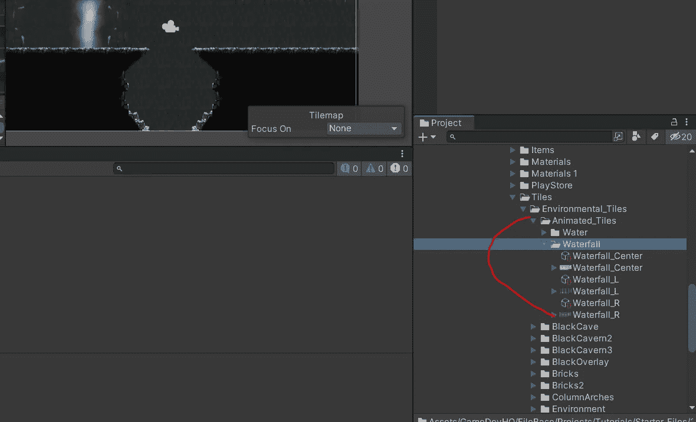
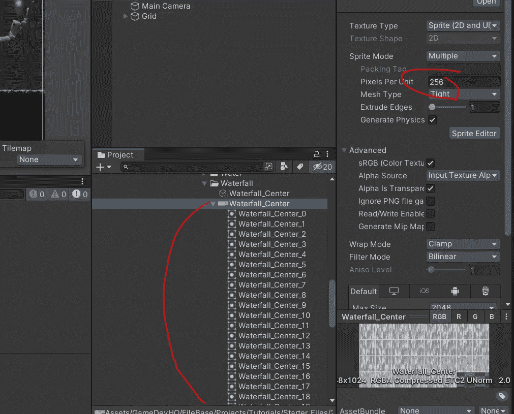
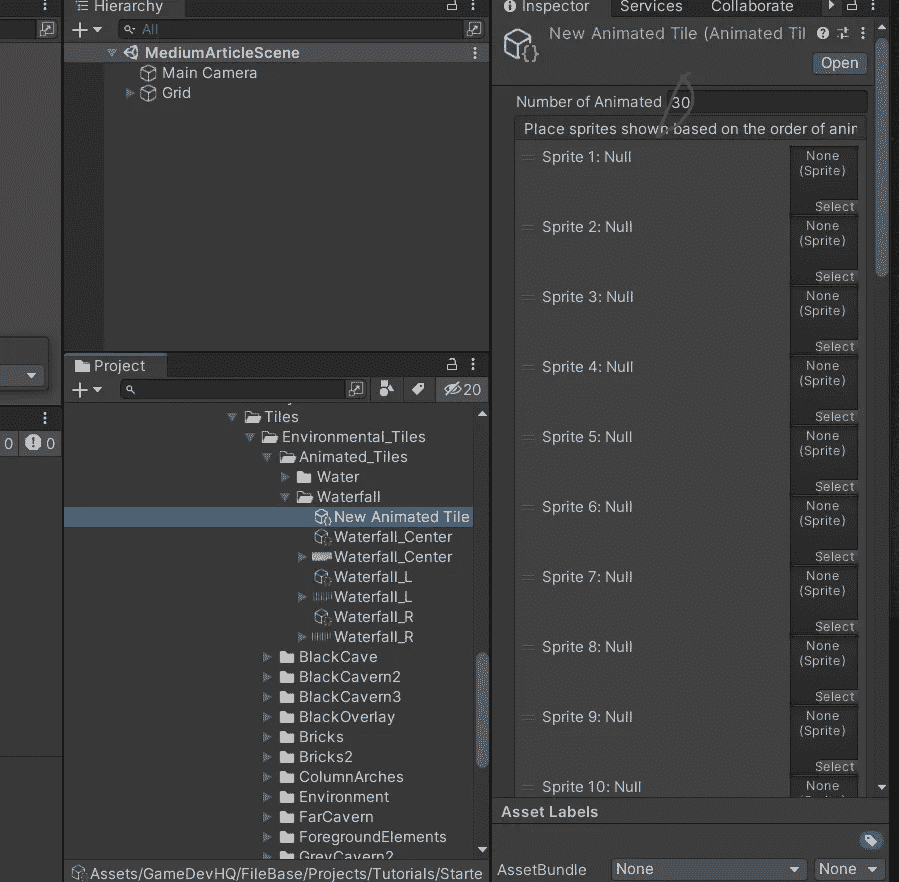
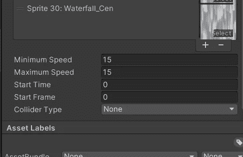
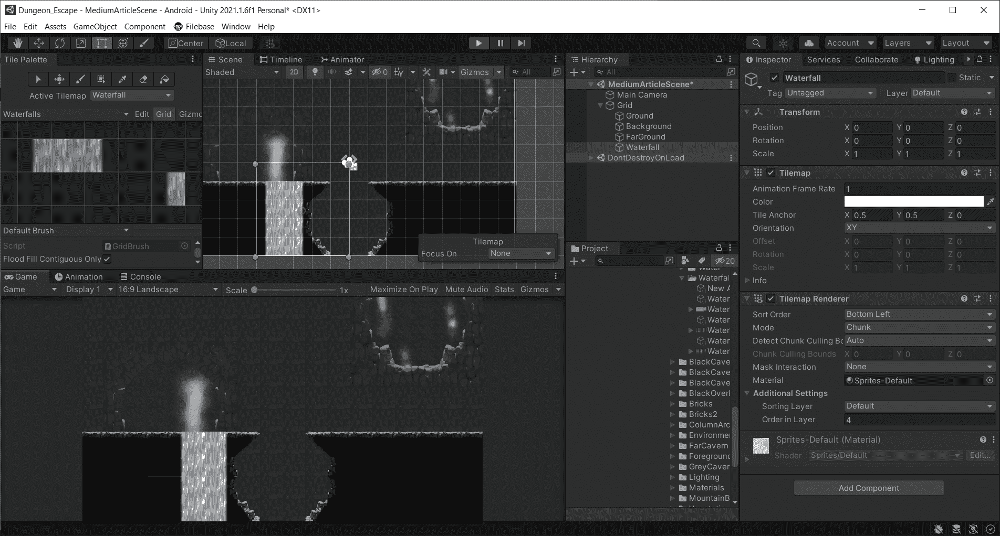

# Unity 手机游戏:动画磁贴集

> 原文：<https://medium.com/nerd-for-tech/mobile-games-in-unity-animated-tilesets-98d7a718474e?source=collection_archive---------19----------------------->

在这篇文章中，我将介绍如何制作一个动画 tileset，这样我就可以添加一个流动的瀑布到场景中。

如果你和我使用相同的资产包，请查看 Tiles 下的 Animated Tiles 文件夹。这有一个文件夹存放所有的瀑布精灵。有一个左，前，右精灵。

以 256 X 256 的尺寸将中间的雪碧片切碎。

之后，右键单击该文件夹并导航到创建> 2D >瓷砖>动画瓷砖。这将创建动画瓷砖。现在你需要拖动每个精灵到每个精灵选择框中。

在底部，一定要相应地设置你的最小和最大速度。我发现 15 对这个来说已经很不错了。

现在，您需要做的就是创建一个新的调色板，并简单地将新创建的动画瓷砖拖动到调色板中。对左侧和右侧重复此过程。现在，当你将这些物体绘制到场景中并按下播放键时，它们将通过精灵产生动画效果！一定要把这个放在不同的图层上。我把我的放在第 4 层，这样它就在地面层的上面。

